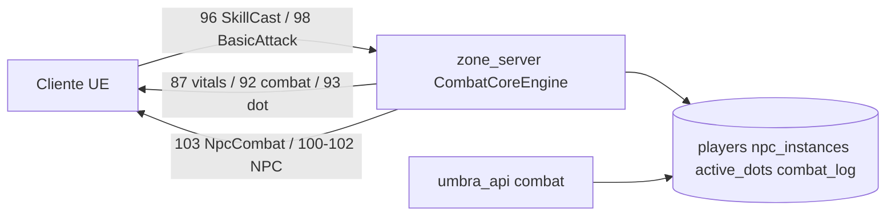

# UmbraEternum - MMORPG Server Stack


Arquitetura de micro-servidores C++17 para MMORPG com integracao Unreal Engine 5, autenticacao JWT, protocolo de movimento binario, Area of Interest (AOI) e escalonamento dinamico de zones.

**Branch ativo:** `backup/local-sync-no-heavy-20260407` (submodulo `UmbraEternumUE` no mesmo branch). Neste branch o **Combat V2 com dano real server-side** esta integrado ao `zone_server` via `CombatCoreEngine`, `CharacterStateLoader` e `CombatCalculator` (commits `a6dfa36`, `4ec5bc3` e anteriores).

---

## Arquitetura

```
                    +----------------------------------+
                    |          UE5 Clients              |
                    +----------+-----------------------+
                               | TCP (WebSocket)
                    +----------v-----------------------+
                    |     Gateway Server (9000)         |
                    |  Per-client rate limiting         |
                    |  Max connections check            |
                    |  LoadBalancer (zone routing)      |
                    |  Auth connection pool             |
                    +--+----------+--------------------+
                       |          |
          +------------v--+  +----v---------------------+
          | Auth (8080)    |  | Zone Servers (8082+)      |
          | JWT/PBKDF2     |  | SpatialGrid AOI (10000u)  |
          | Sessions       |  | Auto-save 30s (batch)     |
          +--------------  +  | Movement validation       |
                              | Prepared statements       |
          +----------------+  | ZoneOrchestrator          |
          | World (8081)   |  |  (dynamic spawn/despawn)  |
          | Events/NPCs    |  +----------+----------------+
          +----------------+             |
                                         |
          +----------------+  +----------v----------------+
          | PHP API (80)   |  |   MySQL (3306)             |
          | 78 endpoints   |  |   Connection Pool (5-25)   |
          | JWT auth       |  |   Prepared Statements      |
          | Prepared SQL   |  |   Batch transactions       |
          +----------------+  +---------------------------+
```

### Fluxo de combate (Combat V2)



---

## Quick Start

### Pre-requisitos

- **Windows**: Visual Studio 2022 (C++17), MySQL 8.0+, WAMP/XAMPP
- **Linux**: GCC 13+, CMake 3.20+, libmysqlclient-dev, libssl-dev, Apache + PHP 8+
- **Ambos**: Git com submodules, Unreal Engine 5.6 (apenas para client)

### Clone e Build

```bash
git clone --recurse-submodules https://github.com/Dev-ElJeffo/UmbraServerV2.git
cd UmbraServerV2
```

**Windows:**
```bash
mkdir build && cd build
cmake -G "Visual Studio 17 2022" -A x64 ..
cmake --build . --config Release
```

**Linux:**
```bash
sudo apt install build-essential cmake libmysqlclient-dev libssl-dev pkg-config
mkdir build && cd build
cmake -DCMAKE_BUILD_TYPE=Release -DCMAKE_CXX_COMPILER=g++ ..
cmake --build . --parallel
```

### Setup do banco de dados

```bash
mysql -u root -p < scripts_main/setup_database.sql
```

Scripts adicionais em `www/umbra_api/scripts/` (classes, factions, skills, inventory, social, etc.).

Scripts de combate V2 (executar apos setup base):

```bat
mysql -u root -p umbra_eternum < www\umbra_api\scripts\create_skill_system.sql
mysql -u root -p umbra_eternum < www\umbra_api\scripts\combat_v2.sql
mysql -u root -p umbra_eternum < www\umbra_api\scripts\add_basic_attack_skills.sql
```

Tabelas relevantes ao combate V2: `basic_attacks`, `active_dots`, `npc_templates`, `npc_instances`, `combat_log`, colunas `effects_json` / `cast_anim_path` em `skills`.

### Executar

```bash
# Servidor monolitico (Auth + World + Gateway)
.\build\bin\Release\umbra_server.exe        # Windows
./build/bin/umbra_server                     # Linux

# Zone Server separado (porta 8082 + zoneId)
.\build\bin\Release\zone_server.exe 0        # Windows - Zone_0 na 8082
./build/bin/zone_server 0                    # Linux
```

Startup esperado:
```
===========================================
    UmbraEternum Server Stack v1.4.0
    Production Scaling Edition
===========================================

[OK] MySQL connected (pool: 5 connections)
[OK] Auth Server started on port 8080
[OK] World Server started on port 8081
[OK] Gateway Server started on port 9000

  Systems active:
    - MySQL Connection Pool (5 connections)
    - Per-client Rate Limiting (100 msg/s)
    - Spatial Grid AOI (cell=10000u, range=3x3 = 30000u radius)
    - Auto-save positions (every 30s)
    - Zone Orchestrator (available for zone_server)
```

---

## Estrutura do projeto

```
UmbraServerV2/
|-- src/                        # Servidor C++
|   |-- auth/                   # AuthServer, JWTManager, SessionManager
|   |-- gateway/                # GatewayServer, LoadBalancer, AuthConnectionPool
|   |-- world/                  # WorldServer, EventManager, TimeManager
|   |-- zone/                   # ZoneServer, MovementServer, SpatialGrid, ZoneOrchestrator
|   |-- chat/                   # ChatServer, ChannelManager
|   |-- network/                # SocketServer, WebSocketServer, MessageHandler
|   |-- database/               # MySQLConnector (pool), AccountDAO, PlayerDAO
|   |-- core/                   # Logger, ConfigManager, Timer, Utils
|   |-- services/               # Matchmaking, InventoryService, CombatService
|   +-- main.cpp                # Entry point do servidor monolitico
|-- config/
|   +-- server.json             # Configuracao centralizada
|-- tests/                      # Google Test (auth, db, zone, network)
|-- third_party/                # spdlog, nlohmann/json, jwt-cpp, googletest
|-- UmbraEternumUE/             # Cliente Unreal Engine 5.6 (submodulo)
|   |-- Source/UmbraEternumUE/
|   |   |-- Core/               # UmbraGameInstance (login, TCP, skillbar)
|   |   |-- Network/            # UmbraTCPClient (conexao TCP persistente)
|   |   |-- UI/                 # Widgets (inventario, skills, trade, party, drag & drop)
|   |   +-- Data/               # Structs (skills, items, inventario)
|   |-- Content/                # Assets, Widgets, Materials
|   +-- Plugins/VaRest/         # Plugin HTTP REST
|-- www/umbra_api/              # API PHP REST
|   |-- api/                    # 78 endpoints (auth, character, inventory, skills, social, gold, admin)
|   |-- config/database.php     # Conexao PDO MySQL
|   |-- helpers/jwt_helper.php  # JWT compativel com C++
|   +-- scripts/                # 34 scripts SQL de migracao
|-- scripts/                    # Scripts utilitarios (start, backup)
|-- scripts_main/               # Setup e manutencao (SQL, PowerShell)
|-- docs/                       # Documentacao tecnica
|-- docs_main/                  # GUIA_COMBATE_V2_DANO_REAL.md e demais guias
|-- UmbraServer/docs_main/      # GUIA_COMBAT_V2_*, GUIA_SISTEMA_COMBATE.md
+-- CMakeLists.txt              # Build system
```

Complemento da arvore acima (modulos adicionados neste branch, sem substituir entradas existentes):

```
|   |-- zone/                   # + CombatCoreEngine, CharacterStateLoader,
|   |                           #   NpcManager, ZoneCombatService, MovementProtocol
|   |-- services/               # + SkillService, CombatCalculator.hpp
|   |                           #   (CombatService legado permanece listado)
|   |-- admin/                  # ServiceAdminRegister — spawn/reload NPC via admin
```

---

## Servidores C++ - Targets CMake

| Target | Porta | Funcao |
|---|---|---|
| `umbra_server` | 8080, 8081, 9000 | Monolitico: Auth + World + Gateway em um processo |
| `auth_server` | 8080 | Standalone: JWT validation, sessions, PBKDF2 |
| `world_server` | 8081 | Standalone: eventos globais, NPCs, time management |
| `zone_server` | 8082+ | Standalone: movimento, AOI, entidades, auto-save |
| `gateway_server` | 9000 | Standalone: proxy TCP, rate limiting, load balancing |
| `chat_server` | 8083 | Standalone: canais de chat, messaging |

Complemento `zone_server` (Combat V2 neste branch): `CombatCoreEngine`, movimento WS, NPC runtime, DOT player (`active_dots`), regen passiva HP/MP, broadcast vitals opcode 87.

---

## Sistemas de producao implementados

### MySQL Connection Pool

Pool de conexoes configuravel em `config/server.json` (`database.pool_size`). Acquire com timeout de 5s, auto-reconnect via `mysql_ping()`, fallback para conexao primaria. Transparente para todo codigo -- DAOs usam pool automaticamente.

### Prepared Statements

Todas as queries de AccountDAO, PlayerDAO e ZoneServer usam `executePreparedInsert`, `executePreparedQuery` e `executePreparedScalar` com placeholders `?`. Zero concatenacao de strings em SQL.

### Area of Interest (AOI)

`SpatialGrid` divide o mundo em celulas de 10000 unidades (~100m UE). Cada jogador recebe updates apenas de jogadores nas 9 celulas adjacentes (3x3). Reduz broadcast de O(n^2) para O(n*k). Integrado no `MovementServer` para `broadcastSnapshot()` e `handleMoveUpdate()`.

### Per-client Rate Limiting

Tracking por client ID no `SocketServer` com sliding window de 1 segundo. Exceder o limite desconecta o cliente automaticamente. Configuravel via `gateway.rate_limit_per_second`.

### Max Connections

Accept loop rejeita novas conexoes acima de `maxConnections_` (default 10000). Previne thread exhaustion e OOM.

### Auto-save

`ZoneServer` salva posicao de todos os jogadores a cada 30 segundos usando batch transaction (BEGIN, N updates, COMMIT). Prepared statements.

### Zone Orchestrator

Componente para escalonamento dinamico de zone servers. Monitora carga por instancia, spawn automatico quando `spawnThreshold` excedido (default 80 jogadores), despawn quando abaixo de `despawnThreshold` (default 10). Fork + exec no Linux.

### LoadBalancer

Zone-aware routing: `selectServerForZone()` retorna instancia com menor carga. Heartbeat tracking com prune automatico de servidores inativos.

---

## Combat V2 — Dano real (server-authoritative)

Principios:

- Cliente envia intencao (opcodes 96/98); o `zone_server` calcula dano, mana, miss e persiste
- HP/MP **current** em `players.health` / `players.mana`; max **total** calculado (classe + nivel + equip + buffs)
- Formulas em `CombatCalculator.hpp`; stats completos via `CharacterStateLoader` (espelha `character_info_helper.php`)
- NPC: HP em `npc_instances` + `NpcManager`; DOT de NPC in-memory (`NpcDotInstance`)

| Componente | Arquivo | Funcao |
|---|---|---|
| CombatCoreEngine | `src/zone/CombatCoreEngine.*` | processBasicAttack, processSkillCast, mana sync, regen, DOT/HOT, miss |
| CharacterStateLoader | `src/zone/CharacterStateLoader.*` | Stats completos, cache 1s |
| CombatCalculator | `src/services/CombatCalculator.hpp` | Dano, crit, hit/miss, cura, DOT tick |
| SkillService | `src/services/SkillService.*` | Skills, cooldown, parse `effects_json` |
| NpcManager | `src/zone/NpcManager.*` | Instancias NPC, applyDamage, respawn |
| ZoneCombatService | `src/zone/ZoneCombatService.*` | Tick `active_dots`, respawn jogador |
| MovementServer | `src/zone/MovementServer.hpp` | Roteamento WS, broadcastVitalsAndCombat |

Fluxos resumidos:

1. **Ataque basico 98** → cooldown → 99 → hit roll → dano → 103/102 (NPC) ou 87+92 (player)
2. **Skill 96** → validate → deduct mana + **87** → 97 → dano/cura → DOT/HOT via `effects_json`
3. **Regen:** a cada 2s, +2% HP / +3% MP do max total (broadcast 87 so se mudou)
4. **Miss:** `clamp(80 + acc - dodge, 5, 95)` — PvE e PvP — opcode 92/103 `reason=6`
5. **DOT player:** INSERT `active_dots` → tick 0.25s → 87+92+93
6. **DOT NPC:** `NpcDotInstance` in-memory → tick frame → 103+102

Constantes ajustaveis:

| Constante | Arquivo | Valor |
|---|---|---|
| Regen interval | CombatCoreEngine.cpp | 2.0 s |
| Regen HP/MP | idem | 2% / 3% do max total |
| Hit base / min / max | CombatCalculator.hpp | 80% / 5% / 95% |
| Crit max | idem | 80% |
| PvP damage reduction | idem | 0.7 (30% menos) |
| State cache TTL | CharacterStateLoader.hpp | 1000 ms |
| DOT tick player | ZoneCombatService | 0.25 s |

Como alterar balanceamento:

- **Skills:** tabela `skills` + `effects_json`; rank em `player_skills`
- **Ataque basico:** tabela `basic_attacks`
- **Formulas globais:** `CombatCalculator.hpp` + recompilar `zone_server`
- **Stats / max HP:** **ambos** `character_info_helper.php` e `CharacterStateLoader.cpp`

Documentacao completa → [`docs_main/GUIA_COMBATE_V2_DANO_REAL.md`](docs_main/GUIA_COMBATE_V2_DANO_REAL.md)

---

## API PHP - 78 Endpoints

| Modulo | Endpoints | Descricao |
|---|---|---|
| Auth | `login.php`, `register.php` | Registro, login com JWT |
| Character | 12 endpoints | CRUD, stats, classes, posicao, PvP |
| Inventory | 7 endpoints | Add/remove/equip/move/split/stack |
| Storage | 6 endpoints | Bank compartilhado por conta |
| Skills | 11 endpoints | Learn/upgrade/use, skillbar, cooldowns, buffs |
| Social | 18 endpoints | Friends, party, trade, block, report |
| Gold | 3 endpoints | Deposit/withdraw/get |
| Admin | 7 endpoints | Ban/unban, items, accounts, server status |
| **Combat** | `apply_vitals.php`, `respawn.php`, `dot_apply.php`, `dot_remove.php`, `get_spawn_points.php`, `log_damage.php` | Vitals, respawn, DOT manual, spawn points, log admin |
| **NPC** | `spawn_npc.php`, `get_npc_templates.php`, `update_npc_template.php` | Spawn/admin de NPCs para zone |

Todos os endpoints usam JWT para autenticacao e prepared statements para SQL.

Contagem total permanece em **78** endpoints documentados acima; modulos adicionais **combat** e **npc** estao em `www/umbra_api/api/combat/` e `www/umbra_api/api/npc/`.

---

## Protocolo de Movimento

Frames binarios little-endian:
- **25 bytes**: MoveUpdate basico (type, playerId, x, y, z, yaw, timestamp)
- **34 bytes**: MoveUpdate com animacao (+speed, velocityZ, isInAir)

Validacoes server-side:
- Speed check (rejeita velocidade acima de `maxSpeed_`)
- Teleport detection (distancia acima de `maxTeleportDist_`)
- Timestamp regression handling

---

## Protocolo WebSocket — Combate (opcodes 86–103)

| Opcode | Nome | Dir | Uso |
|--------|------|-----|-----|
| 86–88 | Vitals legado | S↔C | Self/foreign vitals (V1) |
| 87 | PlayerVitalsUpdate | S→C | HP/MP current + **max total** |
| 89–90 | Death/Respawn | S→C | Morte e respawn |
| 92 | CombatEventNotify | S→C | Dano/cura/miss player (`reason=6` = MISS) |
| 93 | DotTickNotify | S→C | Tick DOT/HOT player |
| 94–95 | Consumable | S→C | Efeito de poção |
| 96 | SkillCastNotify | C→S | Intencao de skill |
| 97 | SkillCastBroadcast | S→C | Animacao/VFX do cast |
| 98 | BasicAttackNotify | C→S | Intencao de ataque basico |
| 99 | BasicAttackBroadcast | S→C | Animacao do ataque |
| 100–103 | NPC | S→C | Spawn/despawn/state/combat event |

Payloads chave (resumo binario):

- **98:** `[98][playerId:4][targetType:1][targetId:4]`
- **96:** `[96][playerId:4][skillId:4][targetType:1][targetId:4][x,y,z:f32]`
- **87:** `[87][playerId:4][hp:i32][maxHp:i32][mp:i32][maxMp:i32][sourceId:4][reason:1]`

---

## Configuracao - config/server.json

```json
{
  "database": {
    "host": "localhost",
    "port": 3306,
    "name": "umbra_eternum",
    "user": "root",
    "password": "YOUR_PASSWORD",
    "pool_size": 5,
    "connection_timeout": 10,
    "auto_reconnect": true
  },
  "auth": {
    "port": 8080,
    "jwt_secret": "CHANGE_ME_IN_PRODUCTION",
    "max_login_attempts": 5
  },
  "gateway": {
    "port": 9000,
    "rate_limit_per_second": 100,
    "max_connections": 10000,
    "use_connection_pool": true,
    "max_connections_per_host": 3
  },
  "zone": {
    "base_port": 8082,
    "max_players_per_zone": 1000,
    "tick_rate": 60,
    "position_sync_rate": 20
  }
}
```

---

## Estimativas de capacidade

### Teste local (Windows dev machine)

| Recurso | Config | Capacidade |
|---|---|---|
| DB Pool | 3 | ~100 queries/s |
| Gateway | 1 instancia | ~500 conexoes |
| Zone Servers | 1-2 manuais | 10-50 jogadores |
| **Total** | | **1-50 jogadores** |

### Alpha/Beta (VPS 8 cores, 16GB RAM, NVMe, 1Gbps)

| Recurso | Config | Capacidade |
|---|---|---|
| DB Pool | 10 | ~400 queries/s |
| Gateway | 1 instancia | ~1500 conexoes |
| Zone Servers | 3-5 instancias | 100-150 jogadores/zona |
| **Total** | | **300-500 jogadores** |

### Producao (Dedicado 16-32 cores, 32-64GB RAM, NVMe RAID, 1Gbps)

| Recurso | Config | Capacidade |
|---|---|---|
| DB Pool | 25 | ~1000 queries/s |
| MySQL | Instancia separada | Remove I/O do game server |
| Gateway | 1-2 instancias | ~2000 conexoes cada |
| Zone Servers | 10-20 (Orchestrator) | 150-200 jogadores/zona |
| **Total** | | **1500-3000 jogadores** |

---

## Seguranca

| Feature | Status | Detalhe |
|---|---|---|
| JWT Tokens | Implementado | HMAC-SHA256 real (OpenSSL) |
| Password Hashing | Implementado | PBKDF2 (100k iteracoes, SHA-256) |
| Prepared Statements (C++) | Implementado | Todas as queries de AccountDAO, PlayerDAO, ZoneServer |
| Prepared Statements (PHP) | Implementado | Todos os endpoints usam PDO prepared |
| Rate Limiting | Implementado | Per-client, sliding window |
| Max Connections | Implementado | Reject acima do limite |
| Input Validation | Implementado | AuthServer valida username/email/password |
| Ownership Validation | Implementado | JWT account_id usado em vez do client input |

---

## Testes

```bash
# C++ (Google Test via CTest)
cd build
ctest -C Release --output-on-failure --timeout 20

# Testes incluidos:
#   AuthTests             - JWT, sessions, hashing
#   ZoneTests             - ZoneServer, PlayerManager, EntitySystem
#   NetworkTests          - Serializacao de mensagens
#   Fase1Tests            - Integracao JWT + crypto
#   PlayerDAOTests        - Parsing de jogadores
#   AuthPlayerDAOTests    - Integracao auth + player
#   DatabaseTests         - Conexao MySQL (requer DB rodando)
```

```bash
# TCP batch test
cd UmbraEternumUE\tests
.\test_tcp_batch.bat 10

# API test
curl -X POST http://localhost/umbra_api/api/login.php -H "Content-Type: application/json" -d "{\"username\":\"testuser\",\"password\":\"Test1234!\"}"
```

**Checklist E2E Combat V2:**

- Cast repetido: mana desce (opcode 87), skill bloqueia sem mana
- Regen parado: HP/MP sobem ate max total (com equip)
- Accuracy baixa: MISS no dummy (opcode 103)
- Skill DOT: ticks 103/102 (NPC) ou 93 (player)
- Dois clients: remote actors sem duplicar `NetMovementClient` no Level BP

Build explicito do zone server:

```bat
cmake --build build --config Release --target zone_server
```

---

## Fluxo de jogo

```
1. Register  -> POST /umbra_api/api/register.php -> conta criada
2. Login     -> POST /umbra_api/api/login.php -> JWT token
3. Character -> POST /umbra_api/api/character/create_character.php -> personagem
4. Connect   -> TCP Gateway:9000 -> token validation -> mundo
5. Zone      -> WebSocket Zone:8082 -> movement (25B/34B frames)
6. Play      -> AOI broadcast -> auto-save 30s -> gameplay
7. Combat     -> LMB/skillbar -> WS 98/96 -> zone calcula dano -> 87/92/103 -> floating text
8. NPC        -> admin spawn_npc.php -> zone reload -> opcode 100 -> dummy na cena
```

---

## UmbraManager (WPF)

Aplicativo desktop Windows (WPF / .NET 8) para administracao e operacao da stack: Dashboard de servicos, GM Console, NPCs, itens, quests, loot, EXP zones e canal admin TCP.

Codigo-fonte: [`tools/UmbraManagerWpf/UmbraManager/`](tools/UmbraManagerWpf/UmbraManager/). Detalhes das abas: [`tools/UmbraManagerWpf/UmbraManager/README.md`](tools/UmbraManagerWpf/UmbraManager/README.md).

### Pre-requisitos

- Windows
- [.NET 8 SDK](https://dotnet.microsoft.com/download/dotnet/8.0)
- Stack C++/PHP/MySQL ja configurada (`config/server.json`, portas admin em `admin.*`)

### Compilacao (Release)

```bash
cd tools/UmbraManagerWpf/UmbraManager
dotnet build UmbraManager.csproj -c Release
```

Saida: `tools/UmbraManagerWpf/UmbraManager/bin/Release/net8.0-windows/`

### Copiar para dist

Feche o UmbraManager se estiver aberto (o exe/dll ficam travados no Windows). Em PowerShell, a partir da raiz do repo:

```powershell
$src = "tools/UmbraManagerWpf/UmbraManager/bin/Release/net8.0-windows"
$dst = "dist/UmbraManager"
Copy-Item "$src\UmbraManager.exe","$src\UmbraManager.dll","$src\UmbraManager.pdb" -Destination $dst -Force
Copy-Item "$src\UmbraManager.deps.json","$src\UmbraManager.runtimeconfig.json" -Destination $dst -Force
Copy-Item "$src\System.Management.dll","$src\System.CodeDom.dll" -Destination $dst -Force
# Runtime Windows do System.Management (obrigatorio para poll/WMI)
New-Item -ItemType Directory -Force -Path "$dst\runtimes\win\lib\net8.0" | Out-Null
Copy-Item "$src\runtimes\win\lib\net8.0\System.Management.dll" -Destination "$dst\runtimes\win\lib\net8.0" -Force
```

### Configuracao

Edite `dist/UmbraManager/config/manager.json` (modelo em `manager.json.example`):

| Campo | Descricao |
|---|---|
| `project_root` | Caminho absoluto do repositorio (ex.: `D:/UmbraServerV2`) |
| `build_dir` | Relativo aos exes da stack (padrao `build/bin/Release`) |
| `config_path` | Relativo ao `server.json` (padrao `config/server.json`) |
| `admin_secret` | Deve ser igual a `admin.shared_secret` em `server.json` |
| `php_api_base` | Base da API admin PHP (ex.: `http://localhost/umbra_api/api`) |
| `zone_instances` | Lista de zone ids gerenciados (ex.: `[0]`) |

### Executar

Abra `dist/UmbraManager/UmbraManager.exe` (ou o exe em `bin/Release/net8.0-windows`). Com a stack e o canal admin (portas 9100+) ativos, o Dashboard deve marcar Auth/World/Gateway/Zone como online.

---

## Roadmap

### Completo

- [x] Arquitetura micro-servicos (Auth, World, Gateway, Zone, Chat)
- [x] JWT HMAC-SHA256 + PBKDF2
- [x] MySQL Connector com Connection Pool
- [x] Prepared Statements em todos os DAOs
- [x] Integracao TCP UE5 (VaRest HTTP + TCP direto)
- [x] Sistema de personagens (6 classes, stats, posicao)
- [x] Inventario (50 slots, equip, stack, split, drag and drop)
- [x] Storage compartilhado (100 slots, store/take all)
- [x] Sistema de Skills (learn, upgrade, skillbar, cooldowns, buffs)
- [x] Skill Drag and Drop (SkillBook para Skillbar, reorder, remove)
- [x] Sistema Social (friends, party, trade, block, report)
- [x] Gold (inventario + storage)
- [x] Movement Protocol (25B/34B frames, validacao server-side)
- [x] Area of Interest (SpatialGrid 2D)
- [x] Auto-save periodico (batch transaction)
- [x] Per-client Rate Limiting
- [x] Zone Orchestrator (spawn/despawn dinamico)
- [x] LoadBalancer zone-aware com heartbeat
- [x] Admin API (ban, items, accounts, server status)
- [x] Combat V2 — dano real (`CombatCalculator` + `CharacterStateLoader` em 96/98)
- [x] Mana sync em tempo real (opcode 87 apos cast)
- [x] Regeneracao passiva HP/MP no zone (`tickRegen`)
- [x] Miss PvE/PvP com floating text (`reason=6`)
- [x] DOT/HOT por skills (`effects_json` → `active_dots` player / in-memory NPC)
- [x] NPC runtime (`NpcManager`, opcodes 100–103)
- [x] `broadcastPlayerVitals` com max HP/MP total (fix HUD)
- [x] Documentacao [`GUIA_COMBATE_V2_DANO_REAL.md`](docs_main/GUIA_COMBATE_V2_DANO_REAL.md)

### Em desenvolvimento

- [ ] Sistema de combate (calculos de dano, PvE/PvP)
- [ ] NPC AI e spawn system
- [ ] Quest system
- [ ] Guild system
- [ ] Async I/O (epoll/IOCP) para 10k+ conexoes

> **Nota:** o item legado "Sistema de combate (calculos de dano, PvE/PvP)" permanece em **Em desenvolvimento** porque ainda faltam buffs de stat, range check server-side, IA de mobs e PvP zones — ver secao 12 do [`GUIA_COMBATE_V2_DANO_REAL.md`](docs_main/GUIA_COMBATE_V2_DANO_REAL.md).

---

## Padroes de codigo

- **C++17**: namespaces `Umbra::<Domain>`, `#pragma once`, smart pointers, `std::function`
- **Estilo**: 2 espacos, PascalCase classes, camelCase metodos/variaveis
- **UE5**: macros UPROPERTY/UFUNCTION, `CreateDefaultSubobject`, `UE_LOG`
- **PHP**: PSR-12, prepared statements, JSON responses
- **Commits**: Conventional Commits (`feat:`, `fix:`, `docs:`, `refactor:`, `chore:`)

---

## Documentacao relacionada

| Documento | Conteudo |
|---|---|
| [`docs_main/GUIA_COMBATE_V2_DANO_REAL.md`](docs_main/GUIA_COMBATE_V2_DANO_REAL.md) | Referencia completa dano real |
| [`UmbraServer/docs_main/GUIA_COMBAT_V2_DANO_BASIC_ATTACK_NPC.md`](UmbraServer/docs_main/GUIA_COMBAT_V2_DANO_BASIC_ATTACK_NPC.md) | LMB, BP, spawn NPC |
| [`UmbraServer/docs_main/GUIA_SISTEMA_COMBATE.md`](UmbraServer/docs_main/GUIA_SISTEMA_COMBATE.md) | Morte, respawn, DoT V1, floating text |
| [`AGENTS.md`](AGENTS.md) | Regras para agentes + contexto combate |

---

**Versao**: 1.4.0
**Ultima Atualizacao**: Fevereiro 2026
**Branch documentado:** backup/local-sync-no-heavy-20260407
**Combat V2 documentado em:** Junho 2026
**Licenca**: Proprietary - UmbraEternum Team
