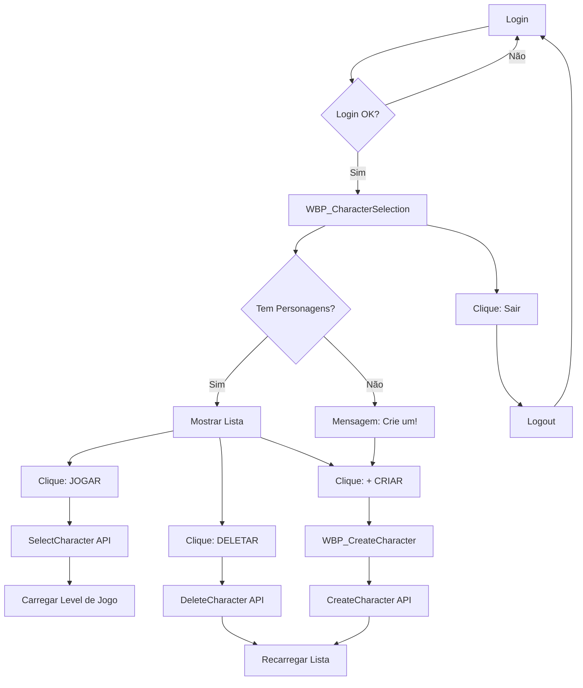

# ⚡ REFERÊNCIA RÁPIDA - SISTEMA DE PERSONAGENS UE5

**Acesso Rápido**: Use este guia para consultas rápidas durante desenvolvimento

---

## 📊 FLUXO COMPLETO



---

## 🎯 ARQUITETURA DE WIDGETS

```
┌─────────────────────────────────────────┐
│     WBP_CharacterSelection              │
│  ┌───────────────────────────────────┐  │
│  │  "SELECIONE SEU PERSONAGEM"       │  │
│  └───────────────────────────────────┘  │
│                                          │
│  ┌─────────────────────────────────┐    │
│  │ ScrollBox (VBox_CharacterList)  │    │
│  │  ┌──────────────────────────┐   │    │
│  │  │ WBP_CharacterItem #1     │   │    │
│  │  │ [TestHero] Lv.1          │   │    │
│  │  │ ❤100/100 🔵50/50         │   │    │
│  │  │ [▶JOGAR]  [🗑]           │   │    │
│  │  └──────────────────────────┘   │    │
│  │  ┌──────────────────────────┐   │    │
│  │  │ WBP_CharacterItem #2     │   │    │
│  │  └──────────────────────────┘   │    │
│  └─────────────────────────────────┘    │
│                                          │
│  [+ CRIAR PERSONAGEM]  [Sair]           │
│  Status: ...                             │
└─────────────────────────────────────────┘
```

---

## 🔗 API ENDPOINTS E FUNÇÕES C++

| **Ação UE5**          | **Função C++**                  | **API PHP**                           | **HTTP**  |
|-----------------------|---------------------------------|---------------------------------------|-----------|
| Listar personagens    | `LoadCharacterList()`           | `/api/character/list_characters.php`  | POST      |
| Criar personagem      | `CreateCharacter(name)`         | `/api/character/create_character.php` | POST      |
| Selecionar personagem | `SelectCharacter(player_id)`    | `/api/character/select_character.php` | POST      |
| Deletar personagem    | `DeleteCharacter(player_id)`    | `/api/character/delete_character.php` | POST      |
| Pegar lista atual     | `GetCharacterList()`            | N/A (cached)                          | N/A       |
| Pegar ativo           | `GetActiveCharacter()`          | N/A (cached)                          | N/A       |
| Verificar se tem ativo| `HasActiveCharacter()`          | N/A (cached)                          | N/A       |

---

## 📦 ESTRUTURA FUmbraPlayerData

```cpp
USTRUCT(BlueprintType)
struct FUmbraPlayerData
{
    GENERATED_BODY()

    // Identidade
    UPROPERTY(BlueprintReadWrite)
    int32 ID;                       // player_id no DB

    UPROPERTY(BlueprintReadWrite)
    FString CharacterName;          // character_name no DB

    // Progressão
    UPROPERTY(BlueprintReadWrite)
    int32 Level;                    // level no DB

    UPROPERTY(BlueprintReadWrite)
    int32 Experience;               // experience no DB

    // Localização
    UPROPERTY(BlueprintReadWrite)
    FString CurrentZone;            // current_zone no DB

    UPROPERTY(BlueprintReadWrite)
    FVector Position;               // pos_x, pos_y, pos_z no DB

    // Stats de Combate
    UPROPERTY(BlueprintReadWrite)
    int32 Health;                   // health no DB
    int32 MaxHealth;                // max_health no DB
    int32 Mana;                     // mana no DB
    int32 MaxMana;                  // max_mana no DB
    int32 Stamina;                  // stamina no DB
    int32 MaxStamina;               // max_stamina no DB

    // Atributos
    int32 Strength;                 // strength no DB
    int32 Dexterity;                // dexterity no DB
    int32 Intelligence;             // intelligence no DB
    int32 Vitality;                 // vitality no DB
};
```

---

## 🎨 TEMPLATE DE WIDGET HIERARCHY

### WBP_CharacterSelection

```
Canvas Panel
└─ Vertical Box (Fill)
    ├─ Text: TXT_Title
    ├─ Spacer (20)
    ├─ Scroll Box: ScrollBox_Characters
    │   └─ Vertical Box: VBox_CharacterList ← AQUI vão os WBP_CharacterItem
    ├─ Spacer (20)
    ├─ Horizontal Box
    │   ├─ Button: BTN_CreateNew
    │   └─ Button: BTN_Logout
    └─ Text: TXT_Status
```

### WBP_CharacterItem

```
Border (Card Style)
└─ Horizontal Box
    ├─ Vertical Box (Info)
    │   ├─ Text: TXT_Name
    │   ├─ Text: TXT_Level
    │   ├─ Text: TXT_Zone
    │   └─ Horizontal Box
    │       ├─ Text: TXT_Health
    │       ├─ Text: TXT_Mana
    │       └─ Text: TXT_Stamina
    └─ Horizontal Box (Actions)
        ├─ Button: BTN_Play
        └─ Button: BTN_Delete
```

### WBP_CreateCharacter

```
Canvas Panel
└─ Border (Overlay escuro)
    └─ Border (Painel central)
        └─ Vertical Box
            ├─ Text: "CRIAR PERSONAGEM"
            ├─ Horizontal Box
            │   ├─ Text: "Nome:"
            │   └─ Editable Text: TXT_Name
            ├─ Text: TXT_Validation
            └─ Horizontal Box
                ├─ Button: BTN_Create
                └─ Button: BTN_Cancel
```

---

## 🔧 CÓDIGO BLUEPRINT ESSENCIAL

### 1. Event Construct - WBP_CharacterSelection

```
Event Construct
├─ Get Game Instance → Cast to Umbra Game Instance → SET MyGameInstance
├─ Bind OnCharacterListLoaded → PopulateCharacterList
├─ Bind OnCharacterListFailed → Show Error
├─ Bind OnCharacterCreated → Reload List
├─ Bind OnCharacterSelected → Open Game Level
├─ Bind OnCharacterDeleted → Show Message
├─ Set Input Mode UI Only (Self)
├─ Set Show Mouse Cursor (TRUE)
└─ Load Character List (MyGameInstance)
```

### 2. PopulateCharacterList - Custom Function

```
PopulateCharacterList
├─ Clear Children (VBox_CharacterList)
├─ Get Character List (MyGameInstance) → Array
├─ For Each Loop:
│   ├─ Create Widget (WBP_CharacterItem)
│   ├─ SetCharacterData (Character)
│   └─ Add Child to Vertical Box (VBox_CharacterList)
└─ If Empty: Show "Nenhum personagem"
```

### 3. SetCharacterData - WBP_CharacterItem

```
SetCharacterData (Character: FUmbraPlayerData)
├─ SET CharacterData = Character
├─ Set Text: TXT_Name ← Character.CharacterName
├─ Set Text: TXT_Level ← "Level: {Character.Level}"
├─ Set Text: TXT_Zone ← "Zona: {Character.CurrentZone}"
├─ Set Text: TXT_Health ← "❤ {Character.Health}/{Character.MaxHealth}"
├─ Set Text: TXT_Mana ← "🔵 {Character.Mana}/{Character.MaxMana}"
└─ Set Text: TXT_Stamina ← "⚡ {Character.Stamina}/{Character.MaxStamina}"
```

### 4. BTN_Play OnClicked - WBP_CharacterItem

```
OnClicked (BTN_Play)
├─ GET CharacterData.ID
├─ GET MyGameInstance
└─ Select Character (MyGameInstance, CharacterData.ID)
```

### 5. BTN_CreateNew OnClicked - WBP_CharacterSelection

```
OnClicked (BTN_CreateNew)
├─ Create Widget (WBP_CreateCharacter)
└─ Add to Viewport (Z-Order: 999)
```

### 6. BTN_Create OnClicked - WBP_CreateCharacter

```
OnClicked (BTN_Create)
├─ Get Text (TXT_Name) → Trim
├─ Is Valid? (3-20 chars)
│   ├─ TRUE: Continue
│   └─ FALSE: Show Error
├─ GET MyGameInstance
├─ Create Character (MyGameInstance, Name)
└─ Set Enabled (BTN_Create, FALSE)
```

---

## 🧪 CHECKLIST DE VALIDAÇÃO

### ✅ C++ Compilado

```
[ ] UmbraDataStructures.h tem Experience, Health, Mana, Stamina, Strength, etc
[ ] UmbraGameInstance.cpp parseia stats em OnCharacterListRequestComplete
[ ] UmbraGameInstance.cpp parseia stats em OnCreateCharacterRequestComplete
[ ] UmbraGameInstance.cpp parseia stats em OnSelectCharacterRequestComplete
[ ] Projeto compila sem erros (Ctrl+Shift+B)
```

### ✅ Widgets Criados

```
[ ] WBP_CharacterSelection existe
[ ] WBP_CharacterItem existe
[ ] WBP_CreateCharacter existe
[ ] Todos compilam sem erros
```

### ✅ Event Graphs Implementados

```
[ ] CharacterSelection: Event Construct com 6 binds
[ ] CharacterSelection: PopulateCharacterList implementada
[ ] CharacterSelection: BTN_CreateNew OnClicked
[ ] CharacterSelection: BTN_Logout OnClicked
[ ] CharacterItem: SetCharacterData implementada
[ ] CharacterItem: BTN_Play OnClicked
[ ] CharacterItem: BTN_Delete OnClicked
[ ] CreateCharacter: Event Construct com 2 binds
[ ] CreateCharacter: TXT_Name OnTextChanged (validação)
[ ] CreateCharacter: BTN_Create OnClicked
[ ] CreateCharacter: BTN_Cancel OnClicked
```

### ✅ Integração

```
[ ] WBP_Login redireciona para WBP_CharacterSelection após login
[ ] APIs testadas em http://localhost/umbra_api/test_character.html
[ ] MySQL está rodando
[ ] WAMP está rodando
```

### ✅ Testes Funcionais

```
[ ] Login → Abre CharacterSelection
[ ] Lista vazia mostra mensagem
[ ] Criar personagem funciona
[ ] Personagem aparece na lista
[ ] Stats aparecem corretamente
[ ] Jogar funciona (abre level)
[ ] Deletar funciona (remove da lista)
[ ] Logout funciona (volta para login)
```

---

## 🆘 TROUBLESHOOTING RÁPIDO

| **Problema**                          | **Solução Rápida**                                          |
|---------------------------------------|-------------------------------------------------------------|
| Lista sempre vazia                    | Verifique binds no Event Construct                         |
| Stats aparecem 0                      | Implemente parse de stats no C++ (Fase 1)                  |
| "Widget to Focus error"               | Set Input Mode UI Only (Self), não TXT_Name                |
| Personagem não cria                   | Teste API diretamente: `test_character.html`                |
| Compile error C2039                   | Adicione campos faltantes em `FUmbraPlayerData`             |
| Widget não aparece                    | Add to Viewport com Z-Order alto (999)                      |
| OnClicked não funciona                | Verifique se widget `Is Variable` = TRUE                    |
| Delegates não disparam                | Verifique se `Bind Event` está no Event Construct          |
| "Cast failed"                         | Verifique se MyGameInstance está setado corretamente        |
| Personagem não deleta                 | Adicione Print String do PlayerID antes de Delete           |

---

## 📞 COMANDOS ÚTEIS

### Teste APIs via PowerShell

```powershell
# Listar personagens
$body = '{"account_id":4}'
Invoke-RestMethod -Uri "http://localhost/umbra_api/api/character/list_characters.php" -Method POST -Body $body -ContentType "application/json"

# Criar personagem
$body = '{"account_id":4,"character_name":"TestHero"}'
Invoke-RestMethod -Uri "http://localhost/umbra_api/api/character/create_character.php" -Method POST -Body $body -ContentType "application/json"

# Selecionar personagem (ID: 1)
$body = '{"account_id":4,"player_id":1}'
Invoke-RestMethod -Uri "http://localhost/umbra_api/api/character/select_character.php" -Method POST -Body $body -ContentType "application/json"

# Deletar personagem (ID: 1)
$body = '{"account_id":4,"player_id":1}'
Invoke-RestMethod -Uri "http://localhost/umbra_api/api/character/delete_character.php" -Method POST -Body $body -ContentType "application/json"
```

### Debug Logs

Adicione nos Event Graphs:

```
Print String: "DEBUG: PopulateCharacterList chamada"
Print String: "DEBUG: CharacterList Length = {Length}"
Print String: "DEBUG: Creating character: {Name}"
Print String: "DEBUG: Selecting ID: {ID}"
```

---

## 🎯 PRÓXIMAS MELHORIAS

Após o básico funcionar:

1. **Sistema de Confirmação**
   - Widget genérico de diálogo
   - Confirmação antes de deletar

2. **Animações**
   - Fade in/out nos widgets
   - Hover effects nos botões
   - Transições suaves

3. **Customização de Personagem**
   - Escolher classe inicial
   - Escolher aparência
   - Preview 3D do personagem

4. **Melhorias de UX**
   - Loading indicators
   - Progress bars para XP
   - Tooltips nos stats
   - Cooldowns nos botões

5. **Sistema de Classes**
   - Warrior, Mage, Rogue
   - Stats iniciais diferentes
   - Skills específicas

6. **Persistência Avançada**
   - Inventário
   - Quests completadas
   - Achievements
   - Friends list

---

## 📚 ARQUIVOS DE REFERÊNCIA

```
D:\UmbraServerV2\
├─ UmbraServer\
│  ├─ INTEGRACAO_COMPLETA_PERSONAGENS_UE5.md  ← Guia detalhado passo a passo
│  ├─ REFERENCIA_RAPIDA_PERSONAGENS.md        ← ESTE ARQUIVO (referência rápida)
│  ├─ SISTEMA_PERSONAGENS.md                   ← Documentação técnica das APIs
│  └─ GUIA_WIDGETS_PERSONAGENS_UE5.md          ← Guia de widgets (antigo)
│
├─ UmbraEternumUE\Source\UmbraEternumUE\
│  ├─ Data\UmbraDataStructures.h               ← Structs (FUmbraPlayerData)
│  └─ Core\
│     ├─ UmbraGameInstance.h                   ← Declarações de funções
│     └─ UmbraGameInstance.cpp                 ← Implementação da lógica
│
└─ www\umbra_api\
   ├─ test_character.html                      ← Interface de teste web
   └─ api\character\
      ├─ list_characters.php                   ← GET lista
      ├─ create_character.php                  ← POST criar
      ├─ select_character.php                  ← POST selecionar
      └─ delete_character.php                  ← POST deletar
```

---

## 🔥 ATALHOS DO EDITOR

### Unreal Engine

| **Ação**                  | **Atalho**        |
|---------------------------|-------------------|
| Compilar Widget           | `F7`              |
| Play (PIE)                | `Alt + P`         |
| Stop PIE                  | `Esc`             |
| Abrir Blueprint           | `Ctrl + B`        |
| Buscar em Blueprints      | `Ctrl + F`        |
| Salvar tudo               | `Ctrl + Shift + S`|

### Visual Studio (C++)

| **Ação**                  | **Atalho**          |
|---------------------------|---------------------|
| Build Solution            | `Ctrl + Shift + B`  |
| Rebuild                   | `Ctrl + Alt + F7`   |
| Go to Definition          | `F12`               |
| Find in Files             | `Ctrl + Shift + F`  |
| Comment/Uncomment         | `Ctrl + K, C / U`   |

---

**🎮 REFERÊNCIA PRONTA PARA USO!**

Mantenha este arquivo aberto durante o desenvolvimento para consultas rápidas.

