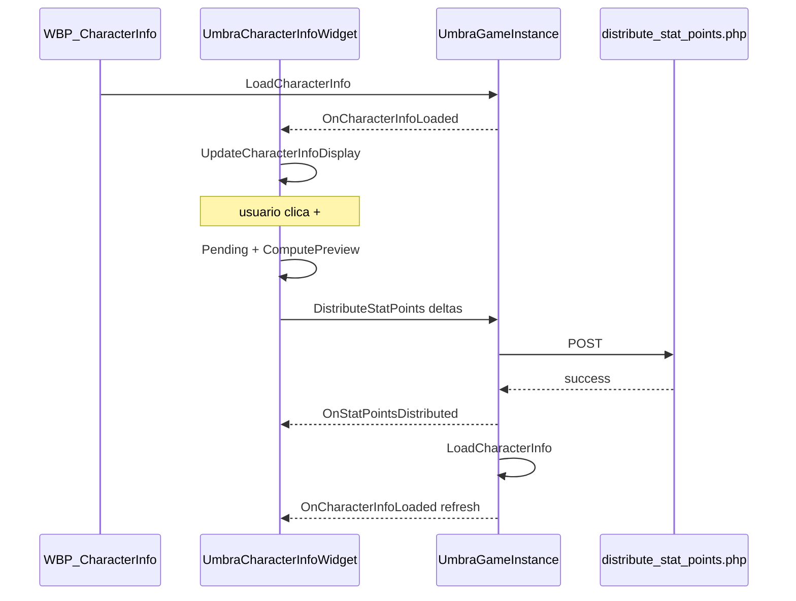

# Guia completo: Pontos de status, preview e tooltips — Character Info (UE 5.6.1)

## Objetivo

Integrar no `WBP_CharacterInfo`:

- **Alocação de pontos** de atributo (STR, DEX, INT, VIT, LUCK) com preview local dos stats derivados
- **Tooltips** ao passar o mouse sobre cada linha do Status Panel
- **Lógica em C++** (`UUmbraCharacterInfoWidget`), com Blueprint apenas para layout e nomes `BindWidget`

**Asset:** `/Game/Widgets/UI/CharacterInfo/WBP_CharacterInfo`

---

## O que já está implementado (código)

### C++ (cliente UE)

| Arquivo | Descrição |
|---------|-----------|
| `UmbraEternumUE/Source/.../UI/Character/UmbraCharacterStatTypes.h` | `EUmbraCharacterStatId`, `FUmbraPendingStatAllocation`, `FUmbraCharacterStatPreview` |
| `UmbraEternumUE/Source/.../UI/Character/UmbraStatCalculator.h/.cpp` | Fórmulas (espelho do PHP), preview, formatação de números |
| `UmbraEternumUE/Source/.../UI/Character/UmbraStatTooltipWidget.h/.cpp` | Widget de tooltip (`WBP_StatTooltip`) |
| `UmbraEternumUE/Source/.../UI/Character/UmbraCharacterInfoWidget.h/.cpp` | Pai do `WBP_CharacterInfo` |

### GameInstance

| Item | Descrição |
|------|-----------|
| `DistributeStatPoints(...)` | POST `/api/character/distribute_stat_points.php` |
| `OnStatPointsDistributed` | Sucesso + `remaining_points` |
| `OnStatPointsDistributionFailed` | Erro da API |
| `OnCharacterInfoLoaded` | Refresh automático após Apply |

### PHP

| Item | Descrição |
|------|-----------|
| `get_character_info.php` | Stats calculados + `stat_points` |
| `distribute_stat_points.php` | Corrigido: usa `getConnection()` |
| `character_info_helper.php` | Fórmulas autoritativas de atributos → combate |

---

## Arquitetura

```
WBP_CharacterInfo (herda UmbraCharacterInfoWidget)
├── Header: Text_Name, Text_Level, Text_EXP, ProgressBar_EXP, Btn_Close
├── Equipamentos: EquipmentSlots + RefreshEquipmentSlots (BP)
├── Character: Text_Class, Text_Faction, ...
└── Status Panel (HB_MAINCONTENT_1)
    ├── Coluna 1 (VB_StatusPanel): primários + HP/Mana + tooltips em Border_*
    ├── Coluna 2 (VB_Combat1): Phys/Mag Atk/Def
    └── Coluna 3 (VB_Combat2): Crit, Double, Accuracy, Dodge, Move Speed

Toolbar (você cria): Text_UnspentPoints, Btn_Apply, Btn_Reset
Botões +/- (você cria): Btn_Plus_Strength, Btn_Minus_Strength, ...
```

### Fluxo de dados



---

## Fórmulas (servidor = preview no cliente)

Implementadas em `www/umbra_api/helpers/character_info_helper.php` e replicadas em `UUmbraStatCalculator`.

### Por atributo primário

| Atributo | A cada 5 | A cada 10 |
|----------|----------|-----------|
| **Strength** | +2 Phys. Atk | +1 Crit, +1 Double Atk |
| **Dexterity** | +1 Accuracy | +1 Phys. Atk, +1 Dodge |
| **Intelligence** | +2 Mag. Atk | +1 Crit, +30 Mana |
| **Vitality** | +1 Crit. Res | +1 Double Res, +30 HP |

### Ganhos por nível (no payload da API)

- HP/MP máx: `nível × 20`
- Phys/Mag Atk: `nível × 5`
- Phys/Mag Def: `nível × 3`
- Pontos livres: **10 por nível** (`player_levels.stat_points_gained`) — creditados no DB quando o sistema de level-up aplicar

### Formato na UI

| Tipo | Exemplo |
|------|---------|
| Primário | `Strength 20/280` (pontos investidos / total com preview) |
| HP/Mana | `Health 150/4.612` |
| Combate | `Phys. Atk 1.113` |

---

## PARTE 1: Compilar o C++

1. Feche o Unreal Editor (recomendado).
2. Compile o projeto `UmbraEternumUE` (Visual Studio → Build Solution).
3. Abra o editor e confirme que não há erros de módulo `UmbraEternumUE`.

---

## PARTE 2: Criar `WBP_StatTooltip`

1. **Content Browser** → `Content/Widgets/UI/CharacterInfo/`
2. Clique direito → **User Interface** → **Widget Blueprint**
3. Nome: `WBP_StatTooltip`
4. **Class Settings** → Parent Class: **`UmbraStatTooltipWidget`**
5. No **Designer**, crie:

| Nome exato | Tipo | Obrigatório |
|------------|------|-------------|
| `TitleText` | Text Block | Sim |
| `DescriptionText` | Text Block | Sim |
| `FormulaText` | Text Block | Opcional (primários) |

6. Ajuste visual (fundo, borda, fonte) — textos vêm do C++.
7. **Compile** e **Save**.

---

## PARTE 3: Reparentar `WBP_CharacterInfo`

1. Abra `WBP_CharacterInfo`.
2. **Class Settings** → Parent Class: **`UmbraCharacterInfoWidget`**
3. **Compile** — deve compilar sem erro (todos os binds são `Optional`).
4. **Class Defaults** (ícone de classe no Blueprint):
   - **Stat Tooltip Class** → `WBP_StatTooltip`

---

## PARTE 4: Toolbar de alocação (Designer)

No **Hierarchy**, localize:

`Border_1529` → `VerticalBox_110`

### 4.1 Criar barra de pontos

1. Selecione `VerticalBox_110`.
2. Adicione um **Horizontal Box** como **primeiro filho** (acima de `HorizontalBox_1` / título "Status Panel").
3. Nome: **`HB_AllocatorToolbar`**
4. Dentro de `HB_AllocatorToolbar`, adicione:

| Nome exato | Tipo | Texto padrão |
|------------|------|--------------|
| `Text_UnspentPoints` | Text Block | `Pontos disponiveis: 0` |
| `Btn_Apply` | Button | `Aplicar` |
| `Btn_Reset` | Button | `Resetar` |

5. **Is Variable** = marcado em cada um (recomendado).
6. Deixe a toolbar **Collapsed** ou **Hidden** até ter `unspent_points > 0` — o C++ controla visibilidade em modo inspeção.

---

## PARTE 5: Botões +/- nos atributos primários

Em cada linha de `VB_StatusPanel`, adicione botões ao **Horizontal Box** da linha (ícone + texto).

### Nomes obrigatórios (BindWidget)

| Stat | Botão + | Botão − |
|------|---------|---------|
| Strength | `Btn_Plus_Strength` | `Btn_Minus_Strength` |
| Dexterity | `Btn_Plus_Dexterity` | `Btn_Minus_Dexterity` |
| Intelligence | `Btn_Plus_Intelligence` | `Btn_Minus_Intelligence` |
| Vitality | `Btn_Plus_Vitality` | `Btn_Minus_Vitality` |
| Luck | `Btn_Plus_Luck` | `Btn_Minus_Luck` |

**Sugestão de layout:** no `HB_Strength`, após `Text_Strength`, adicione dois botões pequenos `+` e `−`. Repita para as outras linhas.

**Containers já vazios (opcional para HP/Mana):**

- `VerticalBox_240` (linha Health)
- `VerticalBox_403` (linha Mana)

Hoje a alocação via API é só nos **5 primários**; HP/Mana são derivados de VIT/INT.

---

## PARTE 6: Mapeamento de widgets existentes (já no seu BP)

Estes **já existem** — o C++ atualiza automaticamente se os nomes forem mantidos:

### Header

- `Text_Name`, `Text_Level`, `Text_EXP`, `ProgressBar_EXP`, `Btn_Close`

### Character / PvP

- `Text_Class`, `Text_Faction`, `Text_Guild`, `Text_Title`, `Text_PVP`, `Text_Caos`, `Text_Honor`

### Equipamentos

- `EquipmentSlots` (`UniformGridPanel`)

### Status Panel — Coluna 1

- `Text_Strength`, `Text_Dexterity`, `Text_Intelligence`, `Text_Vitality`, `Text_Luck`, `Text_Health`, `Text_Mana`

### Coluna 2

- `Text_PhysAtk`, `Text_MagAtk`, `Text_PhysDef`, `Text_MagDef`

### Coluna 3

- `Text_CritRate`, `Text_DoubleRate`, `Text_CritRes`, `Text_DoubleRes`, `Text_Accuracy`, `Text_Dodge`, `Text_MoveSpeed`

### Tooltips (hover na linha inteira)

O C++ usa `GetWidgetFromName` nos borders — **não renomeie**:

`Border_685`, `Border_5`, `Border_6`, `Border_7`, `Border_8`, `Border_9`, `Border_10`,  
`Border_12`, `Border_13`, `Border_14`, `Border_11`,  
`Border_1713`, `Border_15`, `Border_16`, `Border_17`, `Border_19`, `Border_18`, `Border_20`

---

## PARTE 7: Event Graph (migração do Blueprint)

### 7.1 O que o C++ já faz sozinho

No `NativeConstruct`, o widget registra:

- `OnCharacterInfoLoaded` → `UpdateCharacterInfoDisplay` (personagem ativo)
- `OnStatPointsDistributed` / `OnStatPointsDistributionFailed`
- Cliques em `Btn_Apply`, `Btn_Reset`, `Btn_Plus_*`, `Btn_Minus_*`
- Tooltips nos `Border_*`

### 7.2 Personagem próprio (tecla C)

**Opção A — mínima (recomendada):**

No **Event Construct** do `WBP_CharacterInfo`:

```
Event Construct
  → Get Game Instance → Cast to UmbraGameInstance
  → Load Character Info
```

Remova do BP os nós que preenchem `Text_Strength`, `Text_PhysAtk`, etc. (o C++ faz isso em `UpdateCharacterInfoDisplay`).

**Opção B — manter BP em paralelo (teste):**

Deixe `Update Character Info Display` no BP temporariamente. Se valores “piscarem”, remova a lógica duplicada do BP.

### 7.3 Inspeção de outro jogador

A função BP **`Update Inspected Player Info`** pode ser simplificada para:

```
[Update Inspected Player Info]
  Input: PlayerInfo
  → Update Inspected Player Info (C++ — mesma função no pai)
```

Ou chame diretamente no HUD após `Create Widget`:

```
On Player Inspected Manual
  → Create Widget WBP_CharacterInfo
  → Update Inspected Player Info (PlayerInfo)
  → Add to Viewport
```

Variável BP: **`InspectedPlayerInfo`** (`FUmbraCharacterInfo`) — o C++ mantém cópia interna e ativa modo somente leitura.

### 7.4 Equipamentos

Implemente o evento **`Refresh Equipment Slots`** no Blueprint (já existia):

- Input: `Character Info`
- Atualize `EquipmentSlots` com `Get Equipped Items Array` / slots `WBP_EquipmentSlot`
- Em inspeção, use `InspectedPlayerInfo` (ou o parâmetro `CharacterInfo` da função)

O C++ chama `RefreshEquipmentSlots` ao final de `UpdateCharacterInfoDisplay`.

### 7.5 Fechar janela

`Btn_Close` pode continuar no BP (`Remove from Parent`). O C++ não precisa interceptar.

Ao fechar após inspeção, chame **`Clear Inspect Mode`** (C++) se for reabrir o personagem local na mesma instância.

---

## PARTE 8: API e banco de dados

### 8.1 Distribuir pontos

**POST** `/umbra_api/api/character/distribute_stat_points.php`

```json
{
  "token": "jwt...",
  "player_id": 1,
  "strength_points": 2,
  "dexterity_points": 0,
  "intelligence_points": 0,
  "vitality_points": 0,
  "luck_points": 0
}
```

Valores são **incrementos** (deltas), não o total absoluto.

O campo **`player_id`** no body é recomendado (mesmo padrão de `get_character_info.php`): o cliente UE envia `ActivePlayerID` para garantir que a gravação vá ao personagem correto, mesmo se o JWT estiver desatualizado.

### 8.2 Testar com pontos no MySQL

```sql
UPDATE player_stat_points
SET unspent_points = 10
WHERE player_id = SEU_PLAYER_ID;
```

### 8.3 Teste via curl

```bash
curl -X POST http://localhost/umbra_api/api/character/distribute_stat_points.php \
  -H "Content-Type: application/json" \
  -d "{\"token\":\"SEU_JWT\",\"player_id\":1,\"strength_points\":10,\"dexterity_points\":0,\"intelligence_points\":0,\"vitality_points\":0,\"luck_points\":0}"
```

Após sucesso, confira no MySQL:

```sql
SELECT player_id, unspent_points, strength_points
FROM player_stat_points WHERE player_id = 1;
```

---

### 8.4 Formato dos textos primários (`Strength 20/355`)

| Parte | Significado | Origem |
|-------|-------------|--------|
| **Numerador** (ex.: 20) | Base da classe + pontos já distribuídos + pendentes (preview local) | `BaseStrength` + `stat_points.strength_points` + `PendingStrength` |
| **Denominador** (ex.: 355) | Total do atributo com equipamento (e preview de + pendentes) | `stats.total.strength` + preview |

**Não confundir** com “só pontos investidos”: antes da correção, DEX/INT apareciam como `0/329` porque o numerador era apenas `dexterity_points` do banco (0), ignorando a base da classe.

### 8.5 De onde vêm os “90 pontos disponíveis”

Exemplo: você definiu `unspent_points = 100` no MySQL e clicou **+** em Força **10 vezes** sem aplicar:

| Etapa | Valor | Onde |
|-------|-------|------|
| Banco | 100 | `player_stat_points.unspent_points` |
| Cliente após `LoadCharacterInfo` | 100 | `CachedCharacterInfo.StatPoints.UnspentPoints` |
| Pré-alocação local | −10 | `PendingAllocation.PendingStrength` (só RAM) |
| Toolbar **“Pontos disponiveis: 90”** | 100 − 10 | `GetAvailableUnspentPoints()` |

Os **90 não vêm do MySQL** — são o saldo local antes do **Apply**. Se o banco continua `100/0` em força após clicar Apply, a API não gravou (ver logs e curl acima).

---

## PARTE 9: Checklist de validação

### Compilação e editor

- [ ] Projeto C++ compila sem erros
- [ ] `WBP_CharacterInfo` parent = `UmbraCharacterInfoWidget`
- [ ] `WBP_StatTooltip` parent = `UmbraStatTooltipWidget`
- [ ] Class Defaults → Stat Tooltip Class = `WBP_StatTooltip`

### UI

- [ ] `HB_AllocatorToolbar` com `Text_UnspentPoints`, `Btn_Apply`, `Btn_Reset`
- [ ] 10 botões +/- (5 pares) com nomes exatos
- [ ] Nomes dos `Text_*` e `Border_*` preservados

### Gameplay

- [ ] Abrir com **C** → stats preenchidos
- [ ] `unspent_points > 0` → toolbar visível
- [ ] **+** → preview em Phys. Atk, Crit, HP max, etc.
- [ ] **Aplicar** → API OK → stats batem com servidor após refresh
- [ ] **Resetar** → volta ao estado antes dos cliques +
- [ ] **Inspecionar** outro jogador → sem toolbar e sem +
- [ ] Hover em **Strength** → tooltip com título, descrição e fórmula

### Logs (Output Log)

- Sucesso: `[UmbraGameInstance] ✅ Pontos distribuídos...` e `Distribuindo pontos (player_id=N)...`
- Falha: `[CharacterInfoWidget] Falha ao distribuir pontos: ...`
- Bind ausente: `[CharacterInfoWidget] Btn_Apply nao encontrado...`

### Feedback na toolbar

- Durante Apply: `Text_UnspentPoints` mostra **“Salvando pontos...”** (botões desabilitados)
- Erro: texto vermelho `Erro: ...`
- Sucesso: texto verde breve antes do `LoadCharacterInfo` atualizar

### Apply não salva — diagnóstico rápido

| Sintoma ao clicar Apply | Significado |
|-------------------------|-------------|
| Texto **não** muda para `Salvando pontos...` | `OnClicked`/`OnPressed` C++ **não disparou** — recompile; confira hit-test nos pais da toolbar |
| Aparece `Salvando...` e trava 15s | Timeout — API/rede; ver log `Distribuindo pontos` e resposta HTTP |
| `Erro: ...` vermelho | API respondeu falha — ler mensagem completa no `Text_UnspentPoints` |

**Output Log esperado ao clicar Apply:**

```
[CharacterInfoWidget] Btn_Apply OnClicked
[CharacterInfoWidget] Apply clicado — pending=...
[UmbraGameInstance] Distribuindo pontos (player_id=...)
```

**Rede de segurança no BP (opcional):** `Btn_Apply` → **OnClicked** → **Apply Pending Stat Points** (função C++ em Category Character Info|Stat Points).

O C++ registra **OnClicked** e **OnPressed** em `NativeOnInitialized` + `NativeConstruct`, com `RemoveDynamic` antes de `AddDynamic`.

---

## PARTE 10: Solução de problemas

### Mensagens "An opção widget associação X está disponível"

**Não são erros.** O compilador de Blueprint informa que existem widgets opcionais no C++ (`BindWidgetOptional`) que você pode associar em **Class Settings → Widget Bindings** (opcional). Se os widgets já existem no Designer com o **mesmo nome**, ignore essas linhas.

### "InspectedPlayerInfo / Text_Name não é visível para Blueprints"

O Event Graph legado do `WBP_CharacterInfo` ainda faz **Get/Set** em propriedades do pai C++.

**Correção (já no código):** `InspectedPlayerInfo` está com `BlueprintReadWrite`; widgets `Text_*` / `EquipmentSlots` com `BlueprintReadOnly`.

**Após atualizar o C++:**

1. Feche o Unreal Editor.
2. Recompile o projeto (Visual Studio).
3. Reabra o editor e **Compile** o `WBP_CharacterInfo`.

**No Blueprint (recomendado a médio prazo):**

- Remova nós **Set Text** em `Text_Strength`, `Text_PhysAtk`, etc. — o C++ preenche em `UpdateCharacterInfoDisplay`.
- Em **Update Inspected Player Info**, use só: `Set InspectedPlayerInfo` → `Update Inspected Player Info` (função C++) **ou** `Update Character Info Display` com o struct.
- Se existir **variável BP duplicada** `InspectedPlayerInfo`, apague-a e use a do pai C++ (`InspectedPlayerInfo` em Category Character Info|Inspect).

| Problema | Causa provável | Solução |
|----------|----------------|---------|
| Widget não abre após reparent | Erro de compilação C++ | Ver Output Log / VS; recompile |
| Stats não atualizam | BP ainda sobrescreve textos | Remover `Set Text` duplicados no BP |
| Tooltips não aparecem | `StatTooltipClass` vazio ou `WBP_StatTooltip` sem `TitleText` | Class Defaults + nomes BindWidget |
| +/- não respondem | Botões sem nome exato | Conferir `Btn_Plus_Strength`, etc. |
| Apply não faz nada (texto não vira Salvar) | `OnClicked` C++ não ligado ou hit-test | Log `Apply clicado`; recompile; opcional BP → `Apply Pending Stat Points` |
| Apply mostra Salvar mas DB não muda | API/HTTP | Log `Distribuindo pontos`; curl §8.3; MySQL `player_stat_points` |
| Stats primários `0/total` | Numerador antigo (só pontos distribuídos) | Recompilar C++; numerador = base + distribuídos + pending |
| "Pontos insuficientes" | Pending > unspent | Resetar ou reduzir cliques + |
| Preview diferente do servidor | Equipamento mudou / arredondamento | Após Apply, `LoadCharacterInfo` é fonte da verdade |
| Inspeção permite editar | `Update Inspected Player Info` não chamado | HUD deve chamar função C++ ou BP que seta inspeção |

---

## PARTE 11: Funções C++ expostas ao Blueprint

| Função | Uso |
|--------|-----|
| `UpdateCharacterInfoDisplay(CharacterInfo)` | Atualiza toda a UI de stats |
| `UpdateInspectedPlayerInfo(PlayerInfo)` | Modo inspeção + refresh |
| `ClearInspectMode()` | Volta ao personagem local |
| `IsInspectMode()` | Branch no BP |
| `GetDisplayedCharacterInfo()` | Leitura do cache |
| `ApplyPendingStatPoints()` | POST dos pontos pendentes (ligar em `Btn_Apply` OnClicked se necessário) |

| Library | Uso |
|---------|-----|
| `UUmbraStatCalculator::ComputePreview` | Preview customizado no BP |
| `UUmbraStatCalculator::FormatStatNumber` | Formatar números |

---

## Referências no repositório

| Documento / arquivo | Conteúdo |
|---------------------|----------|
| `UmbraServer/docs_main/GUIA_COMPLETO_CHARACTER_INFO.md` | Widget base Character Info |
| `UmbraServer/docs_main/PROCEDIMENTO_WBP_INSPECT_CHARACTERINFO.md` | Inspeção de jogadores |
| `UmbraServer/docs_main/RESUMO_IMPLEMENTACAO_SISTEMA_PONTOS.md` | Fórmulas e tabela `player_stat_points` |
| `www/umbra_api/helpers/character_info_helper.php` | Cálculo autoritativo |
| `AGENTS.md` | Regras de agente e fluxos do projeto |

---

## Resumo executivo

1. **Compile** o C++ e **reparente** `WBP_CharacterInfo` → `UmbraCharacterInfoWidget`.
2. Crie **`WBP_StatTooltip`** e assign em Class Defaults.
3. Adicione **toolbar** e botões **+/-** com os nomes exatos do guia.
4. **Enxugue** o Event Graph do BP (deixe equipamentos e fechar no BP; stats no C++).
5. Teste com **`unspent_points`** no MySQL e valide preview + Apply + inspeção.

Com isso, o Status Panel passa a ter alocação de pontos com preview, tooltips explicativos e persistência via API, mantendo o layout visual que você já construiu no Designer.
