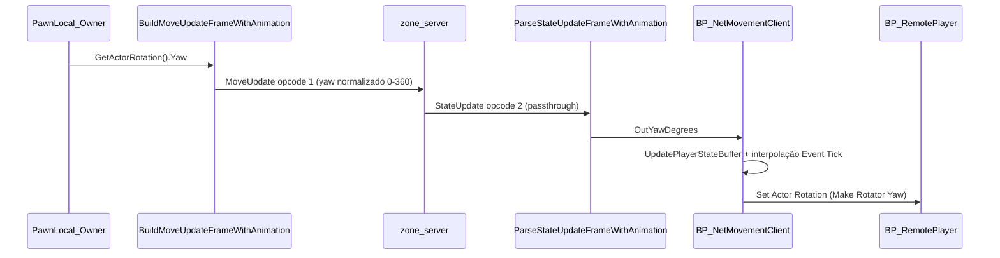

# Guia: Yaw e rotação de remote players

Documentação do fluxo de rotação na rede e como diagnosticar animação "de costas" / "de lado" no observador.

**Status (2026-08):** fix C++ de yaw aplicado (`360 - Yaw` removido). Mesh remote Yaw=-90. **Velocity remota:** Δposição/Δt — [`docs_main/GUIA_BP_REMOTE_LOCOMOTION_VELOCITY_UE561.md`](../../docs_main/GUIA_BP_REMOTE_LOCOMOTION_VELOCITY_UE561.md). Yaw BP: [`docs_main/GUIA_BP_APLICAR_YAW_REMOTE_UE561.md`](../../docs_main/GUIA_BP_APLICAR_YAW_REMOTE_UE561.md). Should Move: [`docs_main/GUIA_BP_ABP_SHOULD_MOVE_REMOTE_UE561.md`](../../docs_main/GUIA_BP_ABP_SHOULD_MOVE_REMOTE_UE561.md).

---

## Contrato canônico

1. Unidade: graus Unreal (`ActorRotation.Yaw`), wire normalizado `[0, 360)`.
2. Owner envia `GetActorRotation().Yaw` — **nunca** `GetControlRotation`.
3. Zone: passthrough (não recalcula yaw de players).
4. Observador: `OutYawDegrees` = wire; `SetActorRotation` no root; interpolar shortest-path.
5. **Proibido** no encode/decode: `360 - Yaw`, `Yaw + 180`, `±90`.

---

## Fluxo owner → wire → observador

### Onde cada peça vive

| Etapa | Arquivo / asset |
|-------|-----------------|
| Envio (owner) | [`WSBinaryBPFL.cpp`](../../UmbraEternumUE/Source/UmbraEternumUE/Network/WSBinaryBPFL.cpp) — `BuildMoveUpdateFrameWithAnimation` |
| Relay | [`MovementServer.hpp`](../../src/zone/MovementServer.hpp) — broadcast `StateUpdate` via AOI |
| Parse (observador) | `WSBinaryBPFL.cpp` — `ParseStateUpdateFrameWithAnimation` |
| Roteamento WS | [`NetMovementClient.cpp`](../../UmbraEternumUE/Source/UmbraEternumUE/Network/NetMovementClient.cpp) → repassa bytes ao Blueprint |
| **Aplicação yaw (BP)** | **`BP_NetMovementClient`** — Custom Event `ProcessNextFrame` + Event Tick |
| Actor remoto | **`BP_RemotePlayer`** (parent `UmbraEternumUECharacter`) |

---

## Correção aplicada (C++)

### Problema

`BuildMoveUpdateFrame` / `WithAnimation` espelhavam o yaw com `360 - YawDegrees`; o parse usava o valor direto → remote de costas / face errada no observador.

### Fix no Source (já no tree)

- Removida a inversão `360 - Yaw` no envio; yaw normalizado `[0, 360)`.
- Parse e `UpdatePlayerStateBuffer` normalizam sem offset.
- `InterpolateNetworkYawDegrees` + `ApplyInterpolatedNetworkYawToActor` (BlueprintPure/Callable).
- Logs: `[YawSend]`, `[YawRecv]`.
- `AUmbraEternumUECharacter::BeginPlay`: se `!IsLocallyControlled()`, desliga `bOrientRotationToMovement` / controller rotation.
- `ANetMovementClient::RegisterRemoteActorInGameInstance`: reforça o mesmo no CMC do remote.

### BP (obrigatório após rebuild)

Passo a passo: [`GUIA_BP_APLICAR_YAW_REMOTE_UE561.md`](../../docs_main/GUIA_BP_APLICAR_YAW_REMOTE_UE561.md).

Script opcional (defaults CMC do `BP_RemotePlayer`):

`UmbraEternumUE/scripts/apply_remote_yaw_defaults.py` — executar no Editor via `py "..."`.

---

## Substituição nó a nó do `Lerp (Float)` por `InterpolateNetworkYawDegrees`

Contexto: no Event Tick de `BP_NetMovementClient`, há um `Lerp (Float)` que recebe `StateA_Yaw`, `StateB_Yaw` e `ClampedAlpha` → `InterpolatedYaw`.

### Passo 1 — Localizar o nó atual

1. Abra `BP_NetMovementClient` → Event Graph → **Event Tick** (`For Each Loop` sobre `RemoteStates`).
2. Encontre o `Lerp` com `A`=`StateA_Yaw`, `B`=`StateB_Yaw`, `Alpha`=`ClampedAlpha`.

### Passo 2 — Inserir helper C++

**Opção A:** `Apply Interpolated Network Yaw To Actor` (Target=`RemoteActorRef`, From/To/Alpha iguais ao Lerp) — substitui Lerp + Make Rotator + Set Actor Rotation.

**Opção B:** `Interpolate Network Yaw Degrees` → `Make Rotator(Yaw=...)` → `Set Actor Rotation`.

### Passo 3 — Remover offsets

No `Make Rotator` / graph: **sem** `+90`, `+180`, `360-Yaw`.

### Passo 4 — Compile + Save

A função só aparece após rebuild C++ do `UmbraEternumUE`.

---

## Checklist se a rotação continuar errada

### A) Binário C++

Filtro: `YawSend` / `YawRecv`. Esperado: `YawReal ≈ WireYaw ≈ OutYaw` (90→90, **não** 270).

### B) CMC do remote

Log: `Remote pawn detectado` ou `Remote pawn CMC locked`. Se `InterpYaw` correto mas `ActorYaw` não muda → CMC ainda reorientando (defaults BP / BeginPlay).

### C) Fonte do yaw no owner

Send deve usar `GetActorRotation`, não `GetControlRotation`.

### D) Spawn

`Make Transform` com `Yaw = OutYawDegrees` no primeiro frame.

### E) AnimBP

`Calculate Direction(Velocity, GetActorRotation)` — não `GetControlRotation`.

---

## Como testar (PIE 2 clients)

Filtro Output Log: `YawSend` OR `YawRecv` OR `Remote pawn`

| Janela | Ação | Esperado |
|--------|------|----------|
| Owner | Girar 360° | `YawReal ≈ WireYaw` (sem espelhamento) |
| Observador | Ver remote | `OutYaw` ≈ `YawSend` do owner |
| Observador | Owner anda pra frente | Animação forward (não backward) |
| Observador | Owner gira | Remote gira no **mesmo sentido** |

Se o owner local ficar invertido após o fix, **não** reintroduzir `360 - Yaw` no C++ — corrigir só mesh relative / BP do remote.

---

## Docs obsoletas (não reaplicar)

| Doc | Motivo |
|-----|--------|
| [`CORRECAO_YAW_180_GRAUS_APLICADA.md`](CORRECAO_YAW_180_GRAUS_APLICADA.md) | Offset +180 no parse — conflita com contrato canônico |
| [`CORRECAO_YAW_ANIMACAO_DIRECAO.md`](CORRECAO_YAW_ANIMACAO_DIRECAO.md) | `Yaw - 180` / sugestões ±90 — obsoleto |
| [`CORRECAO_DIRECAO_INCORRETA_OFFSET_90_GRAUS.md`](CORRECAO_DIRECAO_INCORRETA_OFFSET_90_GRAUS.md) | Offset ±90 no BP — não usar no wire |

Causa raiz correta: remover espelho `360 - Yaw` + CMC remote + interpolação shortest-path.

---

## Warning C4100 (servidor, cosmético)

`broadcastToNearby` em [`MovementServer.hpp`](../../src/zone/MovementServer.hpp) — parâmetros de posição removidos; sem impacto em rotação ou AOI.

---

## Referências

- [`GUIA_BP_APLICAR_YAW_REMOTE_UE561.md`](../../docs_main/GUIA_BP_APLICAR_YAW_REMOTE_UE561.md)
- [`PROCEDIMENTO_MOVIMENTO_WEBSOCKET_BINARIO.md`](../../docs_main/PROCEDIMENTO_MOVIMENTO_WEBSOCKET_BINARIO.md)
- [`ANALISE_XML_IMPLEMENTACAO.md`](../../docs_main/ANALISE_XML_IMPLEMENTACAO.md)
