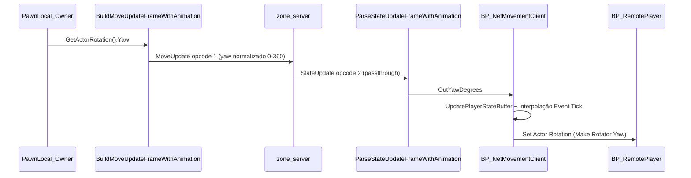

# Guia: Yaw e rotação de remote players

Documentação do fluxo de rotação na rede e como diagnosticar animação "de costas" / "de lado" no observador.

---

## Fluxo owner → wire → observador



### Onde cada peça vive

| Etapa | Arquivo / asset |
|-------|-----------------|
| Envio (owner) | [`WSBinaryBPFL.cpp`](../../UmbraEternumUE/Source/UmbraEternumUE/Network/WSBinaryBPFL.cpp) — `BuildMoveUpdateFrameWithAnimation` |
| Relay | [`MovementServer.hpp`](../../src/zone/MovementServer.hpp) — broadcast `StateUpdate` via AOI |
| Parse (observador) | `WSBinaryBPFL.cpp` — `ParseStateUpdateFrameWithAnimation` |
| Roteamento WS | [`NetMovementClient.cpp`](../../UmbraEternumUE/Source/UmbraEternumUE/Network/NetMovementClient.cpp) → repassa bytes ao Blueprint |
| **Aplicação yaw (BP)** | **`BP_NetMovementClient`** — Custom Event `ProcessNextFrame` |
| Actor remoto | **`BP_RemotePlayer`** — spawn + `Set Actor Rotation` no Event Tick |

### Nós Blueprint relevantes (`BP_NetMovementClient`)

Conforme [`docs_main/ANALISE_XML_IMPLEMENTACAO.md`](../../docs_main/ANALISE_XML_IMPLEMENTACAO.md) e [`docs_main/PROCEDIMENTO_MOVIMENTO_WEBSOCKET_BINARIO.md`](../../docs_main/PROCEDIMENTO_MOVIMENTO_WEBSOCKET_BINARIO.md):

1. **`ProcessNextFrame`** (Custom Event) — chamado quando chega frame binário.
2. **`ParseStateUpdateFrameWithAnimation`** — extrai `OutPlayerId`, `OutLocation`, `OutYawDegrees`, `OutSpeed`, etc.
3. **Branch** — ignora se `OutPlayerId == ActivePlayerID` (próprio player).
4. **Spawn** — `SpawnActorFromClass(BP_RemotePlayer)` com `Make Rotator(Yaw = OutYawDegrees)` no primeiro frame.
5. **Buffer** — `UpdatePlayerStateBuffer(Entry, OutLocation, OutYawDegrees, OutTimestampMs)`.
6. **Event Tick** — interpola `StateA` → `StateB`:
   - Location: `VInterpTo` / `VLerp`
   - Yaw: **usar `InterpolateNetworkYawDegrees`** (C++) em vez de `Lerp` simples
7. **`Set Actor Rotation`** no `RemoteActorRef` com o yaw interpolado.

---

## Correção aplicada (C++)

### Problema

`BuildMoveUpdateFrame` e `BuildMoveUpdateFrameWithAnimation` invertiam o yaw com `360 - YawDegrees` no envio, mas o parse usava o valor direto. No observador, `ActorRotation.Yaw` ficava espelhado em relação ao owner → blendspace de locomotion interpretava movimento como "andando de costas".

### Fix

- Removida a inversão `360 - Yaw` no envio.
- Yaw normalizado para `[0, 360)` em send e receive.
- Logs de diagnóstico:
  - `[YawSend] PlayerId=... YawReal=... WireYaw=...`
  - `[YawRecv] PlayerId=... YawWire=... OutYaw=...`

### Interpolação (suavização)

- `UpdatePlayerStateBuffer` agora normaliza yaw ao gravar no buffer.
- Nova função Blueprint **`InterpolateNetworkYawDegrees(FromYaw, ToYaw, Alpha)`** — interpola pelo **caminho mais curto** (evita saltos perto de 0°/360°).

---

## Substituição nó a nó do `Lerp (Float)` por `InterpolateNetworkYawDegrees`

Contexto: no Event Tick de `BP_NetMovementClient`, há um `Lerp (Float)` (`K2Node_CallFunction_34` na [`ANALISE_XML_IMPLEMENTACAO.md`](../../docs_main/ANALISE_XML_IMPLEMENTACAO.md)) que recebe `StateA_Yaw`, `StateB_Yaw` e `ClampedAlpha` e grava em `InterpolatedYaw`.

### Passo 1 — Localizar o nó atual

1. Abra `BP_NetMovementClient` → Event Graph → role até o **Event Tick** (`For Each Loop` sobre `RemoteStates`).
2. Encontre o `Lerp` (categoria *Math → Float → Lerp*) que tem:
   - Pino `A`: ligado em `StateA_Yaw` (vindo do `Break PlayerStateEntry`)
   - Pino `B`: ligado em `StateB_Yaw`
   - Pino `Alpha`: ligado em `ClampedAlpha` (variável Double)
   - Saída ligada em `Set InterpolatedYaw`.

### Passo 2 — Inserir `Interpolate Network Yaw Degrees`

1. Clique direito num espaço vazio próximo do `Lerp` → digite **`Interpolate Network Yaw Degrees`** (categoria `Umbra | Net | WS | State`, marcada como `BlueprintPure`).
2. Conecte as **três** entradas do novo nó usando exatamente as mesmas fontes que estavam no `Lerp`:

| Pino do novo nó | O que conectar (mesma origem do `Lerp` antigo) | Tipo |
|-----------------|------------------------------------------------|------|
| `From Yaw` (Float) | **`StateA_Yaw`** — saída do `Break PlayerStateEntry` correspondente à `Array Element` do `For Each Loop` | Float |
| `To Yaw` (Float) | **`StateB_Yaw`** — saída do mesmo `Break PlayerStateEntry` | Float |
| `Alpha` (Float) | **`ClampedAlpha`** — `Get ClampedAlpha` (Double, converte automaticamente para Float). Se preferir, conecte direto a saída do `FClamp` (0.0 ↔ 1.0). | Float |

3. Saída `Return Value` (Float) → conecte ao pino do antigo destino (entrada Float de `Set InterpolatedYaw`, ou diretamente ao pino `Yaw` do `Make Rotator` se você não usar a variável intermediária).
4. Apague o nó `Lerp` antigo.

### Passo 3 — Garantir que o `Set Actor Rotation` consome `InterpolatedYaw`

No mesmo Event Tick, depois do `IsValid(RemoteActorRef)`:

1. `Make Rotator` deve ter:
   - `Roll` = 0.0
   - `Pitch` = 0.0
   - `Yaw` = `InterpolatedYaw` (ou direto a saída do `Interpolate Network Yaw Degrees`).
2. `Set Actor Rotation` em `RemoteActorRef`:
   - `New Rotation` = saída do `Make Rotator`
   - `Teleport Physics` = `false`.

### Passo 4 — Compilar e salvar

`Compile` (Ctrl+Shift+C) e `Save` (Ctrl+S) no `BP_NetMovementClient`.

> **Importante:** a função aparece em BP **somente após** o build C++ do `UmbraEternumUE` ser refeito (Live Coding ou rebuild). Se você não vê `Interpolate Network Yaw Degrees` na busca, recompile o projeto pelo Editor (`Build` → `Compile UmbraEternumUE`).

---

## "Rotação continua errada" — checklist de causas comuns

Se após:

- recompilar o C++ (`UmbraEternumUE` Live Coding ou rebuild),
- substituir o `Lerp` pelo `InterpolateNetworkYawDegrees`,
- recompilar e salvar o `BP_NetMovementClient`,

o remote **ainda** parece andar "de costas" / "de lado" / virado pra direção errada no observador, verifique a lista abaixo **em ordem**:

### A) Confirmar que o fix C++ entrou no binário

1. Output Log com filtros `YawSend` e `YawRecv`.
2. Owner gira em uma direção fixa (ex.: forward = +X, `Yaw ≈ 0`).
3. Esperado **no client do owner**: `[YawSend] PlayerId=X YawReal=0.00 WireYaw=0.00`.
4. Esperado **no client do observador**: `[YawRecv] PlayerId=X YawWire=0.00 OutYaw=0.00`.

Se o `WireYaw` ainda for `360 - YawReal` (ex.: `YawReal=0.00 WireYaw=360.00` aparece como `0.00` por normalização, mas `YawReal=90 WireYaw=270`), o binário não foi atualizado — refaça o build.

### B) `BP_RemotePlayer` — Character Movement Component (já resolvido em C++)

Esse é o culpado mais comum quando o `Set Actor Rotation` "não pega".

**Status atual:** corrigido em `AUmbraEternumUECharacter::BeginPlay()` — para qualquer pawn `!IsLocallyControlled()`, o construtor agora desliga em runtime:

- `CharacterMovement->bOrientRotationToMovement = false`
- `CharacterMovement->bUseControllerDesiredRotation = false`
- `bUseControllerRotationYaw/Pitch/Roll = false`

Filtro do Output Log: `Remote pawn detectado` — deve aparecer uma linha por pawn remoto spawnado.

**Se ainda quiser garantir no Blueprint** (defesa em profundidade):

1. Abra `BP_RemotePlayer`.
2. **Components → CharacterMovement** → Details:
   - `Orient Rotation to Movement` → **`false`**
   - `Use Controller Desired Rotation` → **`false`**
3. **Components → CapsuleComponent** (root) → Details → **Pawn**:
   - `Use Controller Rotation Yaw/Pitch/Roll` → **`false`**
4. **Compile** e **Save** o `BP_RemotePlayer`.

### C) Origem do yaw enviado pelo owner

No `SendMoveUpdate` (`BP_NetMovementClient`):

1. Confirme que o pino `YawDegrees` do `BuildMoveUpdateFrame` / `BuildMoveUpdateFrameWithAnimation` é alimentado por **`GetActorRotation` do pawn local → componente `Yaw`**, e **não** por `GetControlRotation`.
2. Se for `GetControlRotation`, troque para `GetActorRotation`:
   - O pawn local em third person tem `Orient Rotation to Movement = true` (correto), então `GetActorRotation().Yaw` reflete a direção visual do personagem.
   - `GetControlRotation` reflete a direção da câmera/mouse, que diverge do mesh quando o personagem está se virando.

### D) Spawn inicial do `BP_RemotePlayer`

No `SpawnActorFromClass(BP_RemotePlayer)` (executado quando `Find` no `RemoteActorIds` falha):

1. `SpawnTransform` deve usar **`Make Transform`** com:
   - `Location` = `OutLocation` (do `ParseStateUpdateFrameWithAnimation`)
   - `Rotation` = **`Make Rotator(Yaw = OutYawDegrees)`** — não usar Rotation zerada.
2. Sem isso, o primeiro frame visual nasce em `Yaw=0` até o Tick aplicar `Set Actor Rotation` — pisca virado pra +X.

### E) Animation Blueprint do remote — fonte de `Direction`

Se o pawn remoto continua animando "de costas" mesmo com `ActorRotation` correta, o problema migrou para a AnimBP de locomotion:

1. Abra a `AnimBP` usada pelo `BP_RemotePlayer` (provavelmente a mesma do owner).
2. Em `Event Blueprint Update Animation`:
   - `Velocity` deve vir de `TryGetPawnOwner` → `GetVelocity`.
   - `Direction` deve ser calculada por `Calculate Direction(Velocity, ActorRotation)` onde `ActorRotation = TryGetPawnOwner.GetActorRotation`.
3. Se a AnimBP usar `GetControlRotation`, o remote (sem controller) recebe `Rotator(0,0,0)` e `Direction` fica errada. Trocar por `GetActorRotation` resolve para owners e remotes.

### F) Print de diagnóstico no observador

No `Set Actor Rotation` do `BP_NetMovementClient`, adicione um `Print String` imediatamente antes:

```
Print String: "Remote " + (String) PlayerId
            + " InterpYaw=" + (String) InterpolatedYaw
            + " ActorYaw=" + (String) RemoteActorRef->GetActorRotation().Yaw
```

Compare com `[YawRecv]` no log. Se `InterpYaw` ≈ `YawRecv` mas `ActorYaw` fica fixo em 0 ou outro valor, a causa é **B** (Character Movement / Use Controller Rotation Yaw).

---

## Como testar (PIE 2 clients)

Filtro Output Log: `YawSend` OR `YawRecv`

| Janela | Ação | Esperado |
|--------|------|----------|
| Owner | Girar 360° | `[YawSend] YawReal ≈ WireYaw` (sem espelhamento) |
| Observador | Ver remote | `[YawRecv] OutYaw` ≈ `YawSend` do owner |
| Observador | Owner anda pra frente | Animação forward (não backward) |
| Observador | Owner gira | Remote gira no **mesmo sentido** |

Se o owner local ficar invertido após o fix, **não** reintroduzir `360 - Yaw` no C++ global — aplicar correção só no BP do remote (opção cirúrgica documentada no plano original).

---

## Warning C4100 (servidor, cosmético)

`broadcastToNearby` em [`MovementServer.hpp`](../../src/zone/MovementServer.hpp) recebia `x, y` mas usava apenas `getNearbyPlayers(sourceClientId)` (posição já registrada no `aoiGrid_`). Parâmetros removidos; sem impacto em rotação ou AOI.

---

## Referências

- [`PROCEDIMENTO_MOVIMENTO_WEBSOCKET_BINARIO.md`](../../docs_main/PROCEDIMENTO_MOVIMENTO_WEBSOCKET_BINARIO.md)
- [`CORRECAO_PROCESSAR_FRAMES_PROPRIO_PLAYER.md`](../../docs_main/CORRECAO_PROCESSAR_FRAMES_PROPRIO_PLAYER.md)
- [`CORRECAO_SPAWN_0_0_0.md`](../../docs_main/CORRECAO_SPAWN_0_0_0.md)
