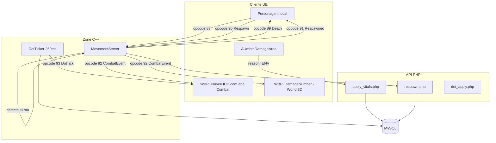

# Guia Passo a Passo — Sistema de Combate, Morte e Respawn

> Implementação completa: dano, cura, DoT/HoT, morte ao chegar em 0 HP e respawn em ponto definido por actor reutilizável.
> **Pré-requisito:** scripts SQL executados, servidor C++ e cliente UE 5.6.1 recompilados.

---

## Sumário

1. [Visão geral do fluxo](#1-visão-geral-do-fluxo)
2. [Opcodes WebSocket](#2-opcodes-websocket)
3. [Endpoints PHP](#3-endpoints-php)
4. [Banco de dados — spawn_points](#4-banco-de-dados--spawn_points)
5. [AUmbraSpawnPoint — actor de respawn no mapa](#5-aumbraspawnpoint--actor-de-respawn-no-mapa)
6. [AUmbraDamageArea — área de dano por segundo](#6-aumbradamagearea--área-de-dano-por-segundo)
7. [WBP_DamageNumber — widget de números flutuantes](#7-wbp_damagenumber--widget-de-números-flutuantes)
8. [Floating text no personagem](#8-floating-text-no-personagem)
9. [Aba Combat no WBP_ChatMain (100% C++)](#9-aba-combat-no-wbp_chatmain-100-c)
10. [Fluxo de morte e respawn no cliente](#10-fluxo-de-morte-e-respawn-no-cliente)
11. [DoT / HoT — instalar via PHP](#11-dot--hot--instalar-via-php)
12. [Testes end-to-end](#12-testes-end-to-end)
13. [Troubleshooting](#13-troubleshooting)

---

## 1. Visão geral do fluxo



| Camada | Responsabilidade |
|--------|------------------|
| **PHP** | Autoridade do DB: `apply_vitals.php` aplica delta de HP/MP + `is_dead`; `respawn.php` restaura + teleporta |
| **Zone C++** | Detecta morte via opcode 88, bloqueia `MoveUpdate` se morto, processa `RespawnRequest` (90), ticka `active_dots` a cada 250ms |
| **Cliente UE** | `AUmbraDamageArea` aplica dano local; `WBP_DamageNumber` exibe números; `UmbraCombatLogWidget` mostra aba Combat |

---

## 2. Opcodes WebSocket

| Opcode | Nome | Direção | Tamanho | Payload |
|--------|------|---------|---------|---------|
| 88 | `ForeignVitalsNotify` | C→S | 26 B | `playerId, hp, maxHp, mp, maxMp, sourceId, reason` |
| 89 | `PlayerDeathNotify` | S→C | 10 B | `playerId, killerId, reason` |
| 90 | `RespawnRequest` | C→S | 10+N B | `playerId, zoneId, spawnKeyLen, spawnKey` |
| 91 | `PlayerRespawnedNotify` | S→C | 38 B | `playerId, x, y, z, yaw, hp, maxHp, mp, maxMp` |
| 92 | `CombatEventNotify` | S→C | 16 B | `targetId, sourceId, delta, reason, isCrit` |
| 93 | `DotTickNotify` | S→C | 19 B | `targetId, dotId, delta, dotType` |

**Tabela de `reason`:** `0`=unknown, `1`=DAMAGE, `2`=HEAL, `3`=SKILL, `4`=ENV, `5`=DOT

---

## 3. Endpoints PHP

| Método | URL | Body |
|--------|-----|------|
| POST | `/api/combat/apply_vitals.php` | `{token, player_id, target_player_id, delta_health, delta_mana, reason, source_skill_id?}` |
| POST | `/api/combat/respawn.php` | `{token, player_id, zone_id?, spawn_key?}` |
| GET  | `/api/combat/get_spawn_points.php?zone_id=1` | — |
| POST | `/api/combat/dot_apply.php` | `{token, source_player_id, target_player_id, dot_type, tick_value, tick_interval_ms, ticks_total, source_skill_id?}` |
| POST | `/api/combat/dot_remove.php` | `{token, target_player_id, source_skill_id?, source_player_id?}` |

---

## 4. Banco de dados — `spawn_points`

A tabela já foi criada por `create_spawn_points.sql`. Para adicionar novos pontos de respawn:

```sql
INSERT INTO spawn_points (spawn_key, zone_id, pos_x, pos_y, pos_z, yaw, is_default, display_name)
VALUES
  ('cemiterio_norte', 1, -2500, 1200, 250, 90, 0, 'Cemitério Norte'),
  ('catacumbas',     2,     0,    0, 100,  0, 1, 'Catacumbas');
```

Regras:
- **Apenas 1 spawn por zone deve ter `is_default=1`**. O respawn sem `spawn_key` cai nesse.
- `spawn_key` deve ser único por zona (índice `uk_zone_key`).
- `pos_x/y/z/yaw` em **coordenadas UE5** (`X` = norte, `Y` = leste, `Z` = altura).
- Para descobrir as coordenadas no editor: posicione o personagem, abra **Output Log** e digite `pwd` ou veja o Transform do Pawn.

---

## 5. AUmbraSpawnPoint — actor de respawn no mapa

### 5.1 O que esse actor faz

- **Visual no editor**: ícone (Billboard) + seta (Arrow) na orientação do respawn.
- **Não é fonte de verdade em runtime**: o servidor (DB) decide para onde teleportar.
- Use o actor para **alinhar visualmente** o spawn que você cadastrou em `spawn_points`.

### 5.2 Colocar no mapa

1. **Content Browser** → habilite **Settings → Show C++ Classes**.
2. **C++ Classes/UmbraEternumUE/Actors/** → arraste **UmbraSpawnPoint** para a viewport.
3. Posicione onde quer o respawn (ajuste rotação para definir o yaw inicial).
4. No painel **Details**, configure:

| Propriedade | Valor exemplo | Descrição |
|-------------|---------------|-----------|
| `Spawn Point Id` | `cidade_inicial` | Deve casar com `spawn_key` no DB |
| `Zone Id` | `1` | Igual ao `zone_id` do DB |
| `bIs Default` | `true` | Marque em apenas um por zona |

### 5.3 Sincronizar com o DB

1. Copie a transform do actor (Details → Transform → Location e Rotation Yaw).
2. Atualize a linha correspondente em `spawn_points`:

```sql
UPDATE spawn_points
SET pos_x = 1234.5, pos_y = -456.7, pos_z = 200.0, yaw = 90.0
WHERE spawn_key = 'cidade_inicial' AND zone_id = 1;
```

### 5.4 Boas práticas

- Crie um sub-mapa **PersistentLevel/SpawnPoints/** e coloque todos os spawns lá.
- Para reaproveitar em outras cidades/dungeons: duplique o actor, mude o `SpawnPointId` e atualize o DB.

---

## 6. AUmbraDamageArea — área de dano por segundo

### 6.1 Colocar no mapa

1. **C++ Classes/UmbraEternumUE/Actors/** → arraste **UmbraDamageArea** para o nível.
2. No componente **Area** (UBoxComponent), ajuste **Box Extent** para o tamanho desejado (ex.: `200 × 200 × 100`).
3. No painel **Details → Damage**, configure:

| Propriedade | Valor padrão | Quando alterar |
|-------------|--------------|----------------|
| `Damage Per Tick` | `10` | Quanto HP perde a cada tick |
| `Tick Interval Sec` | `1.0` | Intervalo entre danos (mín 0,25s) |
| `Source Skill Id` | `0` | Mantenha `0` para dano ambiental (ENV) |
| `Area Key` | `lava_01` | Identificador livre para debug |

### 6.2 Visual da área (componente `Visual` no C++)

O actor `AUmbraDamageArea` já inclui um **`UStaticMeshComponent` chamado `Visual`** (sem colisão, visível em runtime). O `UBoxComponent` `Area` serve **só para overlap** — material nele não aparece no jogo.

**No `BP_DamageArea_Lava` (ou child de `UmbraDamageArea`):**

1. Abra o Blueprint → Hierarchy → selecione **`Visual`**.
2. **Static Mesh** = `Engine/BasicShapes/Cube` (ou `Plane` para chão).
3. **Materials → Element 0** = seu material de lava (ex.: `M_Lava_01`).
4. Ajuste **Scale** do `Visual` para casar com **Box Extent** do `Area`:
   - Ex.: se `Area` tem Box Extent `(200, 200, 100)`, use Scale `(4, 4, 2)` no Cube (cube base = 100 u).
5. Confirme: **Hidden In Game** = desmarcado, **Visibility** = Visible.

**Opcional (efeitos extras):**

1. **Add Component → Niagara** (fogo/poison).
2. **Add Component → Audio** (loop ambiente).

> Se você tinha um StaticMesh adicionado manualmente no BP, pode removê-lo e usar só o `Visual` do C++ — evita conflito de nomes e garante configuração correta.

### 6.3 Como funciona em runtime

- Quando o **personagem local** entra na área: começa um `FTimerHandle` que chama `ApplyVitalsToSelf(-DamagePerTick, 0, "ENV")`.
- Cada tick → `apply_vitals.php` → broadcast WebSocket 87/92 → todos próximos veem HP cair.
- Ao sair: timer para automaticamente.
- **Importante:** só o cliente do personagem que está dentro envia o request (evita duplicação).

### 6.4 Variações de exemplo

| Variação | Damage | Interval | Skill ID | Uso |
|----------|--------|----------|----------|-----|
| Lava forte | 50 | 0,5 | 0 | Castigo |
| Poção venenosa | 5 | 1,0 | 0 | Pântano |
| Aura de cura (HoT) | -20 | 1,0 | 0 | Use `Damage = -20` para curar |

---

## 7. WBP_DamageNumber — widget de números flutuantes

### 7.1 Criar o Widget Blueprint

1. **Content Browser** → navegar para `Content/Widgets/HUD/`.
2. **Add → User Interface → Widget Blueprint**.
3. **Parent Class** = `UmbraDamageNumberWidget` (C++).
4. Nome: **`WBP_DamageNumber`**.

### 7.2 Designer (layout)

```
[Root] Canvas Panel
└── Text_Amount (Text Block)   — Bind: BindWidgetOptional
    ├── Font Size: 32
    ├── Justification: Center
    ├── Outline: Size 2, Color Black
    └── Shadow Offset (X=1, Y=1)
```

| Widget | Nome obrigatório | Tipo |
|--------|------------------|------|
| Text do dano | `Text_Amount` | TextBlock |

> O código C++ usa `BindWidgetOptional`, então se o nome não bater o widget **não quebra**, mas o número não aparece.

### 7.3 Detalhes do componente

- **Anchor:** centralizado (0.5, 0.5).
- **Size to Content:** marcado.
- **Alignment:** (0.5, 0.5).
- Cor é definida em runtime: verde para cura, vermelho para dano.

### 7.4 Animação (Lifetime e fade)

Já feito em C++ (`NativeTick` desloca Y e faz fade alpha). Para customizar:
- `Lifetime` (padrão 1,2s) → tempo de exibição
- `FloatSpeed` (padrão 60 u/s) → velocidade de subida

Edite na instância do widget pela seção **Combat|FloatingText** do Details.

---

## 8. Floating text no personagem

### 8.1 Como já está integrado

`AUmbraEternumUECharacter` já cria um `UUmbraCombatFloatingTextComponent` no construtor:

```cpp
CreateDefaultSubobject<UUmbraCombatFloatingTextComponent>(TEXT("CombatFloatingText"));
```

Esse componente:
1. No `BeginPlay`, faz bind em `OnCombatEvent` e `OnDotTick`.
2. Quando recebe evento com `TargetId == ActivePlayerID`, cria um `UWidgetComponent` em runtime anexado ao `Mesh` na **socket `head`**.
3. Spawna o widget `WBP_DamageNumber`, mostra o número, e destrói após 1,35s.

### 8.2 Ajustar a classe do widget (opcional)

Por padrão usa a classe C++ base. Para usar o Blueprint criado:

1. Abra `BP_ThirdPersonCharacter` (Content/Blueprints/Player_BP/).
2. Selecione o componente **CombatFloatingText**.
3. Details → **Damage Widget Class** → escolha `WBP_DamageNumber`.

### 8.3 Posição do widget no mundo

Por padrão é anexado ao osso `head`. Se seu skeletal mesh não tem essa socket, mude para outro osso no `UmbraCombatFloatingTextComponent.cpp` (linha ~74) ou crie a socket no Skeleton:

1. Abra o Skeletal Mesh do personagem.
2. Na árvore de ossos, clique direito em `head` → **Add Socket**.
3. Posicione acima da cabeça (Z = +20 a +30).

---

## 9. Aba Combat no WBP_ChatMain (100% C++)

> O chat vive em **`Content/Widgets/UI/Chat/WBP_ChatMain`**. **Toda a lógica de tabs (incluindo Combat) está na classe pai `UUmbraChatMainWidget` (C++)**. Você não vai criar funções nem ligar nós no Event Graph — basta dar os **nomes corretos** aos widgets no Designer. O C++ encontra automaticamente, faz o bind dos botões, alterna painéis e some/aparece com o input.

### 9.1 O que o C++ faz por você

Arquivos: `Source/UmbraEternumUE/UI/UmbraChatMainWidget.{h,cpp}` e `UmbraCombatLogWidget.{h,cpp}`.

- O enum `EUmbraChatChannel` tem agora `Local | Global | Group | Combat | Guild`.
- Para cada botão `BTN_TabCombat` / `BTN_TabGuild` o `BindButtons()` faz `OnClicked.AddDynamic` automaticamente.
- A função `ApplyChannelVisibility()` é chamada toda vez que um canal é trocado e:
  - `CombatLogPanel` → `Visible` se canal == Combat, senão `Collapsed`.
  - `Scroll_ChatFeed` → `Collapsed` em Combat, senão `Visible`.
  - O input (`Border_ChatInput` + `ET_ChatInput` + `BTN_SendChat`) é colapsado em Combat.
- `NativeOnKeyDown` / `NativeOnPreviewKeyDown` **ignoram Enter** enquanto a aba Combat estiver ativa, então o input não abre por engano.
- `TXT_ChatInfo` é atualizado para “Canal ativo: Combat” quando a aba estiver ativa.
- O `UUmbraCombatLogWidget` se inscreve sozinho em `OnCombatLogEntry` (no `NativeConstruct`) — você não precisa mexer em delegate.

### 9.2 Criar `WBP_CombatLog` (já feito; só confira)

1. **Content Browser** → `Content/Widgets/UI/Chat/`.
2. **Add → User Interface → Widget Blueprint**.
3. **Parent Class** = `UmbraCombatLogWidget`.
4. Nome: **`WBP_CombatLog`**.

Hierarquia mínima (nomes obrigatórios):

```
[Root] Canvas Panel
└── Border (Brush Color = 0,0,0,0.55)  — anchor Fill (0,0)/(1,1), offsets 0
    └── Scroll_Combat (Scroll Box)            — Is Variable ✓
        └── VB_CombatMessages (Vertical Box)  — Is Variable ✓
```

Em **Details → Combat|Log → Max Lines** = 100. Sem Event Graph.

### 9.3 Estrutura do `WBP_ChatMain` (estado esperado depois das mudanças)

```
[Root] Canvas Panel
└── Border_ChatPanel
    └── VerticalBox_Main
        ├── HorizontalBox_Tabs
        │    ├── BTN_TabLocal
        │    ├── BTN_TabGlobal
        │    ├── BTN_TabGroup
        │    ├── BTN_TabCombat   ← NOVO
        │    ├── BTN_TabGuild
        │    └── BTN_CloseChat
        ├── TXT_ChatInfo
        ├── Scroll_ChatFeed
        │    └── VB_ChatLines
        ├── CombatLogPanel        ← NOVO (instância de WBP_CombatLog, mesmo nível do Scroll)
        └── Border_ChatInput      ← já existe; só confirme o nome
             └── HorizontalBox
                  ├── ET_ChatInput
                  └── BTN_SendChat
```

**Importante:** `CombatLogPanel` fica **irmão** de `Scroll_ChatFeed` (mesmo `VerticalBox_Main`). **Não use Widget Switcher.** O C++ alterna pela `Visibility`.

### 9.4 Passo a passo no Designer (somente cliques, sem nó nenhum)

#### 9.4.1 Criar `BTN_TabCombat`

1. Abra **`WBP_ChatMain`**.
2. Hierarchy → clique direito em **`BTN_TabGlobal`** → **Duplicate**.
3. Renomeie a cópia para **`BTN_TabCombat`** (exatamente esse nome, com a mesma capitalização).
4. Arraste-o dentro do `HorizontalBox_Tabs`, na posição que preferir (sugerido: entre Group e Guild).
5. Selecione o `TextBlock` filho → **Text** = `Combat`.

> O C++ procura por **`BTN_TabCombat`** automaticamente. Se o nome bater, o `BindButtons()` liga o `OnClicked` direto em `SetActiveChannelCombat()`.

#### 9.4.2 Inserir o painel `CombatLogPanel`

1. **Palette → User Created** → arraste **`WBP_CombatLog`** para dentro de `VerticalBox_Main`.
2. Solte logo abaixo de `Scroll_ChatFeed` (mesma indentação — **NÃO** dentro do scroll).
3. Hierarchy → renomeie a instância para **`CombatLogPanel`** (exato).
4. Selecione `CombatLogPanel` → slot do `VerticalBox_Main` → **Size = Fill (1.0)**.
5. Em Details → marque **Is Variable** se ainda não estiver.

> O C++ tenta primeiro o nome `CombatLogPanel`. Se não achar, tenta `WBP_CombatLog` e `WBP_CombatLog_C` como fallback.

#### 9.4.3 Ajustar `Scroll_ChatFeed`

- Selecione `Scroll_ChatFeed` no slot do `VerticalBox_Main` → **Size = Fill (1.0)**.
- Não precisa mais marcar nada de visibility — quem manda agora é o C++.

#### 9.4.4 Confirmar `Border_ChatInput`

1. Selecione a `Border` que envolve `ET_ChatInput` + `BTN_SendChat`.
2. Details → **Is Variable** marcado, nome = **`Border_ChatInput`**.

#### 9.4.5 Compilar e salvar

1. **Compile** o `WBP_ChatMain`.
2. Verifique no Compiler Results: zero warnings/erros.

**Não crie nenhuma função, nenhum `On Clicked` no Event Graph, nem `Set Visibility` em Blueprint.** Se você tinha um `ShowCombatTab` ou outros nodes da tentativa anterior, **apague todos** — eles só vão competir com o C++.

### 9.5 Mapa de bindings automáticos

| Widget no Designer | Tipo esperado pelo C++ | Tratamento automático |
|--------------------|------------------------|------------------------|
| `BTN_TabLocal`     | `UButton`              | `OnClicked → SetActiveChannelLocal()` |
| `BTN_TabGlobal`    | `UButton`              | `OnClicked → SetActiveChannelGlobal()` |
| `BTN_TabGroup`     | `UButton`              | `OnClicked → SetActiveChannelGroup()` |
| `BTN_TabCombat`    | `UButton`              | `OnClicked → SetActiveChannelCombat()` |
| `BTN_TabGuild`     | `UButton`              | `OnClicked → SetActiveChannelGuild()` |
| `BTN_SendChat`     | `UButton`              | `OnClicked → SendCurrentChatMessage()` |
| `BTN_CloseChat`    | `UButton`              | `OnClicked → CloseChat()` |
| `Scroll_ChatFeed`  | `UScrollBox`           | `Visibility` controlada por `ApplyChannelVisibility` |
| `VB_ChatLines`     | `UVerticalBox`         | recebe linhas de chat |
| `ET_ChatInput`     | `UEditableText`        | `OnTextCommitted` para enviar |
| `Border_ChatInput` | `UBorder`              | `Visibility` controlada por `SetInputVisible` |
| `TXT_ChatInfo`     | `UTextBlock`           | rótulo do canal ativo |
| `CombatLogPanel`   | `UUmbraCombatLogWidget` (instância de `WBP_CombatLog`) | `Visibility` controlada por `ApplyChannelVisibility` |

Todos são `BindWidgetOptional`: se você esquecer algum, o widget abre sem crash — só aquela função fica inerte. Use isso para conferir se algum nome está errado (a feature “some” em silêncio).

### 9.6 Formato automático das linhas de combat

O `UUmbraCombatLogWidget::OnCombatLogEntry` formata sem você precisar fazer nada:

| Cenário | Texto produzido |
|---------|-----------------|
| Você levou dano | `Você recebeu 50 de dano (DAMAGE)` |
| Você foi curado | `Você foi curado em 30 (HEAL)` |
| Você atacou alguém | `Você causou 25 em jogador 7 (DAMAGE)` |
| Dano por DoT | `Você recebeu 10 de dano (DOT)` |
| Área ambiental | `Você recebeu 10 de dano (ENV)` |
| Dano de terceiros (espectador) | `[DAMAGE] alvo=5 origem=7 delta=-25` |

### 9.7 Teste de verificação

1. **Recompile o módulo C++** (botão **Compile** do editor ou `Live Coding`).
2. Abra `WBP_ChatMain` no editor → **Compile** o Blueprint → **Save**.
3. Play in Editor → abra o chat.
4. Esperado em **Local / Global / Group / Guild**:
   - `Scroll_ChatFeed` visível, `CombatLogPanel` colapsado.
   - `TXT_ChatInfo` mostra o nome do canal.
   - Enter abre o input normalmente.
5. Clique em **Combat**:
   - `CombatLogPanel` aparece e o `Scroll_ChatFeed` some.
   - `Border_ChatInput` (input) também some.
   - `TXT_ChatInfo` exibe `Canal ativo: Combat`.
   - Enter **não** abre input (intencional).
6. Entre na `AUmbraDamageArea` → uma linha por tick aparece em `CombatLogPanel` e auto-rola.
7. Clique em qualquer outra aba → `Scroll_ChatFeed` volta, `CombatLogPanel` some.
8. Volte para **Combat** → o histórico anterior continua lá.

### 9.8 Migração: o que apagar do estado antigo

Se você seguiu as iterações anteriores do guia, faça esta limpeza antes de testar:

- **Apague** qualquer `Widget Switcher` (`WS_ChatContent`) que tenha sido criado.
- **Apague** a função `ShowCombatTab` no `WBP_ChatMain`.
- **Apague** todos os `On Clicked` que você criou manualmente em `BTN_TabLocal/Global/Group/Combat/Guild` no Event Graph (o C++ pai já faz o bind — se você manter no Blueprint, vai disparar **dois** handlers e bagunçar a visibility).
- **Apague** qualquer node `Set Visibility` ou `Set Active Widget Index` solto no Event Graph relacionado a tabs.
- Garanta que `Scroll_ChatFeed` é **filho direto** do `VerticalBox_Main` (não dentro de switcher) e que `CombatLogPanel` é irmão dele.

Se o `BTN_TabCombat` foi criado mas o C++ não fizer nada quando clicado, é porque:
1. O nome do botão está diferente de `BTN_TabCombat`, **ou**
2. Há um `On Clicked` extra criado no Event Graph capturando o evento antes — apague-o.

---

## 10. Fluxo de morte e respawn no cliente

### 10.1 O que já acontece automaticamente

Quando o personagem local chega a **HP = 0**:

1. Servidor C++ recebe opcode 88, detecta `hp <= 0`, envia opcode **89** (`PlayerDeathNotify`).
2. `UmbraGameInstance` recebe 89 e dispara `OnLocalPlayerDeath`.
3. `AUmbraEternumUECharacter::HandleLocalDeath` é chamado:
   - `DisableInput()` no PlayerController.
   - `CharacterMovement->DisableMovement()`.

### 10.2 Você precisa adicionar: UI de "Você morreu"

1. Crie `WBP_DeathScreen` (Widget Blueprint, parent **UserWidget**).
2. Layout simples:

```
[Root] Canvas (Full Screen)
├── Image (overlay vermelho 50% alpha)
├── Text "VOCÊ MORREU" (centralizado)
└── BTN_Respawn ("Respawn")
```

3. No **Event Graph** do `WBP_DeathScreen`, no **OnClicked do BTN_Respawn**:

```
Get Game Instance → Cast to UmbraGameInstance
→ Request Respawn Via WebSocket
   • Zone Id = 1
   • Spawn Key = "" (vazio = usa default)
→ Remove from Parent (esconde a UI)
```

### 10.3 Disparar a UI no momento da morte

No `WBP_PlayerHUD` Event Graph:

```
[Event Construct]
  Get Game Instance → Cast to UmbraGameInstance
  → Bind Event to On Local Player Death → [Custom Event: ShowDeathScreen]
  → Bind Event to On Local Player Respawn Ready → [Custom Event: HideDeathScreen]

[ShowDeathScreen]
  → Create Widget (WBP_DeathScreen) → Add to Viewport

[HideDeathScreen]
  → Remove from Parent (DeathScreenRef)
```

### 10.4 O que o cliente faz ao receber opcode 91

Já implementado em `UmbraGameInstance::ProcessSocialWebSocketMessage`:

1. Atualiza HP/MP via `ApplyLocalVitalsAndBroadcast`.
2. Dispara `OnLocalPlayerRespawnReady` (esconde UI de morte).
3. **Teleporta o Pawn** para a nova posição (`SetActorLocation`).
4. Define rotação (`SetControlRotation`).
5. Zera velocidade.
6. `HandleLocalRespawn` no personagem reabilita input e movimento.

### 10.5 Animação de morte (opcional, Blueprint)

No **Animation Blueprint** do personagem, adicione um **bool** `bIsDead` exposto. No `BP_ThirdPersonCharacter`:

```
[Event BeginPlay]
  Get Game Instance → Cast → Bind On Local Player Death → [SetDeadAnim true]
  Get Game Instance → Cast → Bind On Local Player Respawn Ready → [SetDeadAnim false]
```

E no AnimGraph: estado **Death** com animação de morrer (ragdoll opcional).

---

## 11. DoT / HoT — instalar via PHP

DoT/HoT são salvos em `active_dots` e processados pelo servidor C++ a cada 250 ms.

### 11.1 Aplicar via skill (cliente UE)

Faça um POST do cliente para `dot_apply.php`. Exemplo em Blueprint usando VaRest:

```
Construct Json Object:
  token = (CurrentToken da GameInstance)
  source_player_id = ActivePlayerID
  target_player_id = (alvo)
  dot_type = "DAMAGE"   // ou "HEAL", "MANA"
  tick_value = 15
  tick_interval_ms = 1000
  ticks_total = 5
  source_skill_id = (id da skill)

Call Request → /api/combat/dot_apply.php
```

### 11.2 Como funciona

- O Zone roda `tickActiveDots` a cada 250 ms (`ZoneCombatService`).
- Para cada DoT com `next_tick_at <= NOW(3)`:
  1. Aplica delta em `players.health/mana`.
  2. Broadcasta opcode **87** (vitais) + **92** (combat event) + **93** (dot tick) para AOI/party.
  3. Decrementa `ticks_remaining`. Se zero, deleta a linha.

### 11.3 Remover antes do tempo

```
POST /api/combat/dot_remove.php
{
  "token": "...",
  "target_player_id": 5,
  "source_skill_id": 12,  // opcional
  "source_player_id": 3   // opcional
}
```

---

## 12. Testes end-to-end

### 12.1 Pré-flight

```bash
# MySQL deve estar rodando
mysql -u root -p umbra_eternum -e "SELECT spawn_key, pos_x, pos_y, pos_z FROM spawn_points;"

# Apache (PHP) ok
curl http://localhost/umbra_api/api/combat/get_spawn_points.php?zone_id=1

# Servidor C++ (Zone na porta 8082)
netstat -an | findstr :8082
```

### 12.2 Teste 1 — Damage Area

1. Coloque `UmbraDamageArea` no nível (Damage=10, Interval=1).
2. Play in Editor.
3. Caminhe para dentro da área.
4. **Esperado:**
   - Output Log: `[UmbraGameInstance] ApplyVitalsToTarget: target=X dHP=-10`
   - Floating text vermelho `-10` sobre a cabeça
   - HP bar do HUD diminuindo a cada segundo
   - Aba Combat: `Você recebeu 10 de dano (ENV)`
5. Saia da área → o dano para.

### 12.3 Teste 2 — Morte e respawn

1. Configure a área com `DamagePerTick = 50` para morrer rápido.
2. Fique dentro até `HP = 0`.
3. **Esperado:**
   - Input bloqueia (não consegue andar/pular).
   - Movimento congela.
   - UI `WBP_DeathScreen` aparece (se você implementou).
4. Clique em **Respawn** (ou chame `RequestRespawn()` no console).
5. **Esperado:**
   - Personagem teleporta para o spawn default da zone 1.
   - HP/MP cheios.
   - Input reabilita.
   - Aba Combat NÃO mostra (respawn não é evento de combate).

### 12.4 Teste 3 — DoT

1. Use VaRest ou Postman:

```http
POST http://localhost/umbra_api/api/combat/dot_apply.php
Content-Type: application/json

{
  "token": "<JWT do player>",
  "source_player_id": 1,
  "target_player_id": 1,
  "dot_type": "DAMAGE",
  "tick_value": 10,
  "tick_interval_ms": 1000,
  "ticks_total": 5,
  "source_skill_id": 1
}
```

2. **Esperado dentro do jogo:**
   - HP cai 10 por segundo, 5 vezes.
   - Floating text vermelho a cada tick.
   - Aba Combat: 5 linhas `Você recebeu 10 de dano (DOT)`.

### 12.5 Teste 4 — Multiplayer (dano em outro jogador)

1. Inicie dois clientes (Play → Number of Players = 2).
2. Cliente A seleciona Cliente B.
3. Chame `ApplyVitalsToTarget(B_PlayerID, -30, 0, "DAMAGE")` em Blueprint.
4. **Esperado:**
   - HP de B cai em ambas as telas.
   - Cliente B vê floating text vermelho.
   - Cliente B vê linha na aba Combat.
   - Cliente A vê linha: `Você causou 30 em jogador B`.

---

## 13. Troubleshooting

### Nenhum floating text aparece

- **Causa provável:** `WBP_DamageNumber` não foi atribuído ao componente.
- **Solução:** abra `BP_ThirdPersonCharacter` → componente `CombatFloatingText` → Details → `Damage Widget Class` = `WBP_DamageNumber`.
- **Verifique** no Skeleton: existe a socket `head`? Se não, crie ou edite o cpp.

### Cliente B não vê floating text sobre o cliente A

- **Causa (corrigida no C++):** o `BP_RemotePlayer` não tinha PlayerID confiável — `GetOwnerPlayerId()` retornava `0` ou o ID do jogador local, e o componente ignorava o evento (`TargetId != OwnerId`).
- **Fix principal:** cada `AUmbraEternumUECharacter` expõe `UmbraNetworkPlayerId`. O pawn local recebe o ID no `BeginPlay`; pawns remotos recebem em `RegisterRemotePlayerActor`. `GetOwnerPlayerId()` consulta esse campo antes dos fallbacks (`RemotePlayerActorsMap`, `NetMovementClient`).
- **Fix secundário (primeiro tick):** o Zone server calculava `delta=0` quando não havia histórico de HP. O opcode **88** agora inclui `delta_applied_health` (4 bytes) vindo do PHP; o servidor usa esse valor para emitir opcode **92** mesmo no primeiro tick.
- **Verificação no Output Log (cliente B — observador):**
  - `BeginPlay owner=BP_RemotePlayer_C_0 ... resolvedOwnerId=<ID de A>` — **nunca 0** após o registro.
  - `CombatEvent WS (92): target=<ID de A> src=... delta=-10 reason=4`
  - `[CombatFloatingText] OnCombatEvent target=<ID de A> ... ownerId=<ID de A> ownerActor=BP_RemotePlayer_C_0`
  - `[CombatFloatingText] Spawn Delta=-10 ...`
- **Se o opcode 92 não chega:** os dois clientes precisam estar na mesma célula AOI (~100 m). Veja a seção abaixo sobre `zone_server.log`.
- **Combat Log:** por design, só registra eventos onde **você** é alvo ou origem — dano de A em si mesmo não aparece no Combat Log de B (mas o floating text sim).

### Como ler `zone_server.log` (floating text multi-cliente)

**Arquivo:** `logs/zone_server.log` (criado ao iniciar o zone server).

**Executar o zone separado** (não está no `umbra_server` monolítico):

```text
build/bin/zone_server.exe 0
```

**Strings para buscar (grep / Ctrl+F):**

| Padrão | Significado |
|--------|-------------|
| `VitalsUpdate target=` | Broadcast após opcode **88** (`ForeignVitalsNotify`) |
| `delta=0` | Opcode **92** **não** é enviado nesse tick (sem histórico e sem `delta_applied` no 88) |
| `delta=-10` | Opcode **92** deve ser enviado aos observadores |
| `-> 0 recipients` | Ninguém na AOI/party recebeu (jogadores longe ou não registrados no grid) |
| `-> 1 recipients` ou mais | Broadcast OK para pelo menos um outro jogador |
| `PlayerVitalsUpdate from player` | Caminho opcode **86** (vitals próprios) — diferente do **88** |

**Exemplo saudável** (ElJeffo id=1 toma dano na lava; MaguWill id=23 perto):

```text
VitalsUpdate target=1 delta=-10 -> 1 recipients
```

**Exemplo problemático** (primeiro tick sem `delta_applied` no 88 — corrigido no cliente):

```text
VitalsUpdate target=1 delta=0 -> 1 recipients
```

**Interpretação dos logs UE (PIE com 2 clientes):**

| Janela | Ao ElJeffo tomar dano | Esperado |
|--------|----------------------|----------|
| ElJeffo (vítima) | local | `OnCombatEvent local` + `Spawn` no `BP_ThirdPersonCharacter` |
| MaguWill (observador) | remoto | `CombatEvent WS (92): target=1` + `resolvedOwnerId=1` no `BP_RemotePlayer` + `Spawn Delta=-10` |

Filtro sugerido no Output Log: `CombatFloatingText` OR `CombatEvent WS` OR `ForeignVitalsNotify`.

### Material da área de dano não aparece no jogo

- **Causa:** material aplicado no `UBoxComponent` `Area` — shapes de colisão são invisíveis em runtime.
- **Solução:** use o componente **`Visual`** (StaticMesh) do `AUmbraDamageArea` → set Static Mesh + Material (seção 6.2).

### Aba Combat não mostra linhas

- **Causa 1:** o widget `CombatLogPanel` não foi adicionado ao `WBP_ChatMain` ou está com nome diferente.
  - **Solução:** abra `WBP_ChatMain`, confira na Hierarchy se existe um widget chamado **`CombatLogPanel`** (instância de `WBP_CombatLog`) **irmão** do `Scroll_ChatFeed`.
- **Causa 2:** `BTN_TabCombat` está com outro nome.
  - **Solução:** renomeie para exatamente `BTN_TabCombat`.
- **Causa 3:** alguém criou `On Clicked (BTN_TabCombat)` no Event Graph.
  - **Solução:** apague esse handler — o C++ pai já faz o bind. Dois handlers competem e a aba pisca/não atualiza.
- **Verificação:** no Output Log procure `OnCombatLogEntry` sendo broadcast. Se aparecer mas a aba estiver vazia, é problema de layout (passos acima). Se nem aparecer, o problema está no Zone server (seção 12 de troubleshooting).

### `CombatLogPanel` continua visível em outras abas

- **Causa única em 99% dos casos:** ainda existe lógica de visibility no Event Graph (Blueprint) competindo com o C++.
  - Apague qualquer `Set Visibility` que mire `CombatLogPanel`, `Scroll_ChatFeed` ou `Border_ChatInput` no `WBP_ChatMain`.
  - Apague qualquer `Widget Switcher` chamado `WS_ChatContent` ou similar.
  - Recompile o BP e teste de novo.

### Personagem morre mas input não desabilita

- **Causa provável:** `BeginPlay` do personagem não rodou em pawn possuído. Verifique `IsLocallyControlled`.
- Verifique log: `Personagem local morto — input desabilitado`.

### Respawn teleporta para (0,0,200)

- **Causa provável:** spawn point default não existe ou está com `is_default=0`.
- **Solução SQL:**

```sql
SELECT * FROM spawn_points WHERE zone_id = 1 AND is_default = 1;
-- Se vazio:
UPDATE spawn_points SET is_default = 1 WHERE spawn_key = 'cidade_inicial' AND zone_id = 1;
```

### DoT não ticka

- Veja log do Zone server: deve aparecer `VitalsUpdate target=X delta=-Y` a cada tick.
- Verifique se `active_dots` tem `next_tick_at` no passado.
- Confira que `skill_id` existe em `skills` (constraint FK).

### Cliente recebe opcode 89 mas UI não muda

- Verifique se o `WBP_PlayerHUD` está ouvindo `OnLocalPlayerDeath` (Event Graph → Bind).
- Adicione `Print String` no Custom Event de morte para confirmar.

### "ChooseError: Spawn skill not found"

- `dot_apply.php` faz fallback para a primeira skill da tabela `skills` se a passada não existir.
- Garanta que pelo menos uma skill esteja cadastrada.

---

## Próximas fases (não cobertas aqui)

- **Cálculo de dano por atributos** (Strength, Defense, resistências, crit) — `CombatCalculator.hpp` já tem o esqueleto pronto.
- **IA de mobs/NPCs** que atacam o jogador.
- **PvP com zonas seguras** (cidades).
- **Combat log persistente** na tabela `combat_log`.
- **Resurrect por outro jogador** (skill de cura full).
