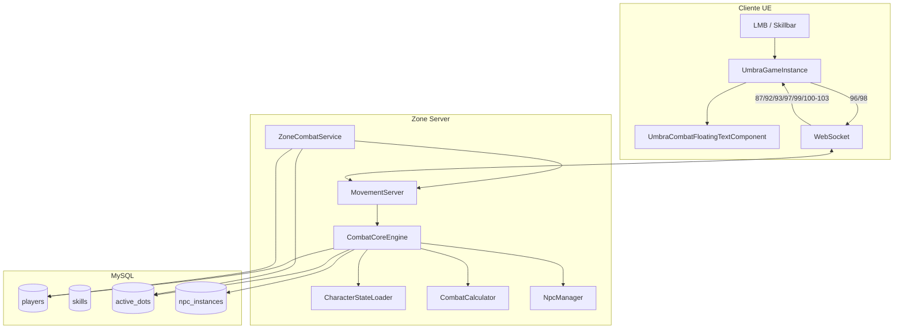
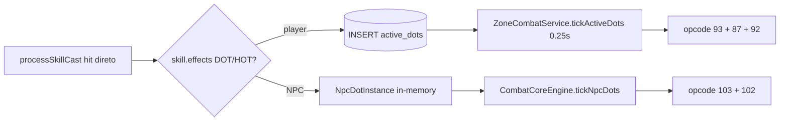

# Guia Combat V2 — Sistema de dano real (referência completa)

> **Documento autoritativo** do combate server-side com `CombatCalculator`, `CharacterStateLoader`, mana sync, regen, miss PvE/PvP e DOT/HOT por skills.
>
> Complementa:
> - [`UmbraServer/docs_main/GUIA_COMBAT_V2_DANO_BASIC_ATTACK_NPC.md`](../UmbraServer/docs_main/GUIA_COMBAT_V2_DANO_BASIC_ATTACK_NPC.md) — setup Blueprint, NPC spawn, LMB
> - [`UmbraServer/docs_main/GUIA_SISTEMA_COMBATE.md`](../UmbraServer/docs_main/GUIA_SISTEMA_COMBATE.md) — opcodes 86–95 (V1), morte/respawn, floating text

---

## 1. Visão geral e princípios

### 1.1 Quem calcula o quê

| Camada | Responsabilidade |
|--------|------------------|
| **Cliente UE 5.6.1** | Envia **intenção** (opcodes 96/98), renderiza animação/VFX/floating text, atualiza HUD com vitals recebidos |
| **Zone Server C++** | Valida, calcula dano/cura/miss/crit, deduz mana, aplica DOT/HOT, persiste HP/MP no MySQL, faz broadcast |
| **PHP API** | Stats para login/HUD inicial (`character_info_helper`), vitals legados (`apply_vitals.php`), admin, spawn NPC |
| **MySQL** | `players.health`/`mana` (current autoritativo), `skills`, `active_dots`, `npc_instances`, `combat_log` |

**Regra de ouro:** o cliente **nunca** calcula dano final. `CurrentCharacterInfo.CurrentMana` deve seguir o opcode **87** após cada cast.

### 1.2 Max HP/MP: base vs total

- **Current** (`players.health`, `players.mana`): valor autoritativo gravado pelo zone.
- **Max total** (exibido na HUD): calculado — **não** é só `players.max_health`/`max_mana`.

```
max_health_total = base_health_classe + (level × 20) + health_bonus
max_mana_total   = base_mana_classe   + (level × 20) + mana_bonus
```

`health_bonus` / `mana_bonus` vêm de VIT/INT, equipamento e poções. O opcode **87** deve enviar esse **max total** (via `CharacterStateLoader`), senão a HUD “encolhe” ao curar/regenerar.

### 1.3 NPC vs jogador

| Aspecto | Jogador | NPC |
|---------|---------|-----|
| HP persistido | `players.health` | `npc_instances.current_health` |
| DOT/HOT | Tabela `active_dots` + `ZoneCombatService` | Lista in-memory `NpcDotInstance` em `CombatCoreEngine` |
| Miss broadcast | Opcode **92** (`reason=6`) | Opcode **103** (`reason=6`) |
| Dodge | Stats do `CharacterStateLoader` | `dodge=0` no template (dummy sempre errável por accuracy baixa) |

### 1.4 Diagrama de arquitetura



---

## 2. Mapa de arquivos

### 2.1 Servidor C++ (zone)

| Arquivo | Papel |
|---------|-------|
| [`src/zone/CombatCoreEngine.cpp`](../src/zone/CombatCoreEngine.cpp) / [`.hpp`](../src/zone/CombatCoreEngine.hpp) | Orquestrador: `processBasicAttack`, `processSkillCast`, `deductPlayerMana`, `broadcastPlayerVitals`, `tickRegen`, `applySkillEffects`, `tickNpcDots`, `broadcastMiss` |
| [`src/zone/CharacterStateLoader.cpp`](../src/zone/CharacterStateLoader.cpp) / [`.hpp`](../src/zone/CharacterStateLoader.hpp) | Stats completos do DB (espelha PHP), cache TTL 1s, `makeNpcDefenderState` |
| [`src/services/CombatCalculator.hpp`](../src/services/CombatCalculator.hpp) | Fórmulas: dano físico/mágico, cura, hit/miss, crit, DOT/HOT tick (header-only singleton) |
| [`src/services/SkillService.cpp`](../src/services/SkillService.cpp) / [`.hpp`](../src/services/SkillService.hpp) | Cache de skills, cooldown, `validateSkillUse`, parse de `effects_json` |
| [`src/services/SkillTypes.hpp`](../src/services/SkillTypes.hpp) | `CharacterState`, `SkillData`, `SkillEffect`, `DamageBreakdown`, enums |
| [`src/zone/NpcManager.cpp`](../src/zone/NpcManager.cpp) / [`.hpp`](../src/zone/NpcManager.hpp) | Instâncias NPC runtime, `applyDamage`, respawn |
| [`src/zone/ZoneCombatService.cpp`](../src/zone/ZoneCombatService.cpp) / [`.hpp`](../src/zone/ZoneCombatService.hpp) | Tick `active_dots` (players), respawn de jogador |
| [`src/zone/MovementServer.hpp`](../src/zone/MovementServer.hpp) | Roteamento WS 96/98, `broadcastVitalsAndCombat`, handlers (sem deadlock recursivo em `mu_`) |
| [`src/zone/MovementProtocol.hpp`](../src/zone/MovementProtocol.hpp) | Opcodes, payloads binários, `CombatReason` (`Miss=6`) |
| [`src/zone/ZoneServer.cpp`](../src/zone/ZoneServer.cpp) | Loop: `tickActiveDots` (0.25s), `combatCoreEngine_->tick`, `tickRegen` |

**Build:** biblioteca `umbra_zone`, executável `zone_server` — [`src/zone/CMakeLists.txt`](../src/zone/CMakeLists.txt).

```bat
cd D:\UmbraServerV2\build
cmake --build . --config Release --target zone_server
```

### 2.2 Cliente UE 5.6.1

| Arquivo | Papel |
|---------|-------|
| [`UmbraEternumUE/Source/.../Core/UmbraGameInstance.cpp`](../UmbraEternumUE/Source/UmbraEternumUE/Core/UmbraGameInstance.cpp) | Envio 96/98, handlers 87/92/93/97/99/100–103, `GetCombatTargetId`, `ApplyLocalVitalsAndBroadcast` |
| [`UmbraEternumUE/Source/.../Components/UmbraCombatFloatingTextComponent.cpp`](../UmbraEternumUE/Source/UmbraEternumUE/Components/UmbraCombatFloatingTextComponent.cpp) | Floating text, `ShowMiss()`, `OnCombatEvent` |
| [`UmbraEternumUE/Source/.../UI/UmbraDamageNumberWidget.cpp`](../UmbraEternumUE/Source/UmbraEternumUE/UI/UmbraDamageNumberWidget.cpp) | `EUmbraFloatingTextKind::Miss`, texto "MISS" |
| [`UmbraEternumUE/Source/.../Network/NetMovementClient.cpp`](../UmbraEternumUE/Source/UmbraEternumUE/Network/NetMovementClient.cpp) | Repasse de mensagens WS sociais/combate para `UmbraGameInstance` |
| [`UmbraEternumUE/Source/.../Actors/UmbraNpcCharacter.cpp`](../UmbraEternumUE/Source/UmbraEternumUE/Actors/UmbraNpcCharacter.cpp) | Spawn opcode 100, `ApplyHealthUpdate` (opcode 102 só HP, sem reposicionar) |

### 2.3 PHP e banco

| Arquivo | Papel |
|---------|-------|
| [`www/umbra_api/helpers/character_info_helper.php`](../www/umbra_api/helpers/character_info_helper.php) | Fonte de verdade de max HP/MP e stats (espelhada no C++) |
| [`www/umbra_api/api/combat/`](../www/umbra_api/api/combat/) | `apply_vitals.php`, `dot_apply.php`, `dot_remove.php`, `respawn.php`, `log_damage.php` |
| [`www/umbra_api/scripts/combat_v2.sql`](../www/umbra_api/scripts/combat_v2.sql) | Migration V2: `basic_attacks`, NPC, colunas extras em `skills` |
| [`www/umbra_api/scripts/create_skill_system.sql`](../www/umbra_api/scripts/create_skill_system.sql) | `skills`, `active_dots`, `skill_effects` |

### 2.4 Legado (não usar para Combat V2)

- [`src/services/CombatService.cpp`](../src/services/CombatService.cpp) — serviço antigo na lib `umbra_services`, separado do fluxo V2.

---

## 3. Fluxos detalhados

### 3.1 Ataque básico (opcode 98 → 99 → dano)

**Cliente → servidor (98):**
```
[98][sourcePlayerId:4 LE][targetType:1][targetId:4 LE]
```
`targetType`: `1`=Player, `2`=Npc.

**Passos no servidor (`CombatCoreEngine::processBasicAttack`):**

1. Carrega `class_id` do atacante → linha em `basic_attacks`.
2. Cooldown server-side (`checkAndStampBasicCooldown`).
3. Broadcast animação **opcode 99** (`BasicAttackBroadcast`).
4. Monta `SkillData` sintética (físico, `powerCoef` da classe).
5. `CharacterStateLoader` → atacante; `buildDefenderState` → alvo.
6. **Hit roll:** `calculateHitChance` + `rollHit` — se falhar → `broadcastMiss` (103 NPC / 92 player) e **return**.
7. `CombatCalculator::calculatePhysicalDamage` → `delta` negativo, `isCrit`, `overkill`.
8. **Alvo NPC:** `NpcManager::applyDamage` → **103** + **102** (HP); **101** se morrer.
9. **Alvo player:** `applyPlayerDamage` → UPDATE DB + **87** + **92**; **89** se morte; `writeCombatLog`.

### 3.2 Skill cast (opcode 96 → 97 → dano + efeitos)

**Cliente → servidor (96):**
```
[96][sourcePlayerId:4][skillId:4][targetType:1][targetId:4][x:4][y:4][z:4]  (floats LE)
```

**Passos (`CombatCoreEngine::processSkillCast`):**

1. `SkillService::getSkillData` + `validateSkillUse` (cooldown, mana, alive).
2. `loadSkillRank` de `player_skills.current_rank`.
3. `startCooldown`, `deductPlayerMana` → **opcode 87** ao atacante (mana sync).
4. Broadcast cast **opcode 97** (anim/VFX/SFX do DB).
5. Heal vs damage conforme `SkillType`/`TargetType`.
6. Hit roll (dano, não heal) → miss se falhar.
7. `calculateHeal` / `calculatePhysicalDamage` / `calculateMagicDamage`.
8. Aplica dano (NPC ou player, mesmo padrão do basic attack).
9. `applySkillEffects` — DOT/HOT de `effects_json`.
10. `writeCombatLog` para alvo player.

### 3.3 Mana sync (opcode 87 após cast)

**Problema resolvido:** antes, `deductPlayerMana` atualizava o DB mas não enviava **87** ao atacante. Com alvo NPC, `applyPlayerDamage` (único ponto que broadcastava vitals) nem era chamado → HUD com mana cheia → `validateSkillUse` rejeitava com `NO_MANA` em silêncio.

**Solução:** `deductPlayerMana` chama `broadcastPlayerVitals(playerId)` ao final.

**Cliente:** `HandlePlayerVitalsUpdateMessage` → `ApplyLocalVitalsAndBroadcast` → `OnCharacterInfoLoaded` atualiza HUD. `UseSkillFromSlot` usa `CurrentCharacterInfo.CurrentMana` para pré-validação local.

### 3.4 Regeneração passiva

`CombatCoreEngine::tickRegen` — chamado em `ZoneServer::update`, acumulador próprio:

| Constante | Valor | Arquivo |
|-----------|-------|---------|
| `kRegenIntervalSeconds` | 2.0 s | `CombatCoreEngine.cpp` |
| `kRegenHealthFraction` | 0.02 (2% do max total) | idem |
| `kRegenManaFraction` | 0.03 (3% do max total) | idem |

Para cada jogador online não morto: lê current do DB, max total via `CharacterStateLoader`, regenera, **só grava e broadcast 87 se o valor mudou** (evita flood e lock com PHP `update_position.php`).

### 3.5 Miss (acerto/erro)

**Fórmula** (`CombatCalculator.hpp`):
```
hitChance = clamp(80 + attacker.accuracy - defender.dodge, 5, 95)
rollHit: roll100() < hitChance  →  acerto se true
```

- Funciona em **PvE e PvP** (roll contra NPC e player).
- Dummy/NPC: `dodge=0` → miss depende da accuracy do atacante (accuracy baixa ≈ 15–20% de errar).
- **Broadcast:** `delta=0`, `reason=6` (`CombatReason::Miss`).
  - NPC: opcode **103**
  - Player: opcode **92**

**Cliente:** trata `reason==6` **antes** do gate `delta!=0`:
- `UmbraCombatFloatingTextComponent::ShowMiss()` → texto "MISS" cinza
- Handlers 92/103 em `UmbraGameInstance.cpp`
- `DispatchMissFloatingTextToRemote` para alvos remotos

### 3.6 DOT/HOT — dois caminhos



**Player:** `CombatCoreEngine::insertPlayerDot` espelha [`dot_apply.php`](../www/umbra_api/api/combat/dot_apply.php). Tick em `ZoneCombatService::tickActiveDots` → **87** + **92** + **93**.

**NPC:** struct `NpcDotInstance` em memória; `tickNpcDots` no `CombatCoreEngine::tick` → `applyDamage` + **103** + **102**.

**Aplicação no cast (`applySkillEffects`):**
- Itera `skill.effects` (tipos `DOT` / `HOT` apenas; `BUFF_STAT` etc. ainda não aplicados).
- Roll `chance_percent`.
- `tickValue`: `value_flat` ou `value_percent` × atk relevante do caster.
- `ticksTotal = duration_ms / tick_interval_ms` (máx. 255).

### 3.7 Max total no opcode 87

`broadcastPlayerVitals`:
- **Current:** `SELECT health, mana` fresco do DB.
- **Max:** `stateLoader_->loadPlayerState` → `buffedStats.maxHealth` / `maxMana`.
- `clamp(current, 0, max)` antes do broadcast.

---

## 4. Fórmulas de combate (`CombatCalculator.hpp`)

### 4.1 Dano físico (`calculatePhysicalDamage`)

1. `baseStat = attacker.physicalAttack`
2. `scaledDamage = baseStat × effectivePowerCoef(rank) / 100`
3. Bônus de scaling por atributos (`strScaling`, `dexScaling`, etc.)
4. Crítico: `critChance = attacker.crit - defender.critResist` (clamp 0–80%); multiplicador `criticalDamage` (padrão 150 = 1.5×)
5. PvP: `PVP_DAMAGE_REDUCTION = 0.7` (30% menos dano) + `skill.pvpModifier`
6. Defesa: `defense / (defense + 100)`, cap 90% (se skill não ignora defesa)
7. Resistência elemental do alvo
8. `finalDamage = max(1, …)`, `overkill` se exceder HP atual

Dano mágico (`calculateMagicDamage`) segue o mesmo pipeline com `magicAttack` / `magicDefense`.

### 4.2 Cura (`calculateHeal`)

Usa stat de scaling da skill (geralmente `magicAttack`), `powerCoef` por rank, `healingBonus` do alvo.

### 4.3 Constantes ajustáveis

| Constante | Valor | Local |
|-----------|-------|-------|
| `MIN_HIT_CHANCE` | 5 | `CombatCalculator.hpp` |
| `MAX_HIT_CHANCE` | 95 | idem |
| Base hit | 80 | `calculateHitChance` |
| `MAX_CRIT_CHANCE` | 80 | idem |
| `BASE_CRIT_MULTIPLIER` | 150 (1.5×) | idem |
| `PVP_DAMAGE_REDUCTION` | 0.7 | idem |
| `MAX_DEFENSE_REDUCTION` | 90% | idem |
| `MAX_RESISTANCE` | 75% | idem |

**Como alterar:** editar `src/services/CombatCalculator.hpp` → recompilar `zone_server`.

### 4.4 DOT/HOT tick

- `calculateDotTickValue`: usa `tickValue` do snapshot, aplica resistência elemental do alvo atual.
- `calculateHotTickValue`: aplica `healingBonus`, cap no HP faltante.

---

## 5. Cálculo de stats e max HP/MP

### 5.1 Pipeline (PHP ↔ C++ espelhados)

| Etapa | Fonte |
|-------|-------|
| Atributos base | `classes` + `player_stat_points` |
| Bônus de nível | `level × 20` HP/MP; atk +5/nível; def +3/nível |
| Equipamento | `player_inventory` + `item_templates.stats_json` + `refinement_bonus_stats` |
| Poções | `player_item_buffs` (chaves `*_buff`) |
| Derivados | STR→atk/crit, DEX→accuracy/dodge, INT→mag atk/mana_bonus, VIT→health_bonus/crit res |

### 5.2 Fórmulas de atributo → combate

```
attack          += (str/5)*2 + (dex/10)
magic_attack    += (int/5)*2
accuracy        += (dex/5)
dodge           += (dex/10)
critical        += (str/10) + (int/10)
health_bonus    += (vit/10)*30
mana_bonus      += (int/10)*30
```

### 5.3 Max final

```cpp
finalMaxHealth = baseHealth + (level * 20) + health_bonus;
finalMaxMana   = baseMana   + (level * 20) + mana_bonus;
```

Implementado em:
- PHP: `character_info_helper.php`
- C++: `CharacterStateLoader.cpp` (linhas ~234–235)

### 5.4 Cache

- `CharacterStateLoader::kCacheTtlMs = 1000` (1 segundo).
- `invalidate(playerId)` após `deductPlayerMana`, UPDATE de HP/MP, troca de equip (quando integrado).

**Como alterar stats de um personagem:**
- Pontos: tabela `player_stat_points`
- Itens: `item_templates.stats_json`
- Fórmulas globais: editar **ambos** `character_info_helper.php` e `CharacterStateLoader.cpp`

---

## 6. Opcodes WebSocket (referência)

Todos little-endian. Definições em [`MovementProtocol.hpp`](../src/zone/MovementProtocol.hpp).

### 6.1 Vitals e combate (dano real)

| Opcode | Nome | Dir | Payload (bytes após type) | Processador |
|--------|------|-----|---------------------------|-------------|
| **87** | PlayerVitalsUpdate | S→C | `playerId:4` `hp:i32` `maxHp:i32` `mp:i32` `maxMp:i32` `sourceId:4` `reason:1` | Cliente: `HandlePlayerVitalsUpdateMessage` |
| **92** | CombatEventNotify | S→C | `targetId:4` `sourceId:4` `delta:i32` `reason:1` `isCrit:1` | Cliente: floating text player; `reason=6` = MISS |
| **93** | DotTickNotify | S→C | `targetId:4` `dotId:8` `delta:i32` `dotType:1` | Cliente: `OnDotTick` |
| **96** | SkillCastNotify | C→S | `sourceId:4` `skillId:4` `targetType:1` `targetId:4` `x,y,z:f32` | Zone: `processSkillCast` |
| **97** | SkillCastBroadcast | S→C | `sourceId:4` `skillId:4` `targetId:4` `castMs:4` + strings anim/vfx/sfx | Cliente: `OnSkillCastBroadcast` |
| **98** | BasicAttackNotify | C→S | `sourceId:4` `targetType:1` `targetId:4` | Zone: `processBasicAttack` |
| **99** | BasicAttackBroadcast | S→C | `sourceId:4` `classId:4` `targetId:4` `hitMs:4` + anim | Cliente: `OnBasicAttackBroadcast` |

### 6.2 NPC

| Opcode | Nome | Dir | Uso |
|--------|------|-----|-----|
| **100** | NpcSpawnNotify | S→C | Spawn completo (mesh, HP, pos) + campos opcionais: `flags:1` (bit0=attackable, bit1=vendor, bit2=quest), `interactionRadius:f32`, `vendorId:u32` |
| **101** | NpcDespawnNotify | S→C | Remove NPC (morte/respawn) |
| **102** | NpcStateUpdate | S→C | HP (+ pos estática do DB) — cliente só atualiza HP |
| **103** | NpcCombatEvent | S→C | Dano/cura/miss no NPC (`reason=6` = MISS) |

### 6.3 `CombatReason` (campo `reason`)

| Valor | Enum | Uso |
|-------|------|-----|
| 0 | Unknown | Vitals sync sem evento |
| 1 | Damage | Ataque básico |
| 2 | Heal | Cura |
| 3 | Skill | Dano de skill |
| 4 | Env | Ambiente (lava, etc.) |
| 5 | Dot | Tick de DOT/HOT |
| 6 | Miss | Erro de acerto (`delta=0`) |

### 6.4 Relacionados (V1, ainda ativos)

| Opcode | Nome |
|--------|------|
| 86 | SelfVitalsNotify |
| 88 | ForeignVitalsNotify |
| 89 | PlayerDeathNotify |
| 90 | PlayerRespawnNotify |
| 95 | ConsumableEffectNotify |

---

## 7. Banco de dados

### 7.1 Scripts (ordem de execução)

```bat
mysql -u root -p umbra_eternum < www\umbra_api\scripts\create_skill_system.sql
mysql -u root -p umbra_eternum < www\umbra_api\scripts\combat_v2.sql
mysql -u root -p umbra_eternum < www\umbra_api\scripts\insert_all_skills.sql
mysql -u root -p umbra_eternum < www\umbra_api\scripts\add_basic_attack_skills.sql
```

### 7.2 Tabelas principais

| Tabela | Colunas relevantes |
|--------|-------------------|
| `players` | `health`, `mana`, `max_health`, `max_mana` (base), `class_id`, `level`, `is_dead` |
| `classes` | `base_strength`…`base_luck`, `base_health`, `base_mana`, `base_physical_attack`, etc. |
| `player_stat_points` | `strength_points`, `dexterity_points`, … |
| `player_inventory` + `item_templates` | `is_equipped`, `stats_json`, `refinement_bonus_stats` |
| `player_item_buffs` | `buff_key`, `bonus_value`, `expires_at_ms` |
| `skills` | `power_coef`, `resource_cost`, `cooldown_ms`, `effects_json`, `cast_anim_path`, … |
| `player_skills` | `current_rank` |
| `basic_attacks` | `class_id`, `power_coef`, `cooldown_ms`, `cast_anim_path` |
| `active_dots` | `target_player_id`, `dot_type`, `tick_value`, `tick_interval_ms`, `ticks_remaining`, `next_tick_at` |
| `combat_log` | `source_player_id`, `target_player_id`, `skill_id`, `action_type`, `value`, `is_critical` |
| `npc_templates` / `npc_instances` | HP, defesa, mesh, posição, `zone_id` |

### 7.3 Exemplo `effects_json` (DOT)

Skill **Corte Dilacerante** (`insert_all_skills.sql`):

```json
[
  {"type": "DAMAGE", "target_stat": "health", "value_percent": 130},
  {"type": "DOT", "target_stat": "health", "value_percent": 40, "duration_ms": 8000, "tick_interval_ms": 2000}
]
```

Tipos suportados no cast (`applySkillEffects`): **`DOT`**, **`HOT`**, **`BUFF_STAT`**, **`DEBUFF_STAT`**, **`SHIELD`**, **`STUN`**, **`SILENCE`**, **`ROOT`**, **`SLOW`**.

### 7.3.1 Rank scaling (`skill_rank_scaling`)

Fonte de verdade do fortalecimento por rank (além do `power_coef` base):

| Coluna | Efeito no cast |
|--------|----------------|
| `power_coef_bonus` | somado ao `power_coef` base |
| `resource_cost_bonus` | somado ao custo de mana |
| `cooldown_reduction_ms` | subtraído do CD |
| `duration_bonus_ms` | somado à duração base |
| `extra_effects_json` | efeitos extras; **cumulativos** para todos os ranks ≤ `current_rank` |

Fallback se não houver linha para o rank: `power_coef * (1 + (rank-1)*0.1)` (mesmo +10%/rank antigo). CD/mana/duração ficam nos valores base.

Seed: `www/umbra_api/scripts/seed_skill_rank_scaling_defaults.sql` (defaults + showcase SILENCE rank 3 / STUN rank 5 em `BARB_RUIN_STRIKE`).

Helpers C++: `SkillData::getEffectivePowerCoef/Cost/Cooldown/Duration` e `buildEffectsForRank`. Hot-reload zone: admin TCP `reload_skills`.

### 7.4 Como alterar uma skill

```sql
UPDATE skills SET
  power_coef = 150,
  resource_cost = 25,
  cooldown_ms = 3000,
  effects_json = '[{"type":"DOT","target_stat":"health","value_percent":30,"duration_ms":6000,"tick_interval_ms":2000}]'
WHERE skill_id = 42;

INSERT INTO skill_rank_scaling (skill_id, rank, power_coef_bonus, extra_effects_json)
VALUES (42, 4, 45, '[{"type":"SILENCE","duration_ms":1500,"chance_percent":100}]')
ON DUPLICATE KEY UPDATE power_coef_bonus=VALUES(power_coef_bonus), extra_effects_json=VALUES(extra_effects_json);
```

Rank do jogador: `UPDATE player_skills SET current_rank = 3 WHERE player_id = ? AND skill_id = ?`.

Preferível: aba **Skills** no UmbraManager + botão **Recarregar no Zone** (`reload_skills`).

### 7.5 Como alterar ataque básico

```sql
UPDATE basic_attacks SET power_coef = 90, cooldown_ms = 800 WHERE class_id = 1;
```

Reiniciar zone ou aguardar reload — `basic_attacks` carregado em `CombatCoreEngine::initialize`.

---

## 8. Configuração

### 8.1 `config/server.json`

```json
"zone": {
  "base_port": 8082,
  "tick_rate": 60,
  "position_sync_rate": 20
},
"gameplay": {
  "respawn_time_seconds": 10
}
```

- Porta zone: `8082` (+ offset por zone).
- Respawn de **jogador**: `gameplay.respawn_time_seconds`.
- Respawn de **NPC**: constante `NpcManager::kDefaultRespawnSeconds = 10` (não lê `server.json` hoje).

### 8.2 Constantes hardcoded no C++

| Constante | Valor | Arquivo |
|-----------|-------|---------|
| Regen interval | 2.0 s | `CombatCoreEngine.cpp` |
| Regen HP | 2% do max total/tick | idem |
| Regen MP | 3% do max total/tick | idem |
| State cache TTL | 1000 ms | `CharacterStateLoader.hpp` |
| DOT tick (player) | 0.25 s | `ZoneCombatService` |
| Hit chance min/max | 5 / 95 | `CombatCalculator.hpp` |

### 8.3 Procedimento para alterar balanceamento

1. Editar constante ou SQL.
2. `cd D:\UmbraServerV2\build && cmake --build . --config Release --target zone_server`
3. Reiniciar `zone_server.exe`.
4. Testar no PIE com dois clients ou dummy NPC.

---

## 9. Cliente UE — setup e targeting

### 9.1 Widget de dano

1. Criar `WBP_DamageNumber` com parent class `UmbraDamageNumberWidget`.
2. Bind widget `Text_Amount`.
3. Assign em `DamageWidgetClass` do `UmbraCombatFloatingTextComponent` (no character e no `AUmbraNpcCharacter`).

Paths auto-procurados: `/Game/Widgets/HUD/`, `/Game/UI/`, `/Game/Blueprints/UI/`.

### 9.2 Targeting (`GetCombatTargetId`)

Prioridade:
1. `FollowTargetNpcId` → `targetType=2` (NPC)
2. `FollowTargetID` → `targetType=1` (player follow)
3. `UmbraPlayerSelectionComponent::GetSelectedPlayerID()` → PvP manual (se ≠ `ActivePlayerID`)

### 9.3 Envio autoritativo

- `bUseAuthoritativeSkillCast = true` (default): cliente envia **96** sem calcular dano local; cooldown otimista via `StartLocalCooldown`.
- LMB → `BasicAttackPressed` → componente de ataque básico → **98**.

### 9.4 Checklist de teste E2E

- [ ] Castar skill no dummy: barra de mana desce em tempo real (opcode 87).
- [ ] Sem mana: skill bloqueia com feedback (`OnSkillUseFailed`), não trava silenciosamente.
- [ ] Parado fora de combate: HP/MP sobem até o **max total** (com itens), não o base.
- [ ] Personagem com accuracy baixa: aparece "MISS" sobre o dummy.
- [ ] Skill com DOT em `effects_json`: dano periódico no boneco (103/102) ou em player (93).
- [ ] Crítico: floating text com prefixo "CRIT".
- [ ] NPC não afunda após hit (opcode 102 só HP).

---

## 10. Troubleshooting

| Sintoma | Causa provável | Onde verificar |
|---------|----------------|----------------|
| Skill para após N usos | Mana desync (sem 87 após cast) | Log `deductPlayerMana`, handler 87 no cliente |
| HUD max HP “encolhe” ao curar | 87 enviava `players.max_health` (base) | `broadcastPlayerVitals` + `CharacterStateLoader` |
| Nunca aparece MISS no dummy | Roll não rodava (gate PvP-only antigo) | `processBasicAttack` / `processSkillCast` hit roll |
| MISS não aparece visualmente | Cliente descarta `delta==0` | `ShowMiss()`, handler `reason==6` antes do gate |
| NPC afunda após hit | Opcode 102 reposiciona com Z do DB | Cliente: `ApplyHealthUpdate` apenas |
| DOT não aplica | `effects_json` vazio ou tipo não DOT/HOT | `skills.effects_json`, log `applySkillEffects` |
| Dano sempre igual | Stats não carregados | `CharacterStateLoader`, equip `is_equipped=TRUE` |
| WebSocket cai ao atacar | Deadlock recursivo em `mu_` | `MovementServer.hpp` — lock curto antes de `processBasicAttack` |
| Remote actor duplicado | Dois `NetMovementClient` no Level BP | Remover spawn duplicado em `Lvl_Tutorial_` |

### Logs úteis

**Servidor** (`logs/server.log`, nível debug):
```
[CombatCoreEngine] SkillCast player=... delta=... crit=...
[CombatCoreEngine] BasicAttack MISS player=... target=...
[CombatCoreEngine] DOT/HOT NPC aplicado: ...
```

**Cliente** (Output Log):
```
[UmbraGameInstance] CombatEvent WS (92): target=... reason=6
[CombatFloatingText] DispatchDamageRemote: ...
ApplyLocalVitalsAndBroadcast [SKILL_COST]: HP=.../... MP=.../...
```

---

## 11. Game loop do Zone Server

`ZoneServer::update(deltaTime)`:

1. `zoneCombatService_->tickActiveDots` — a cada **0.25 s** (DOTs de player no DB).
2. `combatCoreEngine_->tick` — respawn NPC + `tickNpcDots` (DOTs NPC in-memory).
3. `combatCoreEngine_->tickRegen` — regen passiva a cada **2 s**.

Inicialização (`ZoneServer::start`):
- `CombatCoreEngine::initialize` → `SkillService::loadSkillsFromDatabase`, `basic_attacks`, NPCs da zone.
- `movementServer_->setCombatCoreEngine(combatCoreEngine_.get())`.

---

## 12. Escopo futuro (não implementado)

- Range check server-side no basic attack (cooldown sim; `range_max` do SQL pode não ser validado em todos os paths).
- Redesign completo de `skill_effects` normalizado (continua JSON em `effects_json` / `extra_effects_json`).
- Novos tipos de CC além de STUN/SILENCE/ROOT/SLOW.
- `CombatService` legado — não participa do fluxo V2.
- Componentes `UmbraBasicAttackComponent` / `UmbraCombatComponent` — referenciados no character; verificar presença no branch antes de depender do fluxo LMB→98.

---

## 13. Referência rápida de commits/branches

Branch de desenvolvimento atual: `backup/local-sync-no-heavy-20260407` (repo principal e submódulo `UmbraEternumUE`).

Commits relevantes:
- `feat: Combat V2 dano real — CharacterStateLoader e CombatCalculator`
- `feat: mana sync, regen, DOT/HOT, miss PvE e max total no opcode 87`
- `feat: renderizar MISS no cliente e handlers 92/103`
