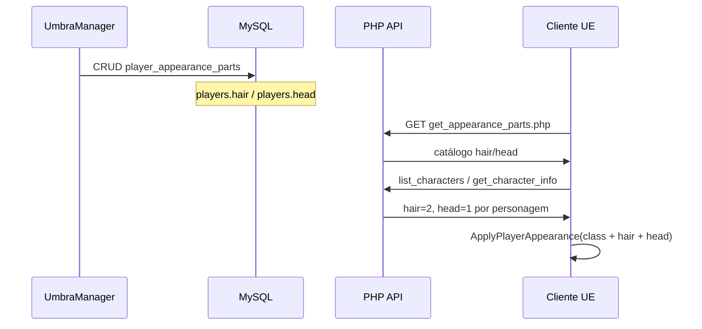

# Guia — Appearance Parts no UmbraManager (UE 5.6.1)

## Objetivo

A aba **Appearance Parts** do UmbraManager mantém o **catálogo global** de variações cosméticas de **cabelo** e **cabeça** que o cliente UE aplica em cima do rig da classe. Cada entrada mapeia um `part_id` numérico para um mesh Unreal e um socket de attach.

Este guia **não** cobre os meshes modulares de corpo/classe (torso, arms, legs, feet, armas default) — esses ficam na aba **Classes**. Veja a seção [Appearance Parts vs Classes](#appearance-parts-vs-classes).

---

## Pré-requisitos

1. Scripts SQL aplicados no banco `umbra_eternum`:

```bash
mysql -u root -p umbra_eternum < www/umbra_api/scripts/add_hair_head_columns.sql
mysql -u root -p umbra_eternum < www/umbra_api/scripts/create_player_appearance_parts.sql
mysql -u root -p umbra_eternum < www/umbra_api/scripts/add_class_mesh_paths.sql
mysql -u root -p umbra_eternum < www/umbra_api/scripts/add_class_modular_mesh_paths.sql
# Se ainda existir left/right_hand de run antigo, o mesmo script agora migra para arms_mesh_path.
# Alternativa dedicada:
mysql -u root -p umbra_eternum < www/umbra_api/scripts/rename_class_hands_to_arms.sql
```

2. Apache/PHP respondendo em `/umbra_api/`.
3. UmbraManager compilado e autenticado como admin.

---

## Appearance Parts vs Classes

| O quê | Onde configurar | Quem consome | Exemplo Polyart |
|-------|-----------------|--------------|-----------------|
| Rig master + AnimBP | **Classes** → `skeletal_mesh_path`, `anim_blueprint_path` | Todos os personagens da classe | Mesh base humanoide |
| Torso, braços, pernas, pés | **Classes** → `torso_mesh_path`, `arms_mesh_path`, … | Por `class_id` | `SK_Male_Torso`, `SK_Male_Arms`, `SK_Male_Legs`, `SK_Male_Feet` |
| Armas default (visual) | **Classes** → `main_hand_mesh_path`, `off_hand_mesh_path` | Por `class_id` | Espada/shield em `HandGrip_R` / `HandGrip_L` |
| Variações de **cabelo** | **Appearance Parts** → `part_type = hair` | Por `players.hair` | Estilos de cabelo diferentes |
| Variações de **cabeça/rosto** | **Appearance Parts** → `part_type = head` | Por `players.head` | `SK_Male_Head` (rosto/cabeça alternativa) |

Regra prática:

- **Mesma peça para todos da classe** → aba **Classes**.
- **Variação escolhida por personagem** (ID no banco) → aba **Appearance Parts**.

---

## Modelo de dados

Tabela: `player_appearance_parts`

| Campo | Significado |
|-------|-------------|
| `part_type` | `hair`, `head` ou `body` (ver nota sobre `body` abaixo) |
| `part_id` | ID numérico gravado em `players.hair` ou `players.head` |
| `mesh_path` | Path completo do asset UE (SKM) |
| `attach_socket` | Nome do socket no rig master onde a peça é anexada |
| `is_enabled` | `1` = visível no catálogo e no cliente; `0` = oculto |

Índice único: `(part_type, part_id)` — não pode haver duas entradas `hair` + `part_id=3`.

### `part_id = 0` (default)

O seed inicial cria entradas `hair/0` e `head/0` com `mesh_path` NULL. Significa **sem peça extra**: o personagem usa só o visual da classe.

No cliente, meshes extras só são aplicados quando `part_id > 0`.

### Sobre `part_type = body`

O Manager e a API aceitam `body`, mas **o cliente UE hoje só aplica `hair` e `head`** (`UUmbraPlayerAppearanceComponent`). Use `body` apenas se você estiver preparando dados para uma feature futura; para corpo modular use a aba **Classes**.

---

## Fluxo ponta a ponta



1. Manager grava o catálogo.
2. Cada linha em `players` guarda quais IDs o personagem usa (`hair`, `head`).
3. No login/lista, o UE carrega o catálogo (`LoadAppearanceParts`) e os IDs por personagem.
4. Ao spawnar preview, pawn local ou remoto, `UUmbraPlayerAppearanceComponent` anexa as SKMs nos sockets configurados.

---

## Passo a passo no Manager

### 1. Abrir a aba

UmbraManager → aba **Appearance Parts**.

### 2. Atualizar lista

Clique em **Atualizar** para carregar `player_appearance_parts` via API admin.

### 3. Criar uma nova parte

1. **Nova parte**
2. Preencher o formulário à direita:

| Campo | Orientação |
|-------|------------|
| `part_type` | `hair` ou `head` |
| `part_id` | Número inteiro ≥ 0; deve bater com `players.hair` ou `players.head` |
| `mesh_path` | Path UE no formato `/Game/Pasta/Asset.Asset` |
| `attach_socket` | Socket do rig master (padrão: `head`) |
| Habilitado | Marcado para o cliente enxergar |

3. **Criar** / **Salvar**

### 4. Editar ou desativar

- Clique **Editar** na grade → altere paths ou desmarque **Habilitado** para esconder sem apagar.
- **Excluir** remove a linha (confirme que nenhum personagem usa aquele `part_id`).

---

## Formato do `mesh_path`

Use sempre o path **completo** copiado do Content Browser (botão direito → Copy Reference):

```
/Game/Polyart/ModularStylizedChars/Meshes/SkeletalMeshes/CharacterModularParts/Male/SK_Male_Head.SK_Male_Head
```

Erros comuns:

- Path sem sufixo `.SK_Male_Head` → load falha no UE (log `[Appearance] Falha ao carregar part`).
- Asset não existe no projeto → mesmo sintoma.
- SKM incompatível com o skeleton do rig master → mesh estranho ou warning; prefira assets do mesmo pack modular.

---

## Vincular ao personagem (`players.hair` / `players.head`)

O catálogo **não** escolhe sozinho qual visual cada personagem usa. É preciso gravar os IDs na tabela `players`:

```sql
-- Personagem id=42: cabelo estilo 2, cabeça padrão 1
UPDATE players SET hair = 2, head = 1 WHERE id = 42;

-- Sem extras (só classe)
UPDATE players SET hair = 0, head = 0 WHERE id = 42;
```

O cliente lê esses valores em:

- `list_characters.php` (seleção de personagem)
- `character_info_helper.php` (mundo / inspect)

**Importante:** o `part_id` do personagem precisa existir no catálogo com `is_enabled = 1` e `mesh_path` preenchido (exceto `0`, que é intencionalmente vazio).

---

## Exemplo completo (Polyart Male)

### Aba Classes (classe Barbarian, `class_id = 1`)

| Campo | Valor exemplo |
|-------|----------------|
| `skeletal_mesh_path` | Rig master compatível com as peças Polyart |
| `anim_blueprint_path` | `/Game/Characters/Mannequins/Anims/Unarmed/ABP_Unarmed` |
| `torso_mesh_path` | `/Game/Polyart/.../SK_Male_Torso.SK_Male_Torso` |
| `arms_mesh_path` | `/Game/Polyart/.../SK_Male_Arms.SK_Male_Arms` |
| `legs_mesh_path` | `/Game/Polyart/.../SK_Male_Legs.SK_Male_Legs` |
| `feet_mesh_path` | `/Game/Polyart/.../SK_Male_Feet.SK_Male_Feet` |

### Aba Appearance Parts

| part_type | part_id | mesh_path | attach_socket |
|-----------|---------|-----------|---------------|
| `head` | `0` | *(vazio)* | `head` |
| `head` | `1` | `/Game/Polyart/.../SK_Male_Head.SK_Male_Head` | `head` |
| `hair` | `0` | *(vazio)* | `head` |
| `hair` | `1` | `/Game/.../SK_Hair_01.SK_Hair_01` | `head` |
| `hair` | `2` | `/Game/.../SK_Hair_02.SK_Hair_02` | `head` |

### Personagem

```sql
UPDATE players SET class_id = 1, hair = 2, head = 1 WHERE id = <player_id>;
```

Resultado esperado no jogo: rig da classe + torso/arms/legs/feet + cabeça Polyart #1 + cabelo #2.

---

## Leader Pose e attach (corpo modular + hair/head)

O rig master (`skeletal_mesh_path`, ex. **SKM_Manny** com material translúcido) é o **Leader Pose Component**: ele anima; todas as peças SKM follower copiam a pose dele.

Regras no cliente (`UmbraPlayerAppearanceComponent`):

| Peça | Attach | Leader Pose |
|------|--------|-------------|
| torso, arms, legs, feet | Raiz do `Mesh` (sem socket) | Sim |
| hair, head (Appearance Parts) | Raiz do `Mesh` (sem socket) | Sim |
| main_hand / off_hand (armas) | Socket `HandGrip_R` / `HandGrip_L` | Não (StaticMesh) |

**Não** use socket (`spine_03`, `pelvis`, `foot_l`, `head`) em peças com Leader Pose — isso desloca o mesh e gera partes flutuando/desconectadas.

O campo `attach_socket` em Appearance Parts permanece no Manager/DB para uso futuro; o cliente **não** usa socket para hair/head modulares SKM.

### Skeleton obrigatório

Todas as SKM follower devem compartilhar o **mesmo Skeleton asset** que o rig master. Se forem diferentes, o Output Log mostra:

`[Appearance] Skeleton mismatch (slot=1): leader=... part=... path=...`

e a peça não é criada (ex.: braços ausentes com path “correto”).

---

## Sockets (`attach_socket` — legado / armas)

Valor histórico em Appearance Parts: **`head`**. Com Leader Pose no hair/head, o socket **não** define posição da peça SKM.

Sockets usados hoje: apenas **armas default** da classe (`HandGrip_R`, `HandGrip_L`).

---

## Onde o visual é aplicado no cliente

| Momento | Comportamento |
|---------|---------------|
| Login | `LoadAppearanceParts()` baixa o catálogo |
| Seleção de personagem | Preview aplica classe + hair/head |
| Entrada no mundo | Pawn local reaplica após `get_character_info` |
| Jogador remoto | Opcode 4 envia `class_id`, `hair`, `head`; mesh remoto atualiza |

Logs úteis (Output Log UE):

- `[UmbraGameInstance] Appearance parts carregadas: N`
- `[Appearance] Falha ao carregar part hair id=X: ...`
- `[Appearance] Skeleton mismatch (...)` — leader e part com skeleton diferente
- `[Appearance] Falha modular SKM slot=1` — braços: path inválido ou load falhou

---

## Checklist de QA

| Teste | Esperado |
|-------|----------|
| Criar `hair/1` com path válido | Aparece na grade após Atualizar |
| Personagem com `hair=0` | Sem mesh extra de cabelo |
| Personagem com `hair=1` | Cabelo visível no preview e no mundo |
| `is_enabled=0` | Cliente ignora a entrada |
| `part_id` inexistente no catálogo | Sem crash; peça simplesmente não aparece |
| Path inválido | Log warning; resto do visual permanece |
| Duplicar `(hair, 1)` | API rejeita (unique key) |
| Remoto multiplayer | Outro cliente vê hair/head corretos após opcode 4 |

---

## Erros frequentes

**Cadastrei no Manager mas no jogo não muda**

1. Personagem tem `hair`/`head` > 0 no banco?
2. Entrada habilitada com path correto?
3. Cliente fez login de novo (catálogo carrega no login)?
4. Recompilou o UE após mudanças C++?

**Cabelo flutuando / offset estranho**

- Peça SKM anexada por socket em vez de Leader Pose na raiz (corrigido no C++).
- Hair/head com skeleton diferente do SKM_Manny → log `Skeleton mismatch`; reimporte no skeleton do Mannequin ou use pack “Rigged to UE5 Mannequin”.

**Peças modulares flutuando / desconectadas**

- Causa típica: Leader Pose + socket (`spine_03`, `pelvis`, etc.) — o cliente agora usa só attach na raiz.
- Recompile o módulo UE após atualizar `UmbraPlayerAppearanceComponent.cpp`.

**Braços/mãos estranhas na junção (punho)**

- Causa típica: geometria do **Manny líder** ainda renderiza braços/mãos por baixo das peças Polyart (mesmo com material translúcido).
- O C++ agora chama `HideBone` no líder para os ossos cobertos por torso/arms/legs/feet/head quando a peça modular correspondente está ativa.
- Se persistir: confirme que `SK_Male_Arms` inclui mãos (Polyart padrão) e que **não** há mesh de mãos em outro slot.

**Braços não aparecem (path correto no Manager)**

1. Output Log: `Skeleton mismatch` → SK_Male_Arms não usa o mesmo Skeleton que SKM_Manny.
2. Output Log: `Falha modular SKM slot=1` → path incompleto (falta `.SK_Male_Arms` no final).
3. Confirme no Content Browser: propriedade **Skeleton** idêntica entre rig master e peças Polyart.

**Confundi com Classes**

- Torso/braços/pernas/pés **não** são Appearance Parts; configure na aba **Classes**.

**Tipo `body` no Manager**

- Aceito pela API, mas **não renderizado** pelo cliente na versão atual. Use Classes para corpo modular.

---

## Referências no repositório

| Arquivo | Papel |
|---------|--------|
| `www/umbra_api/scripts/create_player_appearance_parts.sql` | Schema + seed |
| `www/umbra_api/api/character/get_appearance_parts.php` | Leitura pública (cliente) |
| `www/umbra_api/api/admin/*_appearance_part*.php` | CRUD admin |
| `tools/UmbraManagerWpf/.../AppearancePartsEditorView.xaml` | UI Manager |
| `UmbraEternumUE/.../UmbraPlayerAppearanceComponent.cpp` | Aplicação no pawn |
| `UmbraEternumUE/.../UmbraGameInstance.cpp` | `LoadAppearanceParts`, parse hair/head |
