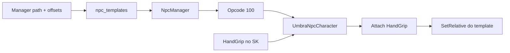

# Guia: arma na mão do NPC (HandGrip) — UE 5.6.1

Fluxo validado no projeto: StaticMesh de arma/escudo anexada em `HandGrip_R` / `HandGrip_L` no Skeletal Mesh do NPC, com path no template (`npc_templates`) via UmbraManager.

## Fluxo recomendado (confirmado)

Use este caminho quando **um mesmo SK** tem um encaixe bom para todos os NPCs que o usam (ex.: Guarda).

1. No **Skeletal Mesh** (Persona / SK editor), selecione o soquete `HandGrip_R` (ou `HandGrip_L`).
2. Ajuste **Relative Location / Rotation / Scale** nos Parâmetros de Soquete até a prévia da arma ficar correta.
3. Salve o mesh.
4. No **UmbraManager** (template NPC):
   - Preencha o path da arma: Mesh mão direita / esquerda (ex.: `/Game/Models/weapons/sword1`).
   - Deixe **todos** os offsets Loc/Rot/Scale em **0** e Scale da mão em **1**.
5. Salve o template (o Manager dispara `reload_npc_instances` nas zones conectadas) ou reinicie a zone.
6. No jogo: a arma deve aparecer no punho.

**Por quê funciona:** o cliente faz Snap no soquete e aplica os offsets do Manager. Com Manager zerado, só o transform do `HandGrip` no SK define o encaixe.

## Regra anti-dobra

Não coloque o **mesmo** Loc/Rot/Scale no soquete **e** no Manager.

| Soquete no SK | Offsets no Manager | Resultado |
|---------------|--------------------|-----------|
| Ajustado (bake) | Tudo 0 / scale 1 | Correto (recomendado) |
| Zerado (0,0,0 / scale 1) | Valores do Details | Correto (por NPC) |
| Ajustado | Mesmos números colados | Errado (transform em dobro) |

## Fluxo alternativo (offsets por NPC)

Quando o **mesmo SK** serve vários NPCs e cada um precisa de encaixe diferente:

1. Ajuste o soquete até a prévia ficar boa **ou** copie os números do Details.
2. **Zere** o soquete no SK (Loc 0, Rot 0, Scale 1) e salve o mesh.
3. No Manager, naquele template, cole:
   - **Loc X/Y/Z** — iguais ao Relative Location do Details.
   - **Rot X/Y/Z** — iguais ao Relative Rotation do Details do UE (`X` = Roll, `Y` = Pitch, `Z` = Yaw).
   - **Scale** — igual ao Relative Scale (uniforme).
4. Salve o template (reload automático das instâncias).

Colunas MySQL: `right_hand_rel_x/y/z`, `right_hand_rel_pitch/yaw/roll`, `right_hand_rel_scale` (e equivalentes `left_hand_*`). O Manager mapeia Rot X/Y/Z ↔ pitch/yaw/roll na borda save/load.

## Runtime (referência)



| Camada | Onde | Papel |
|--------|------|--------|
| Cliente | `UmbraEternumUE/.../Actors/UmbraNpcCharacter.cpp` | Detach/Attach em `HandGrip_R/L`; `SetRelativeLocation/Rotation/Scale` dos offsets do spawn |
| Cliente | `UmbraGameInstance.cpp` (opcode 100) | Lê paths + 7 floats por mão; chama `SetHandAttachOffsets` |
| Zone | `src/zone/NpcManager.cpp` | Carrega paths/offsets do template |
| Protocolo | `src/zone/MovementProtocol.hpp` | Encode/decode após `right_hand_mesh_path` / `left_hand_mesh_path` |
| Admin | UmbraManager Assets UE | Paths + offsets; save → `reload_npc_instances` |
| Schema | `www/umbra_api/scripts/add_npc_hand_attach_offsets.sql` | Colunas de offset |

Log de debug no cliente (Output Log):

```text
[UmbraNpcCharacter] HandAttach npc=... socket=HandGrip_R path=... loc=(...) rot=(P... Y... R...) scale=...
```

Com fluxo recomendado (Manager zerado), espere `loc≈0`, `rot≈0`, `scale=1` e o encaixe vindo do soquete no SK.

## Checklist de teste

- [ ] Guarda: path `/Game/Models/weapons/sword1`, offsets Manager 0, `HandGrip_R` ajustado no SK → punho certo.
- [ ] Soquete e Manager **não** com os mesmos números ao mesmo tempo.
- [ ] Após salvar template com zone admin conectada, NPCs respawnam sem reinício manual (ou reinicie a zone).
- [ ] Escudo na esquerda: mesmo padrão em `HandGrip_L` + `left_hand_mesh_path`.

## Script relacionado (migração única)

Se offsets antigos foram colados como XYZ nos campos pitch/yaw/roll (antes do Manager com Rot X/Y/Z):

```bash
mysql -u root -p umbra_eternum < www/umbra_api/scripts/remap_npc_hand_rot_xyz_to_pyr.sql
```

Rodar **uma vez** só se ainda houver dados no formato antigo. Com fluxo recomendado (Manager 0), esse remap não é necessário.
