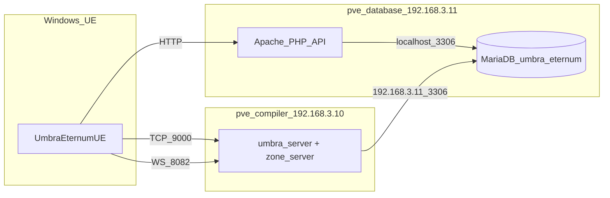

# Guia: deploy Proxmox e como rodar os servidores

Documentação do ambiente de teste com containers **pve-database** (`192.168.3.11`) e **pve-compiler** (`192.168.3.10`).

---

## 1. Contexto do deploy

Objetivo: exportar o banco MySQL local (`umbra_eternum`) e importar no MariaDB do container **pve-database**, configurar Apache/PHP, e apontar o **pve-compiler** + cliente UE para os IPs corretos.

**O que funcionou nos testes:**
- Export do MySQL local (63 tabelas, 32 contas, 24 personagens)
- Import no MariaDB do pve-database
- API PHP em `http://192.168.3.11/umbra_api/api/test.php`
- `umbra_server` (Gateway 9000, Auth 8080) com `database.host = 192.168.3.11`
- `zone_server 0` na porta 8082 (WebSocket)
- Login/registro HTTP

**Pontos de atenção:**
- O binário C++ lê `config/server.json` relativo ao **diretório de execução** (`build/bin/`) — copiar o JSON para `build/bin/config/server.json`
- Apache **não** serve symlinks para `/root` — copiar `www/umbra_api` para `/var/www/html/umbra_api`
- Console Proxmox (tty) e SSH remoto podem ter configurações diferentes para `root`

**NPCs no Proxmox (pendência conhecida):**
- Log: `Got packet bigger than 'max_allowed_packet' bytes` ao carregar NPCs/exp zones
- Queries **sem parâmetros** funcionam (skills, basic_attacks)
- Queries **com `?`** (NpcManager, ExpZoneManager) podem falhar via `executePreparedQuery` contra MariaDB remoto
- No MySQL 8 local (Windows) o mesmo código funciona
- Os NPCs existem no banco importado (12 instâncias) — ver seção 6

---

## 2. Arquitetura alvo



| Serviço | Container | IP | Porta |
|---------|-----------|-----|-------|
| API PHP | pve-database | 192.168.3.11 | 80 |
| MariaDB | pve-database | 192.168.3.11 | 3306 |
| Gateway TCP | pve-compiler | 192.168.3.10 | 9000 |
| Auth | pve-compiler | 192.168.3.10 | 8080 |
| Zone WebSocket | pve-compiler | 192.168.3.10 | 8082 |

---

## 3. Passo a passo manual (containers novos ou reiniciados)

### Fase A — Windows: exportar banco local

```powershell
cd D:\UmbraServerV2

& "C:\Program Files\MySQL\MySQL Server 8.0\bin\mysqldump.exe" -u root -p `
  --databases umbra_eternum `
  --single-transaction --routines --triggers --events `
  --hex-blob --set-gtid-purged=OFF --default-character-set=utf8mb4 `
  > umbra_eternum_proxmox_dump.sql
```

Transferir para o database:

```powershell
scp umbra_eternum_proxmox_dump.sql root@192.168.3.11:/tmp/
```

### Fase B — pve-database: MariaDB + API

No console ou SSH do container:

```bash
apt update
apt install -y mariadb-server apache2 libapache2-mod-php \
  php php-mysql php-cli php-mbstring php-xml php-curl composer

# Permitir conexão remota do compiler
sed -i 's/^bind-address.*/bind-address = 0.0.0.0/' /etc/mysql/mariadb.conf.d/50-server.cnf
systemctl restart mariadb

# Usuários (ajuste senhas em produção)
mysql -u root -p <<'SQL'
CREATE DATABASE IF NOT EXISTS umbra_eternum CHARACTER SET utf8mb4 COLLATE utf8mb4_unicode_ci;
CREATE USER IF NOT EXISTS 'umbra_server'@'192.168.3.10' IDENTIFIED BY '!Mister4126';
GRANT SELECT, INSERT, UPDATE, DELETE ON umbra_eternum.* TO 'umbra_server'@'192.168.3.10';
CREATE USER IF NOT EXISTS 'umbra_api'@'localhost' IDENTIFIED BY '!Mister4126';
GRANT SELECT, INSERT, UPDATE, DELETE ON umbra_eternum.* TO 'umbra_api'@'localhost';
FLUSH PRIVILEGES;
SQL

# Compatibilidade MySQL 8 -> MariaDB
sed -i 's/utf8mb4_0900_ai_ci/utf8mb4_unicode_ci/g' /tmp/umbra_eternum_proxmox_dump.sql
mysql -u root -p < /tmp/umbra_eternum_proxmox_dump.sql

# Publicar API (copiar — NÃO symlink para /root)
cp -a /root/UmbraServerV2/www/umbra_api /var/www/html/
chown -R www-data:www-data /var/www/html/umbra_api
```

Editar [`www/umbra_api/config/database.php`](../www/umbra_api/config/database.php) no container:

- `DB_HOST` = `localhost`
- `DB_USER` = `umbra_api`
- `DB_PASS` = sua senha

```bash
cd /var/www/html/umbra_api && composer install --no-dev
a2enmod rewrite && systemctl reload apache2
curl http://localhost/umbra_api/api/test.php
```

Esperado: `"success": true`, `schema_version` `1.3.0`.

### Fase C — pve-compiler: server.json + compilar

```bash
cd /root/UmbraServerV2

# Opção 1: copiar exemplo do repo
cp config/server.proxmox.json config/server.json

# Opção 2: editar config/server.json manualmente — seção database:
#   "host": "192.168.3.11"
#   "user": "umbra_server"
#   "password": "!Mister4126"

cmake -B build -DCMAKE_BUILD_TYPE=Release
cmake --build build --target umbra_server zone_server -j$(nproc)

# CRÍTICO: config onde o binário roda
cp config/server.json build/bin/config/server.json

mysql -h 192.168.3.11 -u umbra_server -p'!Mister4126' umbra_eternum -e "SELECT 1;"
```

Arquivo de referência: [`config/server.proxmox.json`](../config/server.proxmox.json).

### Fase D — Subir os servidores

```bash
cd /root/UmbraServerV2/build/bin

killall umbra_server zone_server 2>/dev/null || true

./umbra_server > /tmp/umbra_server.log 2>&1 &
./zone_server 0 > /tmp/zone_server_0.log 2>&1 &

sleep 3
ss -tlnp | grep -E '9000|8080|8082'
tail -30 /tmp/umbra_server.log
tail -30 /tmp/zone_server_0.log
```

Procurar nos logs:
- `All servers initialized` (umbra_server)
- `WebSocketServer started on port 8082` (zone_server)
- `[NpcManager] carregadas N instancias` — se N=0, ver seção 6

### Fase E — Cliente UE (Windows)

Configurar no **Blueprint/GameInstance** (sem alterar código-fonte):

| Variável | Valor |
|----------|-------|
| `ServerURL` | `http://192.168.3.11/umbra_api` |
| `GameServerIP` | `192.168.3.10` |
| `GameServerPort` | `9000` |

WebSocket: `ws://192.168.3.10:8082` (Zone ID 0, padrão no cliente).

---

## 4. NPCs: Proxmox vs Windows local

**Sintoma:** `Got packet bigger than 'max_allowed_packet'`, `carregadas 0 instancias`.

**Causa provável:** `executePreparedQuery` com parâmetros (`?`) contra MariaDB remoto. MySQL 8 local não apresenta o mesmo comportamento.

**Opções:**

1. **MySQL 8** no container database (paridade com Windows) — sem mudança de código
2. **Fix mínimo** em [`src/database/MySQLConnector.cpp`](../src/database/MySQLConnector.cpp): adicionar `binds[i].buffer_length = lengths[i]` nos binds de parâmetros → recompilar
3. **Workaround** em NpcManager/ExpZoneManager: `executeQuery()` com `zone_id` inline (inteiro do servidor)

Validar dados no banco:

```sql
USE umbra_eternum;
SELECT COUNT(*) FROM npc_instances;   -- esperado: 12
SELECT COUNT(*) FROM npc_templates;   -- esperado: 10
```

### 4.1 WebSocket fecha no Unreal (auth opcode 109)

**Sintoma:** cliente conecta em `ws://192.168.3.10:8082`, popup "Conexão Encerrada", log do zone:

```
WS client N auth rejeitada: Conta nao encontrada.
```

**Causa:** `executePreparedScalar` contra MySQL 8.4 remoto retorna vazio na query `SELECT session_version FROM accounts WHERE id = ?` (JWT válido, conta existe no banco).

**Fix aplicado (jul/2026):**

1. [`src/database/MySQLConnector.cpp`](../src/database/MySQLConnector.cpp) — bind de resultados por tipo de coluna (`INT` → `LONGLONG`, demais → `STRING`)
2. [`src/zone/MovementSessionAuth.hpp`](../src/zone/MovementSessionAuth.hpp) — fallback com `executeQuery()` se o prepared scalar falhar

**Deploy:** copiar os arquivos, recompilar e reiniciar:

```bash
cd /root/UmbraServerV2/build
cmake --build . --config Release --target zone_server -j4
killall -9 zone_server 2>/dev/null || true
cd /root/UmbraServerV2/build/bin
cp /root/UmbraServerV2/config/server.json config/server.json
./zone_server 0 > /tmp/zone_server_0.log 2>&1 &
```

**Validar:** ao conectar, o log deve mostrar:

```
WS client N autenticado account=XX session_version=YY
```

No cliente UE: logout + login pela API Proxmox (`ServerURL` = `http://192.168.3.11/umbra_api`) antes de entrar na zone.

**Importante:** `ServerURL` e `GameServerIP` são variáveis **diferentes**. Se só a API estiver em `192.168.3.11` mas `GameServerIP` ainda for `127.0.0.1`, o WebSocket tenta `localhost:8082` e o zone no Proxmox **não recebe conexão** (nada aparece no log).

No Blueprint `BP_UmbraGameInstance` ou via código (inferência automática quando `ServerURL` contém `192.168.3.11`):

| Variável | Valor Proxmox |
|----------|----------------|
| `GameServerIP` | `192.168.3.10` |

**Causa:** o cliente UE envia `PlayerInfoUpdate` (ou MoveUpdate) enquanto o opcode 109 ainda está sendo validado no MySQL remoto. O zone kickava com `Autentique-se antes de jogar.`

**Fix (servidor):** mensagens pré-auth são **ignoradas** (não desconectam). O timeout de 10s ainda vale se o 109 nunca chegar.

**Fix (cliente, recompilar UE):** `SendPlayerInfoUpdate` só envia depois de `SessionAuthNotify` ter sido enviado (`bZoneSessionAuthSent`).

### 4.2 Compatibilidade de compilação no pve-compiler (g++/Linux)

Para o próximo clone compilar no Ubuntu sem patches manuais:

| Arquivo | Ajuste |
|---------|--------|
| `src/network/SocketServer.cpp` | `#include <algorithm>` |
| `src/services/Matchmaking.cpp` | `#include <algorithm>` |
| `src/services/SkillTypes.hpp` | `std::max` com cast `int64_t` |
| `src/zone/CharacterStateLoader.cpp` | `item["value_flat"].get<int>()` |

Config de exemplo: [`config/server.proxmox.json`](../config/server.proxmox.json) (senhas/JWT como `CHANGE_ME*`). Dump de referência sanitizado: `umbra_eternum_proxmox_dump.sql` (`password_hash` = `REDACTED_PASSWORD_HASH`).

---

## 5. Conferir se o banco está correto (validação completa)

Use isto **depois do import** no pve-database, com o setup anterior ainda intacto ou após reimportar o dump.

### 5.1 Referência do dump local (Windows)

No seu MySQL local, antes de exportar, anote estes números para comparar:

```powershell
& "C:\Program Files\MySQL\MySQL Server 8.0\bin\mysql.exe" -u root -p -e "
USE umbra_eternum;
SELECT COUNT(*) AS tabelas FROM information_schema.tables WHERE table_schema='umbra_eternum';
SELECT * FROM schema_version;
SELECT COUNT(*) AS accounts FROM accounts;
SELECT COUNT(*) AS players FROM players;
SELECT COUNT(*) AS npc_instances FROM npc_instances;
SELECT COUNT(*) AS skills FROM skills;
"
```

Valores de referência do último export testado (podem variar se você alterou o banco local):

| Item | Valor esperado |
|------|----------------|
| Total de tabelas | **63** |
| `schema_version` | **1.3.0** |
| `accounts` | **32** |
| `players` | **24** |
| `npc_templates` | **10** |
| `npc_instances` | **12** |
| `skills` | **96** (aprox.) |
| `exp_zones` | **1** (aprox.) |

Se os números no Proxmox **batem com o Windows**, o import está correto.

### 5.2 Script de validação no pve-database

No container:

```bash
cd ~/UmbraServerV2
mariadb -u root -p < scripts_main/proxmox/validate_database.sql
```

Ou copie/cole o SQL de [`scripts_main/proxmox/validate_database.sql`](../scripts_main/proxmox/validate_database.sql).

### 5.3 Conferir o que já foi configurado (setup anterior)

Se você **não removeu** o que foi feito antes, verifique:

```bash
# MariaDB escuta na rede?
grep bind-address /etc/mysql/mariadb.conf.d/50-server.cnf
ss -tlnp | grep 3306

# Usuários existem?
mariadb -u root -p -e "
SELECT user, host FROM mysql.user WHERE user IN ('umbra_server','umbra_api');
SHOW GRANTS FOR 'umbra_server'@'192.168.3.10';
"

# API publicada (copia, não symlink)?
ls -la /var/www/html/umbra_api
curl -s http://localhost/umbra_api/api/test.php | head -c 300

# Dump importado?
mariadb -u root -p -e "USE umbra_eternum; SHOW TABLES;" | wc -l
```

**API OK:** JSON com `"success": true`, `schema_version`, contagens de accounts/players.

**Do compiler**, teste conexão remota:

```bash
mysql -h 192.168.3.11 -u umbra_server -p'!Mister4126' umbra_eternum -e "SELECT 1;"
```

### 5.4 Se faltar tabela ou contagem errada

1. Reexportar do Windows (Fase A)
2. No database, **reimportar por cima** (apaga/recria via dump):

```bash
sed -i 's/utf8mb4_0900_ai_ci/utf8mb4_unicode_ci/g' /tmp/umbra_eternum_proxmox_dump.sql
mariadb -u root -p < /tmp/umbra_eternum_proxmox_dump.sql
mariadb -u root -p < ~/UmbraServerV2/scripts_main/proxmox/validate_database.sql
```

Não é necessário rodar dezenas de scripts SQL individuais se o dump completo estiver atualizado.

### 5.5 Fazer tudo funcionar (ordem recomendada)

1. **pve-database:** banco validado (seção 5) + API `test.php` OK
2. **pve-compiler:** `cp config/server.proxmox.json config/server.json` + `cp config/server.json build/bin/config/server.json`
3. **pve-compiler:** subir `umbra_server` e `zone_server 0` (Fase D)
4. **Windows UE:** IPs no Blueprint (Fase E)
5. **NPCs:** se log mostrar `carregadas 0 instancias` → seção 10 (MySQL 8) ou seção 4

---

## 6. Checklist de validação (rede e serviços)

```powershell
# Windows
curl http://192.168.3.11/umbra_api/api/test.php
Test-NetConnection 192.168.3.10 -Port 9000
Test-NetConnection 192.168.3.10 -Port 8082
```

```bash
# pve-compiler
mysql -h 192.168.3.11 -u umbra_server -p umbra_eternum -e "SELECT 1;"
grep NpcManager /tmp/zone_server_0.log
```

---

## 7. Erros comuns

| Erro | Causa | Solução |
|------|-------|---------|
| C++ conecta em `localhost` MySQL | `build/bin/config/server.json` desatualizado | `cp config/server.json build/bin/config/server.json` |
| API 403 Forbidden | Symlink para `/root/UmbraServerV2` | Copiar para `/var/www/html/umbra_api` |
| SSH compiler "Access denied" | SSH ≠ console Proxmox | `passwd root`, `PermitRootLogin yes`, `systemctl restart ssh` |
| Processo antigo não morre | `pkill` insuficiente | `killall -9 zone_server umbra_server` |
| NPCs = 0 | Prepared query + MariaDB | Seção 4 ou **seção 10 (MySQL 8)** |

---

## 8. Scripts auxiliares (opcional)

Pasta [`scripts_main/proxmox/`](../scripts_main/proxmox/):

| Script | Função |
|--------|--------|
| `export_local_db.ps1` | Exporta MySQL local |
| `deploy_proxmox.ps1` | Deploy automático (PuTTY/SSH) |
| `setup_database_container.sh` | Setup pve-database |
| `setup_compiler_container.sh` | Ajusta `server.json` no compiler |
| `start_zone_server.sh` | Inicia zone_server |
| `validate_proxmox.ps1` | Testa portas e API |
| `validate_database.sql` | Contagens e tabelas críticas no MySQL/MariaDB |

Deploy automático (Windows):

```powershell
$env:PROXMOX_SSH_PASSWORD = 'SUA_SENHA_SSH'
.\scripts_main\proxmox\deploy_proxmox.ps1
```

---

## 9. Reexportar banco após mudanças no schema local

```powershell
.\scripts_main\proxmox\export_local_db.ps1
scp umbra_eternum_proxmox_dump.sql root@192.168.3.11:/tmp/
# No database: sed collation + mysql import (Fase B)
```

---

## 10. Alternativa: MySQL 8 no pve-database (paridade com Windows)

Use esta seção se quiser **evitar diferenças MariaDB vs MySQL 8** (especialmente NPCs no `zone_server`). O dump do Windows importa **sem** o `sed` de collation.

### 10.1 Remover MariaDB (se já instalado)

```bash
systemctl stop mariadb 2>/dev/null || true
apt purge -y mariadb-server mariadb-client mariadb-common
apt autoremove -y
rm -rf /var/lib/mysql /etc/mysql
```

### 10.2 Instalar MySQL 8 no Ubuntu 25.04

```bash
apt update
apt install -y wget gnupg lsb-release

wget -O /tmp/mysql.deb https://dev.mysql.com/get/mysql-apt-config_0.8.36-1_all.deb
# Escolha: MySQL Server 8.0, OK nas demais opções
dpkg -i /tmp/mysql.deb
apt update
apt install -y mysql-server mysql-client libmysqlclient-dev

systemctl enable --now mysql
mysql --version
# Esperado: mysql  Ver 8.0.x
```

Durante a instalação, defina senha do **root MySQL** (ex.: a mesma que você já usa: `!Mister4126`).

### 10.3 Configurar rede e usuários (igual MariaDB)

Arquivo: `/etc/mysql/mysql.conf.d/mysqld.cnf`

```ini
[mysqld]
bind-address = 0.0.0.0
character-set-server = utf8mb4
collation-server = utf8mb4_unicode_ci
max_allowed_packet = 64M
```

```bash
systemctl restart mysql

mysql -u root -p <<'SQL'
CREATE DATABASE IF NOT EXISTS umbra_eternum
  CHARACTER SET utf8mb4 COLLATE utf8mb4_unicode_ci;
CREATE USER IF NOT EXISTS 'umbra_server'@'192.168.3.10' IDENTIFIED BY '!Mister4126';
GRANT SELECT, INSERT, UPDATE, DELETE ON umbra_eternum.* TO 'umbra_server'@'192.168.3.10';
CREATE USER IF NOT EXISTS 'umbra_api'@'localhost' IDENTIFIED BY '!Mister4126';
GRANT SELECT, INSERT, UPDATE, DELETE ON umbra_eternum.* TO 'umbra_api'@'localhost';
FLUSH PRIVILEGES;
SQL
```

### 10.4 Importar dump (sem conversão de collation)

No **Windows**, exporte como na Fase A e envie:

```powershell
scp umbra_eternum_proxmox_dump.sql root@192.168.3.11:/tmp/
```

No **pve-database**:

```bash
# MySQL 8 aceita utf8mb4_0900_ai_ci do dump — NÃO precisa do sed
mysql -u root -p < /tmp/umbra_eternum_proxmox_dump.sql

# Validar
mysql -u root -p < ~/UmbraServerV2/scripts_main/proxmox/validate_database.sql
```

### 10.5 API PHP com MySQL 8

Mesmo procedimento da Fase B:

```bash
apt install -y apache2 libapache2-mod-php php php-mysql php-cli php-mbstring php-xml php-curl composer
cp -a ~/UmbraServerV2/www/umbra_api /var/www/html/
# database.php: DB_HOST=localhost, DB_USER=umbra_api, DB_PASS=...
cd /var/www/html/umbra_api && composer install --no-dev
systemctl reload apache2
curl http://localhost/umbra_api/api/test.php
```

O PHP usa `pdo_mysql` — funciona igual com MySQL 8 e MariaDB.

### 10.6 Compiler (sem mudança)

`config/server.json` continua com `"host": "192.168.3.11"`. Recompile só se trocou de MariaDB para MySQL **depois** de já ter buildado (não é obrigatório só por trocar o DB).

Reinicie servidores no compiler (Fase D) e confira NPCs:

```bash
grep NpcManager /tmp/zone_server_0.log
# Esperado: carregadas 12 instancias (ou o count do seu dump)
```

### 10.7 MariaDB vs MySQL 8 — resumo

| | MariaDB 11 (apt) | MySQL 8 (Oracle repo) |
|--|------------------|------------------------|
| Dump Windows | Precisa `sed` collation | Import direto |
| NPCs no zone_server | Pode falhar (prepared query) | Deve funcionar como no Windows |
| Comando cliente | `mariadb` | `mysql` |
| Config rede | `/etc/mysql/mariadb.conf.d/` | `/etc/mysql/mysql.conf.d/` |

---

## 11. Alinhar código no pve-compiler após reset

Se o source no compiler foi alterado manualmente:

```bash
cd /root/UmbraServerV2
git checkout -- src/
git pull
cd build && cmake --build . --target umbra_server zone_server
cp config/server.json build/bin/config/server.json
```
