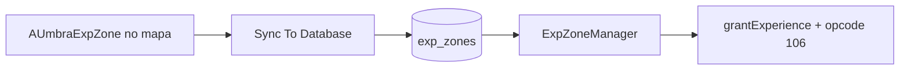

# Guia: Sistema de EXP in-game

## Visão geral

Progressão autoritativa de experiência no servidor C++ (`ExperienceService`) com espelho PHP para quests/admin. Feedback em tempo real via WebSocket (opcodes **106** e **107**).

## Fluxo

```
Fonte (área EXP, quest, admin)
  → ExperienceService::grantExperience(playerId, amount, source)
  → UPDATE players (level, experience, next_level_exp)
  → Triggers MySQL: stat points + skill points
  → CharacterStateLoader::invalidate(playerId)
  → Broadcast opcode 106 (sempre) e 107 (se subiu nível)
  → Cliente UE: floating +EXP, HUD, popup level-up
```

## API C++ (zone)

```cpp
ExperienceGrantResult grantExperience(uint32_t playerId, int64_t amount, const std::string& source);
```

| Campo | Descrição |
|-------|-----------|
| `expGranted` | EXP deste grant |
| `totalExperience` | EXP total após grant |
| `oldLevel` / `newLevel` | Níveis antes/depois |
| `levelsGained` | Quantos níveis subiu |
| `statPointsGained` | Soma de `stat_points_gained` por nível (trigger DB) |
| `skillPointsGained` | Delta de `points_available` |
| `expForNextLevel` | Cache `player_levels.exp_for_next_level` |
| `expInCurrentLevel` | EXP dentro do nível atual (`total - exp_required`) |
| `expProgressPercent` | 0–100 no nível atual |
| `source` | Tag de auditoria (ex.: `exp_zone:training_area`, `quest:kill_wolves_01`) |

## Protocolo WebSocket

| Opcode | Nome | Payload (servidor → cliente) |
|--------|------|------------------------------|
| **106** | `ExpGainNotify` | `[type][playerId:4][expGained:i32][totalExp:i64][expForNext:i32][progressPercent:u8][expInCurrentLevel:i32]` (26 bytes) |
| **107** | `LevelUpNotify` | `[type][playerId:4][newLevel:u32][levelsGained:u8][statPointsGained:u16][skillPointsAvail:u16]` |

Destinatários: jogador + party + AOI (mesmo padrão de vitals).

### Cliente UE — roteamento obrigatório

Em [`NetMovementClient.cpp`](../UmbraEternumUE/Source/UmbraEternumUE/Network/NetMovementClient.cpp), os opcodes **106** e **107** devem estar em `bIsSocialMessage` para chegar a `UUmbraGameInstance::ProcessSocialWebSocketMessage`. Sem isso: sem floating `+EXP`, sem popup de level-up, sem atualização de skill points em tempo real.

### Semântica EXP no cliente (`FUmbraCharacterInfo`)

| Campo | Significado |
|-------|-------------|
| `TotalExperience` / `Experience` | EXP total acumulada (lifetime, DB `players.experience`) |
| `ExpInCurrentLevel` | EXP dentro do nível atual (`total - exp_required`) |
| `ExpForNextLevel` | EXP necessária para subir do nível atual |
| `ExpProgressPercent` | 0–100 no nível atual |

**WBP_CharacterInfo:** exibir `ExpInCurrentLevel / ExpForNextLevel` (não total / exp_for_next).

## PHP

### Helper

`www/umbra_api/helpers/experience_helper.php` — função `umbra_grant_experience($pdo, $player_id, $amount, $source)`.

### Endpoint

`POST /umbra_api/api/character/grant_experience.php`

```json
{
  "token": "<jwt>",
  "player_id": 1,
  "amount": 500,
  "source": "quest:example"
}
```

Resposta espelha `ExperienceGrantResult` (+ `leveled_up`, `skill_points_available`).

## Áreas de EXP (resumo servidor)

Tabela `exp_zones` no MySQL (script `create_exp_zones_table.sql`). `ExpZoneManager` carrega as zonas **uma vez** na inicialização e verifica jogadores a cada 1 s:

- Jogador dentro do cilindro (`radius` horizontal, tolerância Z ±500 uu)
- Não morto
- Cooldown por jogador = `tick_interval_sec`
- Grant com `source = "exp_zone:" + name`

Área de teste padrão: zone `0`, nome `training_area`, +50 EXP a cada 5s.

**Passo a passo no MySQL e no mapa:** ver [§2 — Área de EXP no MySQL](#2--área-de-exp-no-mysql).

## Level-up e pontos

| Evento | Stat points | Skill points |
|--------|-------------|--------------|
| Level N→N+k | Trigger `trg_update_stat_points_on_level`: `+10 × k` em `unspent_points` | Trigger `trg_update_skill_points_on_level` **ou** `ExperienceService` UPDATE explícito: `level × 3` disponíveis |
| Aprender skill | — | `learn_skill.php` gasta `skill_cost` |
| Distribuir stat | `distribute_stat_points.php` | — |

Subir nível **não** aprende skills — só libera `can_learn` em `get_available_skills.php`.

A **distribuição de atributos** fica no `WBP_CharacterInfo` existente (*Pontos disponíveis*, Apply/Reset, coluna +/-). O popup de level-up **não** duplica essa UI — ver [§5](#5--widget-level-up-wbp_levelup--popup-minimalista).

## Hook para quests (contrato)

### Recompensa JSON

```json
{
  "rewards": [
    { "type": "experience", "amount": 250, "source": "quest:kill_wolves_01" }
  ]
}
```

Quest engine (futuro) chama `grant_experience.php` ou `ExperienceService` via bridge C++.

### Variáveis de quest sugeridas

| Variável | Origem |
|----------|--------|
| `exp_gained_total` | Soma na sessão ou agregado DB |
| `exp_gained_last` | `exp_granted` da última resposta |
| `player_level` | `new_level` após grant |
| `leveled_up` | `levels_gained > 0` |

### Auditoria opcional

Tabela sugerida `player_exp_log` (`player_id`, `amount`, `source`, `created_at`) para objetivos do tipo “ganhe 5000 EXP”.

---

## Implementação no Editor (UE 5.6.1)

Este guia assume **Unreal Engine 5.6.1** e o código C++ já presente no repositório. O foco é **passos no Editor** para ligar floating EXP, barra no HUD, área de treino no MySQL e popup de level-up.

Estilo de referência (tabelas nó a nó): [GUIA_NODOS_LOJA_NAMEPLATE_COMPRADOR_UE561.md](GUIA_NODOS_LOJA_NAMEPLATE_COMPRADOR_UE561.md).

### 0. Referência rápida C++

| Área | Classe / delegate | Arquivo(s) |
|------|-------------------|--------------|
| Grant EXP (servidor) | `ExperienceService`, `ExpZoneManager` | `src/zone/ExperienceService.*`, `ExpZoneManager.*` |
| Volume visual mapa | `AUmbraExpZone` | `UmbraEternumUE/.../Actors/UmbraExpZone.h/.cpp` |
| Opcodes 106/107 | `ExpGainNotify`, `LevelUpNotify` | `src/zone/MovementProtocol.hpp` |
| GameInstance | `OnExpGained`, `OnLevelUp`, `OnSkillPointsUpdated` | `UmbraEternumUE/.../Core/UmbraGameInstance.h/.cpp` |
| Barra EXP HUD | `UUmbraHudExperienceWidget` | `.../UI/UmbraHudExperienceWidget.h/.cpp` |
| Popup level-up | `UUmbraLevelUpWidget` | `.../UI/UmbraLevelUpWidget.h/.cpp` |
| Floating `+N EXP` | `UUmbraCombatFloatingTextComponent` | `.../Components/UmbraCombatFloatingTextComponent.cpp` |
| Ficha / pontos | `UUmbraCharacterInfoWidget` | `.../UI/Character/UmbraCharacterInfoWidget.h/.cpp` |
| Skill book | `OpenSkillBook` no PlayerController | `UmbraEternumUEPlayerController.h/.cpp` |
| Refresh ficha | `RequestCharacterInfoRefresh` | `UmbraGameInstance.h` |

**BindWidget (nomes exatos no Designer):**

| Parent C++ | Widgets UMG |
|------------|-------------|
| `UmbraHudExperienceWidget` | `ProgressBar_EXP_HUD`, `Text_Level_HUD` |
| `UmbraLevelUpWidget` | `Text_Level` (recomendado); `Text_StatPoints` / `Text_SkillPoints` são opcionais — **omitir** no BP minimalista |
| `UmbraCharacterInfoWidget` | `Text_UnspentPoints`, `Btn_Apply`, `Btn_Reset`, `Btn_Plus_*` — ver [GUIA_COMPLETO_CHARACTER_INFO](../UmbraServer/docs_main/GUIA_COMPLETO_CHARACTER_INFO_PONTOS_STATUS_TOOLTIPS.md) |

### 1. Pré-requisitos

| # | Onde | O que fazer |
|---|------|-------------|
| 1.1 | Visual Studio + Editor UE **5.6.1** | Compilar o módulo `UmbraEternumUE` sem erros (classes `UmbraLevelUpWidget`, `UmbraHudExperienceWidget`, etc.). |
| 1.2 | Servidor C++ | Build `zone_server.exe` e manter rodando com MySQL conectado. |
| 1.3 | MySQL | Rodar `www/umbra_api/scripts/create_exp_zones_table.sql` e `add_stat_points_level_trigger.sql`. |
| 1.4 | `config/manager.json` | Confirmar `zone_instances` (ex.: `[0]` → `zone_id = 0` na tabela `exp_zones`). |
| 1.5 | Cliente in-game | Login + seleção de personagem + WebSocket da zone ativo (EXP só chega online). |
| 1.6 | Apache / VaRest | API PHP acessível na URL configurada no projeto. |

---

### 2. Área de EXP no MySQL



**Fonte da verdade:** tabela `exp_zones` no MySQL. O actor no mapa é ferramenta visual; use **Sync To Database** para gravar a geometria no banco.

#### 2.1 Confirmar `zone_id`

O `zone_id` em `exp_zones` deve coincidir com a instância C++ onde o jogador está conectado:

| Config | Valor típico |
|--------|--------------|
| `config/manager.json` → `zone_instances` | `[0]` |
| Linha em `exp_zones` | `zone_id = 0` |
| Seed padrão | `name = 'training_area'` |

#### 2.2 Volume visual no mapa (`AUmbraExpZone`) — recomendado

| # | Editor | Ação |
|---|--------|------|
| 2.2.1 | **Place Actors** ou Content Browser | **C++ Classes → UmbraEternumUE → Actors → UmbraExpZone** → arrastar para o mapa |
| 2.2.2 | Posicionar | Mover para o centro da área de treino |
| 2.2.3 | **Details → Exp Zone** | `Zone Id` = `0`, `Zone Name` = `training_area`, `Radius`, `Exp Per Tick`, `Tick Interval Sec` |
| 2.2.4 | **Visual** (child) | **Static Mesh** = `Cylinder`; material translúcido (ex. `M_ExpZone_Debug`) |
| 2.2.5 | Ajustar tamanho | `Radius` e `Height Half Extent` redimensionam o cilindro |
| 2.2.6 | **Sync To Database** | Botão no Details → HTTP para `upsert_exp_zone.php` (**funciona sem PIE**; usa `Dev Api Base Url`) |
| 2.2.7 | Reiniciar zone | Reinicie `zone_server` após sync (zonas carregadas na inicialização) |

**Blueprint filho (opcional):** `BP_ExpZone_Training` (parent `UmbraExpZone`).

**Como funciona:**

- O cilindro é **visual** + ferramenta de level design. O grant usa **MySQL** (`ExpZoneManager` lê `exp_zones` no startup).
- `Sync To Database` usa `VaRestSubsystem` + `Dev Api Base Url` (padrão `http://localhost/umbra_api`) — **não exige GameInstance**.
- Em PIE com login, o token JWT é enviado se disponível; em dev local o endpoint aceita sem token.
- O SQL equivalente aparece no **Output Log** se o HTTP falhar.

**Propriedades (Details):**

| Propriedade | Padrão | Descrição |
|-------------|--------|-----------|
| `Zone Id` | 0 | `exp_zones.zone_id` |
| `Zone Name` | `training_area` | Identificador único por zona |
| `Dev Api Base Url` | `http://localhost/umbra_api` | API usada no Editor sem login |
| `Radius` | 1500 | Raio horizontal (uu) |
| `Height Half Extent` | 500 | Visual apenas; servidor usa ±500 uu em Z |
| `Exp Per Tick` | 50 | EXP por intervalo |
| `Tick Interval Sec` | 5 | Cooldown por jogador |
| `Min/Max Player Level` | 0 | 0 = sem limite |
| `Enabled` | true | Desliga sem apagar do mapa |

#### 2.3 Obter coordenadas manualmente (alternativa)

| # | Método | Passos |
|---|--------|--------|
| 2.3.1 | **Details** | PIE → personagem → **Transform → Location** (X, Y, Z). |
| 2.3.2 | SQL direto | `UPDATE exp_zones SET center_x=..., radius=...` |

```sql
UPDATE exp_zones
SET center_x = -1234.0,
    center_y = 5678.0,
    center_z = 120.0,
    radius = 1500,
    exp_per_tick = 50,
    tick_interval_sec = 5.0,
    enabled = 1
WHERE zone_id = 0 AND name = 'training_area';
```

#### 2.4 Criar área adicional

```sql
INSERT INTO exp_zones (
    zone_id, name, center_x, center_y, center_z, radius,
    exp_per_tick, tick_interval_sec, min_player_level, max_player_level, enabled
) VALUES (
    0, 'village_safe', 5000.0, -2000.0, 100.0, 800,
    25, 10.0, 1, 10, 1
);
```

Ou coloque outro `AUmbraExpZone` no mapa e use **Sync To Database**.

#### 2.5 Validação rápida

1. **Sync To Database** com Apache/PHP rodando.
2. Reiniciar `zone_server` → log `[ExpZoneManager] loaded N exp zones from MySQL`.
3. Personagem dentro do raio → `[ExperienceService] grant ... source=exp_zone:training_area`.
4. Cliente: floating **`+50 EXP`** + barra HUD.

#### 2.6 Troubleshooting área EXP

| Sintoma | Causa provável | Correção |
|---------|----------------|----------|
| Nenhum EXP | `zone_id` errado | Conferir instância do `zone_server` vs. linha SQL |
| Nenhum EXP | Actor visual longe do MySQL | **Sync To Database** após mover o actor |
| Sync não grava | Apache/API offline | Subir Apache; conferir `Dev Api Base Url` |
| Nenhum EXP | Jogador fora do raio | Comparar posição do pawn com `center_x/y` e `radius` |
| Nenhum EXP | Jogador morto | `isDead` bloqueia grant |
| Nenhum EXP | `enabled = 0` | `UPDATE exp_zones SET enabled = 1` |
| Mudança SQL sem efeito | Zonas carregadas no startup | Reiniciar `zone_server` |
| EXP só via PHP, não na área | `zone_server` sem DB | Verificar conexão MySQL no log de startup |

---

### 3. Floating EXP (verificação)

Não é necessário Blueprint extra se o componente de combate já estiver no pawn.

| # | Editor | Ação |
|---|--------|------|
| 3.1 | Blueprint do personagem jogável | Abrir (ex. variant de combate / `BP_UmbraCharacter`). |
| 3.2 | **Components** | Confirmar **`UmbraCombatFloatingTextComponent`**. |
| 3.3 | **Class Defaults** do componente | `Damage Widget Class` → `WBP_DamageNumber` (parent `UUmbraDamageNumberWidget`). |
| 3.4 | PIE na área EXP | Deve aparecer **`+50 EXP`** em roxo `(0.75, 0.55, 1.0)` sem wiring manual. |

O C++ escuta `OnExpGained` no `BeginPlay` do componente.

---

### 4. Barra EXP no HUD (`WBP_HudExperience` + `WBP_PlayerHUD`)

Use um **sub-widget** dedicado; não reparente o `WBP_PlayerHUD` inteiro.

| # | Editor | Ação |
|---|--------|------|
| 4.1 | Content Browser → `Content/Widgets/HUD/` | **Add → User Interface → Widget** → `WBP_HudExperience` |
| 4.2 | **Class Settings → Parent Class** | `UmbraHudExperienceWidget` |
| 4.3 | **Designer** | `Horizontal Box`: `Text_Level_HUD` (Text Block) + `ProgressBar_EXP_HUD` (Progress Bar, fill horizontal) |
| 4.4 | Nomes **exatos** | `Text_Level_HUD`, `ProgressBar_EXP_HUD` — marcar **Is Variable** |
| 4.5 | Estilo | Barra fina (~8–12 px); cor fill roxa/dourada alinhada ao floating |
| 4.6 | Abrir `WBP_PlayerHUD` | Arrastar instância de `WBP_HudExperience` para o layout (topo ou perto da barra de HP) |
| 4.7 | Anchors | Top-center ou top-left; margens para não sobrepor skill bar |
| 4.8 | **Compile → Save** | Ambos os assets |
| 4.9 | PIE | `Text_Level_HUD` mostra nível de `CurrentCharacterInfo`; barra atualiza no opcode **106** |

**Não é necessário** bind manual a `OnExpGained` no `WBP_PlayerHUD` — o parent C++ já escuta os delegates.

---

### 5. Widget Level Up (`WBP_LevelUp`) — popup minimalista

**Princípio:** a alocação de pontos **não** fica no popup. O jogador distribui atributos no **`WBP_CharacterInfo`** — *Pontos disponíveis: N*, **Apply** / **Reset**, coluna **+** / **−** (guia: [GUIA_COMPLETO_CHARACTER_INFO](../UmbraServer/docs_main/GUIA_COMPLETO_CHARACTER_INFO_PONTOS_STATUS_TOOLTIPS.md)).

O `WBP_LevelUp` só **celebra o nível** e oferece **um atalho** para abrir a ficha.

#### 5.1 Criar o asset

| # | Editor | Ação |
|---|--------|------|
| 5.1.1 | `Content/Widgets/HUD/` | Criar `WBP_LevelUp` |
| 5.1.2 | **Parent Class** | `UmbraLevelUpWidget` |
| 5.1.3 | **Class Defaults** | `Auto Hide Sec` = **8** (popup some sozinho) |
| 5.1.4 | **Visibility** no Designer | **Collapsed** |

#### 5.2 Hierarquia UMG (enxuta)

```
WBP_LevelUp (UmbraLevelUpWidget) — Visibility: Collapsed
└── Border_Panel (Border) — ~300×120, fundo semi-transparente
    └── HorizontalBox_Row
        ├── Text_Level              ← "Nível 50!" (C++ preenche via BindWidget)
        └── BTN_OpenCharacterInfo   ← botão "+" ou ícone de ficha
```

**Não incluir no popup:**

- `Text_StatPoints`, `Text_SkillPoints`
- Apply / Reset ou +/- de atributos
- Botão de skill book (opcional futuro; tecla **K** / HUD já abre o skill book)

#### 5.3 Inserir no `WBP_PlayerHUD`

| # | Ação |
|---|------|
| 5.3.1 | Arrastar `WBP_LevelUp` para dentro do `WBP_PlayerHUD` |
| 5.3.2 | Posição central ou canto superior; **ZOrder alto** (ex. 500) |
| 5.3.3 | Não precisa fullscreen — painel compacto basta |

#### 5.4 Animação e som (`On Level Up Shown`)

No **Graph** do `WBP_LevelUp`, implementar o evento Blueprint **`On Level Up Shown`**:

1. **Set Visibility** → Visible
2. **Play Animation** em `Border_Panel` (ex. `Anim_LevelUp_Pop`: scale 0.8 → 1.1 → 1.0 em ~0.4 s)
3. **Play Sound 2D** (asset curto de level-up, opcional)
4. Não chamar Collapsed manualmente — o C++ esconde após `AutoHideSec`

#### 5.5 Botão único: abrir Character Info

No **`BTN_OpenCharacterInfo` → OnClicked**:

| Passo | Nó Blueprint |
|-------|--------------|
| 1 | **Get Player Controller** → cast para o BP do seu PlayerController |
| 2 | **Get Game Instance** → cast `UmbraGameInstance` |
| 3 | **`Request Character Info Refresh`** (garante `Text_UnspentPoints` atualizado) |
| 4 | Abrir a ficha — **reutilize o mesmo fluxo** que o HUD já usa hoje (ex. função `OpenCharacterInfo` no `WBP_PlayerHUD`, botão de atalho C, etc.): |
| | → Se já existir instância: **Set Visibility** Visible + **Bring to Front** |
| | → Se não existir: **Create Widget** (`WBP_CharacterInfo`) → **Add to Viewport** |
| 5 | **Set Visibility Collapsed** no `WBP_LevelUp` |

Na ficha aberta, o jogador usa *Pontos disponíveis*, coluna **+** e **Apply** — fluxo já implementado no `UmbraCharacterInfoWidget`.

**Exemplo de fluxo (se o HUD centraliza a ficha):**

```
BTN_OpenCharacterInfo (OnClicked)
  → Get Owning Player → Get HUD Widget (ou variável CharacterInfoRef no PlayerController)
  → Chamar função BP existente "OpenCharacterInfo" / "ToggleCharacterInfo"
  → Request Character Info Refresh (GameInstance)
  → Set Visibility Collapsed (self = WBP_LevelUp)
```

#### 5.6 Skill book (fora do popup)

Após level-up, o C++ já chama `LoadAvailableSkills()` e `LoadPlayerSkills()`. O jogador abre o skill book quando quiser (**K** ou botão no HUD). Não é requisito do popup de level-up.

---

### 6. Composição final do `WBP_PlayerHUD`

```
WBP_PlayerHUD
├── ... (HP, mana, skill bar, chat — existentes)
├── WBP_CombatFeedback (UmbraCombatFeedbackWidget)
├── WBP_HudExperience (UmbraHudExperienceWidget)     ← §4
└── WBP_LevelUp (UmbraLevelUpWidget)                 ← §5, ZOrder alto
```

| # | Verificar |
|---|-----------|
| 6.1 | `WBP_PlayerHUD` é adicionado ao viewport **uma vez** (PlayerController / GameMode — fluxo já existente no projeto). |
| 6.2 | Não criar segunda instância de `WBP_LevelUp` fora do HUD. |
| 6.3 | `WBP_CharacterInfo` continua sendo aberto pelo fluxo habitual; o popup só redireciona para ele. |

---

### 7. Checklist de aceite E2E (PIE)

| Passo | Ação | Esperado visual |
|-------|------|-----------------|
| 1 | Parado na `training_area` 5 s | Floating `+50 EXP` + barra HUD sobe |
| 2 | Acumular 1000 EXP | Popup: `Text_Level` “Nível 2!” + botão **+** |
| 3 | Clicar **+** | `WBP_CharacterInfo` com *Pontos disponíveis: 10* (ou saldo correto) |
| 4 | Na ficha: **+** e **Apply** | Stats sobem; pontos disponíveis diminuem |
| 5 | `grant_experience.php` com 1000 EXP | Mesmo popup (valida PHP sem área) |
| 6 | Morto na área | Sem EXP |

### Smoke test PHP

```bash
curl -X POST http://localhost/umbra_api/api/character/grant_experience.php \
  -H "Content-Type: application/json" \
  -d '{"token":"<jwt>","player_id":1,"amount":1000,"source":"admin:smoke"}'
```

---

### 8. Troubleshooting Blueprint

| Sintoma | Causa | Correção |
|---------|-------|----------|
| Barra/nível HUD não atualiza | Parent class errado em `WBP_HudExperience` | Reparent para `UmbraHudExperienceWidget` |
| `Text_Level` vazio no popup | Nome diferente de `Text_Level` | Renomear widget; **Is Variable** marcado |
| Popup nunca aparece | `WBP_LevelUp` fora do viewport / não filho do HUD | Inserir no `WBP_PlayerHUD` com ZOrder alto |
| Popup visível no Designer mas não no PIE | Visibility Visible no Designer | Deixar **Collapsed**; C++/evento mostram |
| Botão **+** não abre ficha | Fluxo isolado sem reutilizar OpenCharacterInfo | Chamar mesma função BP do atalho existente |
| Pontos desatualizados na ficha | Sem refresh antes de abrir | `RequestCharacterInfoRefresh` no OnClicked |
| Floating `+EXP` não aparece | Opcodes 106/107 não roteados no `NetMovementClient` | Incluir `MsgType == 106 \|\| 107` em `bIsSocialMessage` |
| Texto `Exp: 121500 / 18850` | Usando EXP total no numerador | Usar `ExpInCurrentLevel / ExpForNextLevel` |
| Stat sobe, skill não no level-up | Trigger skill ausente + opcode 107 | Rodar `add_skill_points_level_trigger.sql`; `ExperienceService` já faz UPDATE explícito |
| Skill book não atualiza pontos | Sem bind `OnSkillPointsUpdated` | Parent `UmbraSkillBookWidget` + opcional `Text_SkillPoints` |
| Dois HUDs / dois popups | `Add to Viewport` duplicado | Uma instância só do `WBP_PlayerHUD` |

---

## Scripts SQL (ordem)

1. `www/umbra_api/scripts/create_exp_zones_table.sql`
2. `www/umbra_api/scripts/add_stat_points_level_trigger.sql`
3. `www/umbra_api/scripts/add_skill_points_level_trigger.sql`
4. `www/umbra_api/scripts/populate_player_levels.sql` (se tabela vazia)

## Arquivos principais

| Camada | Arquivos |
|--------|----------|
| Servidor | `src/zone/ExperienceService.*`, `ExpZoneManager.*`, `MovementProtocol.hpp`, `ZoneServer.cpp` |
| Config geometria | `config/exp_zones_zone{id}.json`, `config/server.json` → `zone.exp_zones_file_pattern` |
| SQL (fallback) | `create_exp_zones_table.sql`, `add_stat_points_level_trigger.sql` |
| PHP | `experience_helper.php`, `grant_experience.php` |
| Cliente C++ | `UmbraGameInstance.*`, `UmbraCombatFloatingTextComponent.*`, `UmbraLevelUpWidget.*`, `UmbraHudExperienceWidget.*`, `UmbraExpZone.*`, `Editor/UmbraExpZoneExporter.*` |
| Cliente BP | `WBP_HudExperience`, `WBP_LevelUp`, `WBP_PlayerHUD`, `WBP_CharacterInfo`, `BP_ExpZone_*` |
| PHP zone | `api/zone/upsert_exp_zone.php` |
