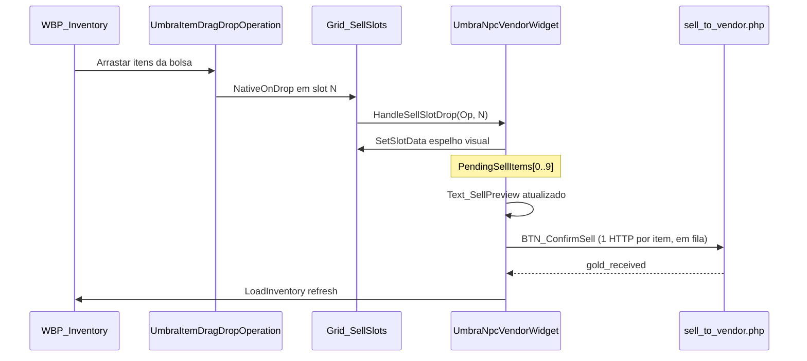

# Guia passo a passo — NPC interativo, diálogo e vendedor (UE **5.6.1**)

Este guia cobre a integração completa do sistema de NPCs não atacáveis com menu de diálogo (Quest stub + Troca) e loja de NPC (compra/venda via PHP/MySQL).

---

## 0. Referência rápida (C++)

| Área | Classe / endpoint | Arquivo |
|------|-------------------|---------|
| NPC no mundo | `AUmbraNpcCharacter` | `UmbraEternumUE/.../Actors/UmbraNpcCharacter.*` |
| Interação (raio + E) | `UUmbraNpcInteractionComponent` | `.../Components/UmbraNpcInteractionComponent.*` |
| Diálogo | `UUmbraNpcDialogWidget` | `.../UI/UmbraNpcDialogWidget.*` |
| Vendedor | `UUmbraNpcVendorWidget` | `.../UI/UmbraNpcVendorWidget.*` |
| HTTP / abrir UI | `UUmbraGameInstance::OpenNpcDialog`, `OpenNpcVendorUI`, `PurchaseFromNpcVendor`, `SellToNpcVendor` | `.../Core/UmbraGameInstance.*` |
| PlayerController | `InteractPressed()` | `.../UmbraEternumUEPlayerController.*` |
| SQL | `create_npc_interactive_tables.sql` | `www/umbra_api/scripts/` |
| PHP | `api/npc_vendor/*.php` | `www/umbra_api/api/npc_vendor/` |

---

## 1. Pré-requisitos

| # | Onde | Ação |
|---|------|------|
| 1.1 | MySQL | Rodar `combat_v2.sql` (se ainda não aplicado) |
| 1.2 | MySQL | Rodar `www/umbra_api/scripts/create_npc_interactive_tables.sql` |
| 1.3 | Servidor C++ | Rebuild zone server após alterações em `NpcManager` / `MovementProtocol.hpp` |
| 1.4 | UE 5.6.1 | Compile C++ no Editor até zerar erros |
| 1.5 | WAMP | `umbra_api` acessível na URL do VaRest |

Validação SQL:

```sql
SELECT nt.npc_name, nt.is_attackable, nt.has_vendor, nv.vendor_id
FROM npc_templates nt
LEFT JOIN npc_vendors nv ON nv.npc_template_id = nt.npc_template_id
WHERE nt.npc_name = 'npc_merchant_01';
```

Após spawn no mundo, recarregar NPCs no zone server: comando admin `reload_npc_instances`.

---

## 2. GameInstance — Class Defaults

| # | No Editor | Ação |
|---|-----------|------|
| 2.1 | Blueprint do **GameInstance** → **Class Defaults** | |
| 2.2 | Categoria **Npc\|Interaction\|UI** | **Npc Dialog Widget Class** → `WBP_NpcDialog` |
| 2.3 | Categoria **Npc\|Vendor\|UI** | **Npc Vendor Widget Class** → `WBP_NpcVendor` |
| 2.4 | Compile + Save | |

---

## 3. WBP_NpcDialog (parent `UmbraNpcDialogWidget`)

Criar em `/Game/Widgets/UI/Npc/WBP_NpcDialog`.

| Nome exato no Designer | Tipo | Função |
|-----------------------|------|--------|
| `Text_NpcName` | TextBlock | Título / nome |
| `Text_DialogBody` | TextBlock | Corpo do diálogo |
| `Btn_Quest` | Button | Abre `WBP_QuestInteraction` (sistema de quests) |
| `Btn_Trade` | Button | Abre `WBP_NpcVendor` |
| `Btn_Close` | Button | Fecha painel |

**Reparent:** `UmbraNpcDialogWidget` (C++).

---

## 4. WBP_NpcVendor (parent `UmbraNpcVendorWidget`)

Criar em `/Game/Widgets/UI/Npc/WBP_NpcVendor`.

| Nome exato | Tipo | Função |
|------------|------|--------|
| `Text_VendorTitle` | TextBlock | Nome do vendedor |
| `TXT_Gold` | TextBlock | Saldo do jogador |
| `TXT_VendorInfo` | TextBlock | Compra: `Item: Nome | Amount: Qtd | Total: X gold` (atualiza ao mover o slider) |
| `Slider_Quantity` | Slider | Quantidade da compra (mín. 1, máx. conforme estoque) |
| `TXT_Amount` | TextBlock | Número inteiro espelhando o valor atual do slider |
| `Grid_BuySlots` | UniformGridPanel | Grade de compra (5 colunas) |
| `Grid_SellSlots` | UniformGridPanel | Grade de venda: **10 slots** (5 colunas × 2 linhas) |
| `Text_SellPreview` | TextBlock | Venda: `Item: … | Amount: … | Total: … gold` |
| `BTN_BuyItem` | Button | Compra item **selecionado** na grade |
| `BTN_ConfirmSell` | Button | Confirma venda de **todos** os itens na grade |
| `BTN_CancelSell` | Button | Limpa todos os slots de venda |
| `Btn_Close` | Button | Fecha |

**Class Defaults do WBP_NpcVendor:**

- **Buy Slot Widget Class** → `WBP_InventorySlot` ou `WBP_StoreSlot` (parent `UmbraInventorySlotWidget`).
- **Sell Slot Widget Class** → opcional; se vazio, usa **Buy Slot Widget Class**.

Ao abrir a loja, o C++ chama `EnsureInventoryVisibleForPersonalShop()` para exibir o inventário e permitir drag.

**Proximidade:** clique, tecla **E** e APIs PHP validam distância com a posição **atual do pawn** (`IsLocalPlayerNearNpc` no cliente; `pos_x`/`pos_y`/`pos_z` opcionais no body JSON). Fora do `interaction_radius` (+ 50u de margem) o diálogo/loja não abre.

### 4.1 Grade de venda (`Grid_SellSlots`) — passo a passo

#### Layout no Designer

| # | Ação |
|---|------|
| 1 | Adicionar **Uniform Grid Panel** com nome exato `Grid_SellSlots` |
| 2 | No painel, definir **Slot Padding** pequeno (ex. 2–4) para os 10 slots caberem |
| 3 | **Não** colocar slots manualmente no Designer — o C++ cria os 10 em `PopulateSellGrid()` |
| 4 | Layout final: **5 colunas × 2 linhas** = 10 slots (índices 0–9, linha 0 = slots 0–4, linha 1 = slots 5–9) |

#### Fluxo C++ (drag múltiplo → confirmar)



| # | Etapa | O que acontece |
|---|--------|----------------|
| 1 | `NativeConstruct` | `PopulateSellGrid()` cria 10 slots e chama `ConfigureNpcVendorSellSlot(this, Index)` |
| 2 | Drag em slot vazio | `HandleSellSlotDrop`: guarda item em `PendingSellItems[SlotIndex]`; bloqueia o mesmo `inventory_id` em dois slots |
| 3 | Preview | `Text_SellPreview`: 1 item → nome + qty + total; 2+ itens → `Multiple items` + quantidade de stacks + soma |
| 4 | `BTN_ConfirmSell` | `StartSellBatch()` → `SellToNpcVendor` sequencial para cada stack |
| 5 | `BTN_CancelSell` | `ClearPendingSell()` — limpa os 10 slots e o preview |
| 6 | Sucesso | Limpa grade, atualiza gold, `LoadInventory` + recarrega catálogo |

#### Formato `Text_SellPreview`

| Situação | Exemplo |
|----------|---------|
| Vazio | `Item: — \| Amount: 0 \| Total: 0 gold` |
| 1 item | `Item: Poção \| Amount: 5 \| Total: 75 gold` |
| Vários itens | `Item: Multiple items \| Amount: 3 \| Total: 450 gold` |

`Amount` na venda múltipla = **número de stacks** na grade (não a soma das quantidades).

#### Checklist Blueprint (venda)

- [ ] `Grid_SellSlots` presente com nome exato
- [ ] Inventário aberto (`EnsureInventoryVisibleForPersonalShop`)
- [ ] Itens **não** equipados, `tradeable`, bolsa (slots 0–49)
- [ ] `BTN_ConfirmSell`, `BTN_CancelSell` e `Text_SellPreview` visíveis

### 4.2 Compra — seleção + slider de quantidade

Espelha a loja pessoal (`SelectBuyerStoreSlot` + highlight), com **Slider** em vez de SpinBox.

#### Layout no Designer (compra)

| Nome exato | Tipo | Função |
|------------|------|--------|
| `Slider_Quantity` | Slider | Min 1, Step 1; desabilitado até selecionar item |
| `TXT_Amount` | TextBlock | Mostra o inteiro atual (ex. `3`) |
| `TXT_VendorInfo` | TextBlock | Resumo completo da compra |

#### Passo a passo — montagem no WBP

| # | Ação no Editor |
|---|----------------|
| 1 | Criar **Horizontal Box** (ou overlay) abaixo da `Grid_BuySlots` |
| 2 | Adicionar `Slider_Quantity`: **Min Value** = 1, **Max Value** = 99 (C++ ajusta ao selecionar), **Step Size** = 1 |
| 3 | Ao lado do slider, `TXT_Amount` com texto padrão `1` (fonte maior, centralizado) |
| 4 | Abaixo, `TXT_VendorInfo` com texto inicial: `Selecione um item na grade para comprar.` |
| 5 | Compile + Save |

#### Passo a passo — comportamento (C++)

| # | Ação do jogador | C++ |
|---|-----------------|-----|
| 1 | Clicar slot em `Grid_BuySlots` | `SelectBuyStockSlot` → destaque + `ConfigureBuyQuantitySlider(MaxQty)` |
| 2 | — | `MaxQty` = `min(max_buy_per_tx, stock_qty se finito, max_stack_size)` |
| 3 | Mover `Slider_Quantity` | `OnBuyQuantitySliderChanged` → atualiza `TXT_Amount` e `TXT_VendorInfo` (handle à **esquerda** = qty 1) |
| 3b | Item com qty máx. 1 | C++ oculta o slider (`Collapsed`); só `TXT_Amount` mostra `1` |
| 4 | — | Formato: `Item: Poção \| Amount: 3 \| Total: 150 gold` |
| 5 | `BTN_BuyItem` | `PurchaseFromNpcVendor(SelectedStockId, Quantity)` — sem fallback do 1º item |

Se nenhum slot estiver selecionado, o slider fica desabilitado e `BTN_BuyItem` mostra aviso em `TXT_VendorInfo`.

#### Exemplo visual sugerido

```
[ Grid_BuySlots — 5 colunas ]
[ Slider_Quantity =========●=== ]  [ TXT_Amount: 3 ]
TXT_VendorInfo: Item: Poção | Amount: 3 | Total: 150 gold
[ BTN_BuyItem ]
```

---

## 5. Input — tecla E (interação)

| # | Ação |
|---|------|
| 5.1 | Criar **Input Action** `IA_Interact` |
| 5.2 | Adicionar ao `IMC_Default` mapeando tecla **E** |
| 5.3 | No Blueprint do **PlayerController**, no evento do `IA_Interact`, chamar **`InteractPressed`** |

O `UUmbraNpcInteractionComponent` (já criado no PC C++) detecta o NPC mais próximo dentro do `interaction_radius` e abre o diálogo ao pressionar E.

**Prompt opcional:** criar TextBlock no HUD e bind em `OnFocusedNpcChanged` do componente (Blueprint).

---

## 6. Fluxo de teste (PIE)

1. Login → conectar TCP → ver NPC `npc_merchant_01` spawnar (opcode 100 com `flags` sem bit attackable).
2. **Clique longe** → mensagem de proximidade, **sem** abrir `WBP_NpcDialog`.
3. Aproximar → pressionar **E** ou clicar no NPC → abre `WBP_NpcDialog`.
4. **Troca** → abre `WBP_NpcVendor` com catálogo do banco (sem erro “longe demais” se estiver no raio).
5. **Comprar** → clicar slot → mover `Slider_Quantity` → `TXT_VendorInfo` atualiza → `BTN_BuyItem`.
6. **Comprar sem seleção** → aviso em `TXT_VendorInfo`, sem compra.
7. Arrastar 1+ itens para `Grid_SellSlots` → preview em `Text_SellPreview` → **Confirmar venda** → gold sobe.
8. **Cancelar venda** → `BTN_CancelSell` limpa todos os slots de venda.
9. Tentar atacar (LMB) → sem dano (cliente + servidor).
10. Afastar além do raio → UI fecha automaticamente.

---

## 7. Configurar vendedor no banco

### Template + flags

```sql
UPDATE npc_templates
SET is_attackable = 0, has_vendor = 1, has_quest_dialog = 1,
    interaction_radius = 300,
    dialog_title = 'Meu Vendedor',
    dialog_text = 'Texto do diálogo.'
WHERE npc_name = 'npc_merchant_01';
```

### Estoque

```sql
INSERT INTO npc_vendor_stock (vendor_id, item_template_id, buy_price_gold, stock_qty, sort_order)
SELECT nv.vendor_id, 123, 500, 10, 0
FROM npc_vendors nv
JOIN npc_templates nt ON nt.npc_template_id = nv.npc_template_id
WHERE nt.npc_name = 'npc_merchant_01'
ON DUPLICATE KEY UPDATE buy_price_gold = VALUES(buy_price_gold), stock_qty = VALUES(stock_qty);
```

- `stock_qty = -1` → estoque infinito
- Venda ao NPC: `item_templates.value * sell_rate_percent / 100` (coluna em `npc_vendors`)

---

## 8. Quest (sistema completo)

O botão **Quest** chama `UUmbraGameInstance::OpenQuestInteractionForNpc` (ZOrder **275**) e abre `WBP_QuestInteraction`. O clique no NPC abre **apenas** o diálogo (ZOrder 260).

Guia completo: [`GUIA_SISTEMA_QUESTS_UE561.md`](GUIA_SISTEMA_QUESTS_UE561.md)

Resumo:

- SQL: `www/umbra_api/scripts/create_quest_system_tables.sql`
- API: `www/umbra_api/api/quest/*.php`
- `get_npc_interaction_info.php` retorna `quest_offer_count` e `has_quest_dialog` quando há ofertas
- Kill progress na zone: `QuestProgressService` + `CombatCoreEngine`

---

## 9. Endpoints PHP (teste curl)

```bash
# Substitua TOKEN, NPC_ID e coordenadas do jogador (opcional mas recomendado)
curl -X POST http://localhost/umbra_api/api/npc_vendor/get_npc_interaction_info.php \
  -H "Content-Type: application/json" \
  -d '{"token":"TOKEN","npc_instance_id":NPC_ID,"pos_x":100.0,"pos_y":200.0,"pos_z":50.0}'

curl -X POST http://localhost/umbra_api/api/npc_vendor/get_npc_vendor_catalog.php \
  -H "Content-Type: application/json" \
  -d '{"token":"TOKEN","npc_instance_id":NPC_ID,"pos_x":100.0,"pos_y":200.0,"pos_z":50.0}'
```

Sem `pos_x`/`pos_y`/`pos_z`, o PHP usa `players.pos_*` do MySQL (fallback legado).

---

## 10. Critérios de aceite

- [ ] NPC `is_attackable=0` não recebe dano (servidor + cliente)
- [ ] Clique longe não abre diálogo; perto abre com botões corretos
- [ ] Compra com slot + quantidade corretos (não o 1º item por padrão)
- [ ] Compra sem seleção mostra aviso, não debita gold
- [ ] Compra debita gold e adiciona item; estoque finito decrementa
- [ ] Compra com slider: `TXT_Amount` e `TXT_VendorInfo` sincronizados com `Slider_Quantity`
- [ ] Venda múltipla: até 10 itens na `Grid_SellSlots`; preview `Multiple items` quando 2+
- [ ] Venda via drag + confirmar credita gold; cancelar limpa a grade
- [ ] Proximidade PHP usa posição do cliente quando enviada no JSON
- [ ] UI fecha ao sair do raio ou Fechar; movimento bloqueado enquanto aberta
