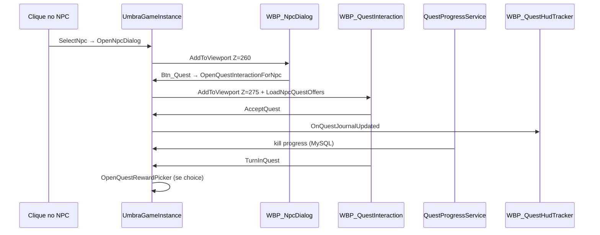

# Guia: Sistema de Quests (UE 5.6.1)

Sistema end-to-end: MySQL → PHP autoritativo → progresso de kill na zone C++ → widgets UE.

Este guia cobre **backend + implementação completa dos Blueprints**, com **classe C++**, **caminho do WBP** e **BindWidget** separados por widget.

---

## Índice

1. [Schema e seed](#1-schema-e-seed)
2. [Endpoints PHP](#2-endpoints-php)
3. [Zone C++ — kill autoritativo](#3-zone-c--kill-autoritativo)
4. [Pré-requisitos no Editor](#4-pré-requisitos-no-editor)
5. [BP GameInstance — Class Defaults](#5-bp-gameinstance--class-defaults)
6. [Input — tecla J (journal)](#6-input--tecla-j-journal)
7. [WBP_QuestInteraction](#7-wbp_questinteraction)
8. [WBP_QuestEntry](#8-wbp_questentry)
9. [WBP_QuestJournal](#9-wbp_questjournal)
10. [WBP_QuestRewardPicker](#10-wbp_questrewardpicker)
11. [WBP_QuestHudTracker](#11-wbp_questhudtracker)
12. [WBP_PlayerHUD — composição](#12-wbp_playerhud--composição)
13. [Integração WBP_NpcDialog](#13-integração-wbp_npcdialog)
14. [Regras do Event Graph](#14-regras-do-event-graph)
15. [Fluxo no jogo](#15-fluxo-no-jogo)
16. [Testes PIE](#16-testes-pie)
17. [Troubleshooting](#17-troubleshooting)
18. [Referências](#18-referências)

---

## 1. Schema e seed

```bash
mysql -u root -p umbra_eternum < www/umbra_api/scripts/create_quest_system_tables.sql
```

| Tabela | Função |
|--------|--------|
| `quests` | Definição da missão |
| `quest_objectives` | Objetivos (`talk`, `kill`, `collect`, `deliver`, `reach_area`, `use_item_at`) |
| `quest_rewards` | Recompensas fixas |
| `quest_reward_choices` | Recompensas com escolha no turn-in |
| `npc_quest_offers` | NPC → quest |
| `player_quests` | Estado por jogador |
| `player_quest_objectives` | Progresso por objetivo |

Seed: 3 quests em `npc_merchant_01` (matar `dummy_treino`, entregar poção, santuário com escolha).

---

## 2. Endpoints PHP

Pasta: `www/umbra_api/api/quest/`

| Endpoint | Função |
|----------|--------|
| `get_npc_quest_offers.php` | Lista quests do NPC + status |
| `get_quest_detail.php` | Detalhe, objetivos, progresso |
| `get_quest_journal.php` | Journal (ativas + concluídas) |
| `accept_quest.php` | Aceitar quest |
| `abandon_quest.php` | Abandonar |
| `report_quest_progress.php` | `reach_area` / `use_item_at` |
| `turn_in_quest.php` | Entrega (`needs_reward_choice` se aplicável) |
| `choose_quest_reward.php` | Escolhe recompensa e finaliza |

```bash
curl -X POST http://localhost/umbra_api/api/quest/get_npc_quest_offers.php \
  -H "Content-Type: application/json" \
  -d '{"token":"TOKEN","npc_instance_id":1,"pos_x":100,"pos_y":0,"pos_z":200}'
```

---

## 3. Zone C++ — kill autoritativo

| Arquivo | Função |
|---------|--------|
| `src/zone/QuestProgressService.hpp/.cpp` | Incrementa kill no MySQL |
| `src/zone/CombatCoreEngine.cpp` | Hook em `handleNpcDamageResult` |

```bash
cd d:\UmbraServerV2\build
cmake --build . --config Release --target umbra_server
```

---

## 4. Pré-requisitos no Editor

| # | Ação |
|---|------|
| 4.1 | Compilar o módulo `UmbraEternumUE` no Visual Studio (classes `UmbraQuest*Widget`, `UmbraQuestAreaTrackerComponent`) |
| 4.2 | Rodar o SQL de quests (§1) |
| 4.3 | Criar pasta no Content Browser: `Content/Widgets/UI/Quest/` |
| 4.4 | Confirmar que `WBP_NpcDialog` já usa parent `UmbraNpcDialogWidget` (ver [guia NPC](GUIA_SISTEMA_NPC_INTERATIVO_VENDOR_UE561.md)) |

**Componente automático no C++:** `AUmbraEternumUEPlayerController` já cria `UUmbraQuestAreaTrackerComponent` — não precisa adicionar manualmente no BP do PC.

---

## 5. BP GameInstance — Class Defaults

Abra o Blueprint do **GameInstance** (ex.: `BP_UmbraGameInstance`).

| # | Categoria | Propriedade | Valor |
|---|-----------|-------------|-------|
| 5.1 | **Quest \| UI** | `Quest Interaction Widget Class` | `WBP_QuestInteraction` |
| 5.2 | **Quest \| UI** | `Quest Journal Widget Class` | `WBP_QuestJournal` |
| 5.3 | **Quest \| UI** | `Quest Reward Picker Widget Class` | `WBP_QuestRewardPicker` |
| 5.4 | **Npc \| UI** | `Npc Dialog Widget Class` | `WBP_NpcDialog` (não use o mesmo asset da linha 5.1) |

Compile + Save.

> **Importante:** `Npc Dialog Widget Class` e `Quest Interaction Widget Class` devem ser **dois Blueprints diferentes**. Se forem o mesmo asset, o servidor bloqueia a abertura e exibe erro no log.

**Métodos expostos (chamados pelo C++ / BP):**

| Método | Uso |
|--------|-----|
| `OpenQuestInteractionForNpc` | Abre painel de quests no NPC |
| `OpenQuestJournal` / `CloseQuestJournal` | Journal completo |
| `OpenQuestRewardPicker` | Escolha de recompensa (também aberto automaticamente no turn-in) |
| `LoadQuestJournal` | Refresh HUD + journal |
| `AcceptQuest`, `TurnInQuest`, `AbandonQuest`, `ChooseQuestReward` | Ações |

**Delegates (opcional no BP):**

`OnQuestOffersLoaded`, `OnQuestDetailLoaded`, `OnQuestJournalUpdated`, `OnQuestActionCompleted`, `OnQuestActionFailed`, `OnQuestNeedsRewardChoice`

---

## 6. Input — tecla J (journal)

| # | Ação |
|---|------|
| 6.1 | Content → **Input → Input Action** → criar `IA_OpenQuestJournal` (Digital bool) |
| 6.2 | Abrir `IMC_Default` (ou IMC de gameplay) → mapear tecla **J** → `IA_OpenQuestJournal` |
| 6.3 | No BP do **Character** (`BP_UmbraCharacter` ou equivalente) → **Class Defaults** → `Open Quest Journal Action` = `IA_OpenQuestJournal` |
| 6.4 | O C++ chama `AUmbraEternumUEPlayerController::OpenQuestJournal` (cursor visível + `GameAndUI`) |

---

## 7. WBP_QuestInteraction

Painel aberto ao clicar **Quest** no diálogo do NPC.

| Campo | Valor |
|-------|-------|
| **Asset** | `Content/Widgets/UI/Quest/WBP_QuestInteraction` |
| **Parent Class** | `UmbraQuestInteractionWidget` |
| **Aberto por** | `UUmbraGameInstance::OpenQuestInteractionForNpc` (ZOrder **275**, acima do diálogo 260) |

> **Fluxo correto:** clique no NPC abre **somente** `WBP_NpcDialog`. O painel de quests abre **apenas** ao clicar `Btn_Quest` no diálogo — nunca no clique do NPC.

### 7.1 BindWidget (nome exato no Designer)

Marque **Is Variable = true** em cada widget listado.

| Nome exato | Tipo UE | Obrigatório | Função |
|------------|---------|-------------|--------|
| `List_QuestOffers` | Scroll Box | **Obrigatório** | Lista de quests clicáveis (visível ao abrir) |
| `Panel_QuestList` | Border / Vertical Box | Opcional | Container da lista; se vazio, oculta `List_QuestOffers` |
| `Panel_QuestDetail` | Border / Vertical Box | **Recomendado** | Detalhe + botões; **oculto** até clicar numa quest |
| `Btn_Back` | Button | **Recomendado** | Volta à lista (oculto na lista, visível no detalhe) |
| `Text_QuestTitle` | Text Block | Recomendado | Título da quest selecionada (dentro de `Panel_QuestDetail`) |
| `Text_QuestBody` | Text Block | Recomendado | Texto de oferta / progresso / entrega |
| `VBox_Objectives` | Vertical Box | Recomendado | Objetivos (`2/5`, ✓) — só após clicar na quest |
| `VBox_Rewards` | Vertical Box | Recomendado | Preview de recompensas — só após clicar na quest |
| `BTN_Accept` | Button | Recomendado | Aceitar — só se status `available` |
| `BTN_TurnIn` | Button | Recomendado | Entregar — só se status `ready` (objetivos cumpridos) |
| `BTN_Abandon` | Button | Recomendado | Abandonar — se status `active` ou `ready` |
| `Btn_Close` | Button | Recomendado | Fecha o painel inteiro |

> **UX em duas telas:** ao abrir → **só a lista**. Ao clicar numa quest → **lista some**, aparece o detalhe. `Btn_Back` (ou `BackToQuestList`) restaura a lista.

### 7.2 Comportamento da lista e prerequisite

| Estado | Visível | Oculto |
|--------|---------|--------|
| Lista (inicial) | `List_QuestOffers` / `Panel_QuestList` | `Panel_QuestDetail`, `Btn_Back` |
| Detalhe (após clicar) | `Panel_QuestDetail`, `Btn_Back` | `List_QuestOffers` / `Panel_QuestList` |

Ao abrir (via `Btn_Quest` no diálogo):

1. `LoadNpcQuestOffers` busca ofertas do NPC na API.
2. A API **não retorna** quests `locked` (prerequisite não cumprido / level baixo) nem `completed` (já feitas, não repetíveis).
3. O C++ monta uma linha `WBP_QuestOfferEntry` por quest disponível (`available`, `active`, `ready`).
4. **Nenhuma quest é selecionada automaticamente** — o painel de detalhe fica oculto.
5. Clique numa linha → `SelectOffer(QuestId)` → carrega detalhe HTTP → exibe `Panel_QuestDetail`.

| Status na lista | Botões no detalhe |
|-----------------|-------------------|
| `available` (não aceita) | **Accept** |
| `active` (aceita, em progresso) | **Abandon** |
| `ready` (objetivos cumpridos) | **Turn In** + **Abandon** |

| # | Ação no Editor |
|---|----------------|
| 7.2.1 | `List_QuestOffers` — coluna esquerda ou tela cheia inicial |
| 7.2.2 | Envolver detalhe em `Panel_QuestDetail` (ou `VB_QuestContent`) |
| 7.2.3 | Adicionar `Btn_Back` **dentro** do painel de detalhe (rótulo: "Voltar") |
| 7.2.4 | `Text_QuestBody` com **Auto Wrap Text** ligado no Designer (C++ também força wrap) |
| 7.2.5 | Conteúdo longo dentro de `Scroll_QuestFeed` (Scroll Box) para não ultrapassar o painel |

### 7.3 WBP_QuestOfferEntry

Linha clicável na lista de ofertas do NPC.

| Campo | Valor |
|-------|-------|
| **Asset** | `Content/Widgets/UI/Quest/WBP_QuestOfferEntry` |
| **Parent Class** | **`UmbraQuestOfferEntryWidget`** ← não use `UmbraQuestEntryWidget` (journal) |
| **Instanciado por** | `WBP_QuestInteraction` (`QuestOfferEntryWidgetClass`) |

> **Erro comum (lista vazia):** se o parent for `UmbraQuestEntryWidget`, o C++ não consegue instanciar as linhas e a lista fica vazia. Reparent para `UmbraQuestOfferEntryWidget` e recompile o WBP.

| Nome exato | Tipo UE | Obrigatório | Função |
|------------|---------|-------------|--------|
| `Btn_Select` | Button | Recomendado | Clique → seleciona a oferta |
| `Text_Title` | Text Block | Recomendado | Nome da quest (`Text_Objective` também funciona como fallback) |

**Event Graph:** vazio — `SetupOffer` e clique são C++.

### 7.4 Layout sugerido

```
[ Border / Canvas ]
├── Panel_QuestList (ou List_QuestOffers)   ← tela 1: só lista
└── Panel_QuestDetail / VB_QuestContent     ← tela 2: detalhe (Collapsed no início)
    ├── Btn_Back
    ├── Scroll_QuestFeed
    │   ├── Text_QuestTitle
    │   ├── Text_QuestBody  (wrap + scroll)
    │   ├── VBox_Objectives
    │   └── VBox_Rewards
    └── HBox: BTN_Accept | BTN_TurnIn | BTN_Abandon
[ Btn_Close ]                               ← fora dos dois painéis
```

### 7.5 Class Defaults

| Propriedade | Valor |
|-------------|-------|
| `Quest Offer Entry Widget Class` | `WBP_QuestOfferEntry` |

### 7.6 Event Graph

**Deixe vazio** — botões, lista, delegates e refresh são tratados em `UmbraQuestInteractionWidget.cpp`.

**Não** chame `OpenQuestInteractionForNpc` nem `Add to Viewport` aqui.

---

## 8. WBP_QuestEntry

Linha clicável na lista do journal.

| Campo | Valor |
|-------|-------|
| **Asset** | `Content/Widgets/UI/Quest/WBP_QuestEntry` |
| **Parent Class** | `UmbraQuestEntryWidget` |
| **Instanciado por** | `WBP_QuestJournal` (`QuestEntryWidgetClass` ou fallback C++) |

### 8.1 BindWidget

| Nome exato | Tipo UE | Obrigatório | Função |
|------------|---------|-------------|--------|
| `Text_Title` | Text Block | Recomendado | Nome da quest |
| `Text_Objective` | Text Block | Recomendado | Objetivo atual (`Matar lobos (2/5)`) |
| `Btn_Select` | Button | Recomendado | Clique → `OnQuestEntrySelected` → journal seleciona a quest |

### 8.2 Layout sugerido

```
[ Button Btn_Select (transparente ou com hover) ]
├── Text_Title
└── Text_Objective (fonte menor, cor secundária)
```

### 8.3 Event Graph

Vazio — `SetupEntry` e clique são C++.

---

## 9. WBP_QuestJournal

Journal completo (tecla **J**).

| Campo | Valor |
|-------|-------|
| **Asset** | `Content/Widgets/UI/Quest/WBP_QuestJournal` |
| **Parent Class** | `UmbraQuestJournalWidget` → herda `UmbraDraggableWindowWidget` |
| **Aberto por** | `OpenQuestJournal` (ZOrder 15) |

### 9.1 BindWidget

| Nome exato | Tipo UE | Obrigatório | Função |
|------------|---------|-------------|--------|
| `Scroll_QuestList` | Scroll Box | Recomendado | Lista de `WBP_QuestEntry` (criados em runtime) |
| `BTN_Active` | Button | **Recomendado** | Aba de quests ativas/prontas |
| `BTN_Completed` | Button | **Recomendado** | Aba de quests já concluídas (`CachedJournal.Completed`) |
| `Text_QuestTitle` | Text Block | Recomendado | Título da quest selecionada |
| `Text_QuestBody` | Text Block | Opcional | Legado — o C++ colapsa e usa `VBox_Objectives` |
| `VBox_Objectives` | Vertical Box | **Obrigatório** | Descrição + objetivos (preenchido pelo C++) |
| `VBox_Rewards` | Vertical Box | **Recomendado** | Recompensas com ícone + nome do item |
| `BTN_TurnIn` | Button | **Recomendado** | Entregar — visível só quando status `ready` (itens/objetivos OK) |
| `BTN_Abandon` | Button | Opcional | Abandonar quest ativa ou pronta |
| `Btn_Close` | Button | Recomendado | Fecha via `CloseQuestJournal` |

> **Sem auto-seleção:** ao abrir o journal, o painel direito mostra *"Selecione uma quest"* até você clicar numa entrada da lista.

> **Turn In:** a API promove a quest para `ready` quando você tem os itens de entrega na bolsa (objetivo `deliver`). O botão `BTN_TurnIn` aparece nesse momento.

### 9.2 Arrastar janela (herança `UmbraDraggableWindowWidget`)

| # | Ação |
|---|------|
| 9.2.1 | Adicionar `Border_TitleBar` (ou similar) no topo |
| 9.2.2 | No **Event Construct** do WBP: `Set Drag Area Widget` → referência ao `Border_TitleBar` |
| 9.2.3 | Ver também [GUIA_DRAG_WIDGETS_UE561.md](GUIA_DRAG_WIDGETS_UE561.md) |

Se `DragAreaWidget` ficar **None**, a janela **não arrasta**.

### 9.3 Class Defaults do WBP_QuestJournal

| Propriedade | Valor |
|-------------|-------|
| `Quest Entry Widget Class` | `WBP_QuestEntry` |

Se vazio, o C++ usa `UUmbraQuestEntryWidget` diretamente.

### 9.4 Layout sugerido

```
[ Border_TitleBar ]  "Diário de Quests"     [ Btn_Close ]
├── Painel esquerdo
│   ├── HBox: BTN_Active | BTN_Completed
│   └── Scroll_QuestList (~35%)
└── Painel direito (VerticalBox — filhos com slot Auto, exceto Scroll Fill)
    ├── Text_QuestTitle                    (Auto)
    ├── Scroll_QuestDetail                 (Fill) — opcional mas recomendado
    │   └── VerticalBox
    │       ├── VBox_Objectives            (Auto) — corpo + objetivos
    │       └── VBox_Rewards               (Auto) — ícone + nome do item
    └── HBox: BTN_TurnIn | BTN_Abandon     (Auto)
```

> **Evitar sobreposição:** não use **Fill** em `Text_QuestBody`, `VBox_Objectives` e `VBox_Rewards` ao mesmo tempo no mesmo painel sem Scroll. O C++ colapsa `Text_QuestBody` e renderiza tudo em `VBox_Objectives` + `VBox_Rewards`.

### 9.5 Event Graph

Vazio — lista, detalhe e abandonar são C++.

---

## 10. WBP_QuestRewardPicker

Abre quando `turn_in_quest` retorna `needs_reward_choice: true`.

| Campo | Valor |
|-------|-------|
| **Asset** | `Content/Widgets/UI/Quest/WBP_QuestRewardPicker` |
| **Parent Class** | `UmbraQuestRewardPickerWidget` |
| **Aberto por** | `OpenQuestRewardPicker` (ZOrder 25) |

### 10.1 BindWidget

| Nome exato | Tipo UE | Obrigatório | Função |
|------------|---------|-------------|--------|
| `Text_Title` | Text Block | Opcional | Título ("Escolha sua recompensa") |
| `Text_SelectedItem` | Text Block | **Recomendado** | Mostra `Item selecionado: {nome}` após clique |
| `VBox_Choices` | Vertical Box | Recomendado | Linhas `WBP_QuestRewardChoiceEntry` (ícone clicável) |
| `BTN_ConfirmReward` | Button | Recomendado | Confirma → `ChooseQuestReward` (desabilitado até selecionar) |

### 10.1.1 WBP_QuestRewardChoiceEntry

| Campo | Valor |
|-------|-------|
| **Asset** | `Content/Widgets/UI/Quest/WBP_QuestRewardChoiceEntry` |
| **Parent Class** | `UmbraQuestRewardChoiceEntryWidget` |
| **Class Default no picker** | `Quest Reward Choice Entry Class` → `WBP_QuestRewardChoiceEntry` |

| Nome exato | Tipo UE | Função |
|------------|---------|--------|
| `Btn_Select` | Button | Clique → seleciona a recompensa |
| `Image_Icon` | Image | Ícone do item (`ItemIconsDataTable` no GI) |
| `Text_Name` | Text Block | Nome do item / Gold / EXP |
| `Text_Qty` | Text Block | Quantidade (se > 1) |
| `Border_Highlight` | Border | Destaque da opção selecionada |

> Sem WBP, o C++ monta uma linha mínima em runtime (fallback).

### 10.2 Escolha da opção

1. Clique numa linha em `VBox_Choices` → `Text_SelectedItem` atualiza e `BTN_ConfirmReward` hababilita.
2. `BTN_ConfirmReward` chama `ChooseQuestReward` com o `choice_id` selecionado.

Não é mais necessário wiring manual no Event Graph para a seleção básica.

### 10.3 Event Graph

Somente wiring de seleção manual (se desejar); confirmar e fechar já estão no C++.

---

## 11. WBP_QuestHudTracker

Tracker minimizável no HUD (até 3 quests ativas).

| Campo | Valor |
|-------|-------|
| **Asset** | `Content/Widgets/UI/Quest/WBP_QuestHudTracker` |
| **Parent Class** | `UmbraQuestHudTrackerWidget` |
| **Onde colocar** | Filho de `WBP_PlayerHUD` (não Add to Viewport separado) |

### 11.1 BindWidget

| Nome exato | Tipo UE | Obrigatório | Função |
|------------|---------|-------------|--------|
| `Panel_Expanded` | Border / Overlay / qualquer Widget | Recomendado | Painel expandido (oculto quando minimizado) |
| `VBox_QuestLines` | Vertical Box | **Recomendado** | Só linhas dinâmicas — **único** container que o C++ limpa |
| `VBox_ActiveQuests` | Vertical Box | Legado | Fallback se `VBox_QuestLines` ausente — **não** coloque botões aqui |
| `Text_MinimizedSummary` | Text Block | Recomendado | Modo compacto: ex. `Quests: 2` (fora de `Panel_Expanded`) |
| `Btn_ToggleMinimize` | Button | Recomendado | Alterna minimizado / expandido |
| `Btn_OpenJournal` | Button | Opcional | Chama `OpenQuestJournal` no GI |

### 11.2 Layout sugerido

```
[ Anchor: top-left ou abaixo da barra de EXP ]

Modo expandido (Panel_Expanded — VerticalBox):
├── VBox_QuestLines          (Auto) ← título + TODOS os objetivos por quest
└── HorizontalBox_Tabs       (Auto) ← botões FIXOS (nunca dentro de VBox_QuestLines)
    ├── Btn_ToggleMinimize
    └── Btn_OpenJournal

Modo minimizado (root, fora de Panel_Expanded):
├── Btn_ToggleMinimize  "+"
└── Text_MinimizedSummary  "Quests: N"
```

> **Erro comum:** botões dentro de `VBox_ActiveQuests` / `VBox_QuestLines` somem após o primeiro refresh do journal. Mantenha botões como **irmãos** de `VBox_QuestLines`, não filhos dele.

### 11.3 Comportamento C++

- `NativeConstruct` → bind `OnQuestJournalUpdated` + `LoadQuestJournal`
- `Btn_ToggleMinimize` → `Panel_Expanded` Collapsed/Visible + `Text_MinimizedSummary` invertido

### 11.4 Event Graph

Vazio.

---

## 12. WBP_PlayerHUD — composição

Mesmo padrão de `WBP_HudExperience` ([GUIA_SISTEMA_EXP.md](GUIA_SISTEMA_EXP.md) §4).

```
WBP_PlayerHUD
├── … (HP, mana, etc.)
├── WBP_HudExperience          ← barra EXP
└── WBP_QuestHudTracker        ← NOVO (filho, não viewport separado)
```

| # | Ação |
|---|------|
| 12.1 | Abrir `WBP_PlayerHUD` |
| 12.2 | Arrastar **instância** de `WBP_QuestHudTracker` para o layout (canto superior esquerdo ou abaixo da EXP) |
| 12.3 | Ajustar **Anchors** e **Position** para não sobrepor outros elementos |
| 12.4 | Compile + Save |

**Não** faça bind manual a `OnQuestJournalUpdated` no HUD pai — o tracker C++ já escuta.

---

## 13. Integração WBP_NpcDialog

Já documentado em [GUIA_SISTEMA_NPC_INTERATIVO_VENDOR_UE561.md](GUIA_SISTEMA_NPC_INTERATIVO_VENDOR_UE561.md).

### 13.1 Parent class e binds obrigatórios

| Campo | Valor |
|-------|-------|
| **Parent Class** | `UmbraNpcDialogWidget` (não `UserWidget`, não `UmbraQuestInteractionWidget`) |
| **Npc Dialog Widget Class** (GI) | `WBP_NpcDialog` |
| **Quest Interaction Widget Class** (GI) | `WBP_QuestInteraction` — **asset diferente** do diálogo |

| Nome | Tipo | Função |
|------|------|--------|
| `Btn_Quest` | Button | C++ chama `OpenQuestInteractionForNpc` e fecha o diálogo |
| `Btn_Trade` | Button | Abre loja NPC |
| `Btn_Close` | Button | Fecha diálogo |

Visibilidade de `Btn_Quest`: `has_quest_dialog` **ou** `quest_offer_count > 0` na API.

### 13.2 Fluxo de abertura (ordem correta)

| Ação do jogador | Widget aberto | ZOrder |
|-----------------|---------------|--------|
| Clique no NPC (não atacável) | **Somente** `WBP_NpcDialog` | 260 |
| Clique em `Btn_Quest` no diálogo | `WBP_QuestInteraction` (diálogo fecha) | 275 |
| Clique em `Btn_Trade` | `WBP_NpcVendor` (diálogo fecha) | 270 |

O C++ em `OpenNpcDialog` **fecha** qualquer `WBP_QuestInteraction` aberto antes de mostrar o diálogo (evita “flash” da tela de quest).

### 13.3 Event Graph do WBP_NpcDialog

| Permitido | Proibido |
|-----------|----------|
| Vazio (recomendado) | `OpenQuestInteractionForNpc` no **Construct** ou no clique do NPC |
| | `OnClicked` manual em `Btn_Quest` (C++ já faz bind) |
| | `Add to Viewport` do painel de quests |

Se `Btn_Quest` tiver **OnClicked** no Blueprint **e** bind C++, ambos podem disparar — remova o evento do BP.

### 13.4 Troubleshooting

| Sintoma | Causa provável | Correção |
|---------|----------------|----------|
| Quest aparece um instante e depois o diálogo | `WBP_NpcDialog` chama quest no Construct; ou classes trocadas no GI | Event Graph vazio; separar `Npc Dialog` ≠ `Quest Interaction` |
| `Btn_Quest` não abre nada | Parent do WBP não é `UmbraNpcDialogWidget`; ou botão sem nome `Btn_Quest` | Reparent + renomear botão |
| Quest abre mas fica invisível | ZOrder antigo (20) atrás do HUD | Recompilar C++ (agora usa **275**) |
| Lista vazia ao abrir | `WBP_QuestOfferEntry` com parent **`UmbraQuestEntryWidget`** (errado) | Reparent → **`UmbraQuestOfferEntryWidget`**; Class Default em `WBP_QuestInteraction` |
| Lista vazia | SQL de quests não rodou no MySQL | Executar `create_quest_system_tables.sql` |
| Detalhe visível ao abrir | `VB_QuestContent` / `Scroll_QuestFeed` sem wrapper | C++ agora oculta `VB_QuestContent`; recompile |
| Lista com altura zero | `List_QuestOffers` sem espaço no Vertical Box | Dar **Fill** ou altura mínima (~200px) à lista; `VB_QuestContent` começa Collapsed |

---

## 14. Regras do Event Graph

| Widget | Pode ficar vazio? | Exceção |
|--------|-------------------|---------|
| `WBP_QuestInteraction` | Sim | — |
| `WBP_QuestOfferEntry` | Sim | — |
| `WBP_QuestEntry` | Sim | — |
| `WBP_QuestJournal` | Quase | `Set Drag Area Widget` no Construct |
| `WBP_QuestRewardPicker` | Quase | botões de seleção manual (opcional) |
| `WBP_QuestHudTracker` | Sim | — |

**Não implementar no BP:**

- HTTP / VaRest para quests (tudo no `UUmbraGameInstance`)
- `OnClicked` manual em `BTN_Accept`, `BTN_TurnIn`, etc. (C++ já faz bind)
- `Add to Viewport` duplicado do journal, interaction ou diálogo (GI controla instância única)
- `OpenQuestInteractionForNpc` no clique do NPC ou no Construct do `WBP_NpcDialog`

---

## 15. Fluxo no jogo



1. Clique no NPC → **somente** diálogo (`WBP_NpcDialog`)
2. Diálogo → **Quest** → painel de interação (`WBP_QuestInteraction`) com lista automática
3. **Aceitar** → HUD + journal atualizam
3. **Matar** mobs → zone incrementa kill
4. **Coletar/entregar** → PHP valida inventário
5. **Área / usar item** → `UUmbraQuestAreaTrackerComponent` + `UseInventoryItem`
6. **Turn-in** → recompensas; escolha abre picker
7. Tecla **J** → journal completo

---

## 16. Testes PIE

| # | Teste | Resultado esperado |
|---|-------|-------------------|
| 1 | Interagir com `npc_merchant_01` | Abre **somente** `WBP_NpcDialog` (sem flash de quest) |
| 2 | Clicar **Quest** no diálogo | Abre `WBP_QuestInteraction` com **somente a lista** de quests |
| 3 | Clicar numa quest na lista | Aparece detalhe (body, objetivos, recompensas) + botão conforme status |
| 2 | Aceitar missão de kill | Aparece no HUD (`Quests: 1`) e no journal (J) |
| 3 | Matar `dummy_treino` ×3 | Objetivo kill completa; status **ready** |
| 4 | Turn-in no mercador | Gold + EXP; inventário atualiza |
| 5 | Quest do santuário (escolha) | Picker com 2 opções; só uma concedida |
| 6 | HUD minimizar | `Panel_Expanded` some; `Text_MinimizedSummary` visível |
| 7 | Abandonar no journal | Quest some da lista ativa |

---

## 17. Troubleshooting

| Sintoma | Causa provável | Correção |
|---------|----------------|----------|
| "Configure QuestInteractionWidgetClass" | GI sem Class Default | §5 |
| Botões não respondem | Parent class errado no WBP | Reparent para classe C++ correta |
| Textos vazios | Nomes BindWidget diferentes do C++ | Conferir tabela §7–§11 (case-sensitive) |
| Journal não arrasta | `DragAreaWidget` não setado | §9.2 |
| HUD não atualiza | Tracker fora do `WBP_PlayerHUD` | §12 |
| Kill não progride | Zone server sem rebuild / SQL não rodado | §1 e §3 |
| `Btn_Quest` oculto | Sem `has_quest_dialog` e sem ofertas | Rodar seed SQL |
| HUD some ao minimizar e não volta | `Btn_ToggleMinimize` dentro de `Panel_Expanded` que era colapsado inteiro | Manter botão fora do conteúdo ou usar `VBox_QuestLines` dedicado; recompilar C++ |
| HUD só 1 objetivo | Versão antiga usava só `current_objective` | Recompilar — agora lista `detail.objectives` |
| Textos sobrepostos no journal | Fill em vários TextBlocks no mesmo painel | §9.4 — Scroll + slot Auto; adicionar `VBox_Rewards` |
| Recompensa mostra `Item #id` | API sem `item_name` ou GI sem DataTable de ícones | SQL com JOIN; `ItemIconsDataTable` no GI |
| Picker confirma sem escolher | Sem clique na opção | §10 — clicar ícone/linha antes de confirmar |

---

## 18. Referências

| Tópico | Guia |
|--------|------|
| NPC diálogo / vendedor | [GUIA_SISTEMA_NPC_INTERATIVO_VENDOR_UE561.md](GUIA_SISTEMA_NPC_INTERATIVO_VENDOR_UE561.md) §8 |
| EXP nas recompensas | [GUIA_SISTEMA_EXP.md](GUIA_SISTEMA_EXP.md) |
| Janelas arrastáveis | [GUIA_DRAG_WIDGETS_UE561.md](GUIA_DRAG_WIDGETS_UE561.md) |
| Padrão BP passo a passo | [GUIA_CRIACAO_BLUEPRINTS_REFINACAO.md](GUIA_CRIACAO_BLUEPRINTS_REFINACAO.md) |

### Arquivos C++ (referência rápida)

| Classe | Header |
|--------|--------|
| `UUmbraQuestInteractionWidget` | `UI/UmbraQuestInteractionWidget.h` |
| `UUmbraQuestJournalWidget` | `UI/UmbraQuestJournalWidget.h` |
| `UUmbraQuestEntryWidget` | `UI/UmbraQuestEntryWidget.h` |
| `UUmbraQuestHudTrackerWidget` | `UI/UmbraQuestHudTrackerWidget.h` |
| `UUmbraQuestRewardPickerWidget` | `UI/UmbraQuestRewardPickerWidget.h` |
| `UUmbraQuestRewardChoiceEntryWidget` | `UI/UmbraQuestRewardChoiceEntryWidget.h` |
| `UUmbraQuestAreaTrackerComponent` | `Components/UmbraQuestAreaTrackerComponent.h` |
| `UUmbraGameInstance` (HTTP quests) | `Core/UmbraGameInstance.h` |
